<p align="center">
  <a href="https://www.rust-lang.org/"></a>
  <a href="https://github.com/robintra/perf-sentinel/actions/workflows/ci.yml"></a>
  <a href="https://github.com/robintra/perf-sentinel/actions/workflows/security-audit.yml"></a>
  <a href="https://sonarcloud.io/summary/overall?id=robintrassard_perf-sentinel"></a>
  <a href="https://sonarcloud.io/summary/overall?id=robintrassard_perf-sentinel"></a>
</p>

<picture>
  <source media="(prefers-color-scheme: dark)" srcset="https://raw.githubusercontent.com/robintra/perf-sentinel/main/logo/logo-dark-horizontal.svg">
  
</picture>

Analyse les traces d'exécution (requêtes SQL, appels HTTP) pour détecter les requêtes N+1, les appels redondants et évalue l'intensité I/O par endpoint (GreenOps).

## Pourquoi perf-sentinel ?

Les anti-patterns de performance comme les requêtes N+1 existent dans toute application qui fait des I/O, monolithes comme microservices. Dans les architectures distribuées, un appel utilisateur cascade sur plusieurs services, chacun avec ses propres I/O et personne n'a de visibilité sur le chemin complet. Les outils existants sont soit spécifiques à un runtime (Hypersistence Utils -> JPA uniquement), soit lourds et propriétaires (Datadog, New Relic), soit limités aux tests unitaires sans vision cross-service.

perf-sentinel adopte une approche différente : **l'analyse au niveau protocole**. Il observe les traces produites par l'application (requêtes SQL, appels HTTP) quel que soit le langage ou l'ORM utilisé. Il n'a pas besoin de comprendre JPA, EF Core ou SeaORM : il voit les requêtes qu'ils génèrent.

## GreenOps : scoring éco-conception intégré

Chaque finding inclut un **I/O Intensity Score (IIS)** : le nombre d'opérations I/O générées par requête utilisateur pour un endpoint donné. Réduire les I/O inutiles (N+1, appels redondants) améliore les temps de réponse *et* réduit la consommation énergétique : ce ne sont pas des objectifs concurrents.

- **I/O Intensity Score** = opérations I/O totales pour un endpoint / nombre d'invocations
- **I/O Waste Ratio** = opérations I/O évitables (issues des findings) / opérations I/O totales

Aligné avec le modèle **Software Carbon Intensity** ([SCI v1.0 / ISO/IEC 21031:2024](https://github.com/Green-Software-Foundation/sci)) de la Green Software Foundation. Le champ `co2.total` contient le **numérateur SCI** `(E × I) + M` sommé sur les traces analysées, pas le score d'intensité par requête. Le scoring multi-région est automatique quand les spans OTel portent l'attribut `cloud.region`. **Plus de 30 régions cloud** disposent de profils d'intensité carbone horaire intégrés, avec une variation saisonnière (mois x heure) pour FR, DE, GB et US-East. En mode daemon, le coefficient énergétique peut être affiné via [Scaphandre](https://github.com/hubblo-org/scaphandre) (RAPL bare-metal) ou l'estimation cloud-native CPU% + SPECpower pour les VMs AWS/GCP/Azure (section `[green.cloud]`) et l'intensité du réseau électrique peut être récupérée en temps réel via l'**API Electricity Maps**, avec repli automatique sur le modèle proxy I/O. Les utilisateurs peuvent fournir leurs propres profils horaires via `[green] hourly_profiles_file` ou ajuster les coefficients du modèle proxy depuis des mesures terrain via `perf-sentinel calibrate`.

> **Note :** les estimations CO₂ sont **directionnelles**, pas auditables. Chaque estimation porte un intervalle d'incertitude multiplicative `~2×` (`low = mid/2`, `high = mid×2`) car le modèle proxy I/O est approximatif. perf-sentinel est un **compteur de gaspillage**, pas un outil de comptabilité carbone. Ne l'utilisez pas pour le reporting CSRD ou GHG Protocol Scope 3. Voir [docs/FR/LIMITATIONS-FR.md](docs/FR/LIMITATIONS-FR.md#précision-des-estimations-carbone) pour la méthodologie complète.

## Positionnement

| Critère              | [Hypersistence Optimizer](https://vladmihalcea.com/hypersistence-optimizer/) | [Datadog APM](https://www.datadoghq.com/product/apm/) | [New Relic APM](https://newrelic.com/platform/application-monitoring) | [Digma](https://digma.ai/) | **perf-sentinel** |
|----------------------|------------------------------------------------------------------------------|-------------------------------------------------------|-----------------------------------------------------------------------|----------------------------|-------------------|
| Détection N+1 SQL    | ✅ JPA uniquement                                                             | ⚠️ Manuel (vue trace)                                 | ⚠️ Manuel (vue trace)                                                 | ✅ (JVM)                    | ✅ Polyglotte      |
| Détection N+1 HTTP   | ❌                                                                            | ⚠️ Manuel (vue trace)                                 | ⚠️ Manuel (vue trace)                                                 | ⚠️ Partiel                 | ✅                 |
| Polyglotte           | ❌ Java/JPA                                                                   | ✅ (agents par langage)                                | ✅ (agents par langage)                                                | ⚠️ JVM + .NET              | ✅ Protocol-level  |
| Cross-service        | ❌                                                                            | ✅                                                     | ✅                                                                     | ⚠️ Partiel                 | ✅ Trace ID        |
| Angle GreenOps / SCI | ❌                                                                            | ❌                                                     | ❌                                                                     | ❌                          | ✅ Natif           |
| Léger                | N/A (lib)                                                                    | ❌ (~150 Mo)                                           | ❌ (~150 Mo)                                                           | ❌ (~100 Mo)                | ✅ (<10 Mo RSS)    |
| Open-source          | ❌ Commercial                                                                 | ❌                                                     | ⚠️ Free tier limité                                                   | ⚠️ Freemium                | ✅ AGPL v3         |
| CI/CD quality gate   | ⚠️ (assertions manuelles)                                                    | ❌                                                     | ⚠️ (alertes, pas de gate natif)                                       | ⚠️                         | ✅ Natif           |

## Que remonte-t-il ?

Pour chaque anti-pattern détecté, perf-sentinel remonte :

- **Type :** N+1 SQL, N+1 HTTP, requête redondante, SQL lent, HTTP lent, fanout excessif, service bavard (chatty service), saturation du pool de connexions ou appels sérialisés. Les corrélations cross-trace sont aussi remontées en mode daemon
- **Template normalisé :** la requête ou l'URL avec les paramètres remplacés par des placeholders (`?`, `{id}`)
- **Occurrences :** combien de fois le pattern s'est déclenché dans la fenêtre de détection
- **Endpoint source :** quel endpoint applicatif l'a généré (ex : `GET /api/orders`)
- **Suggestion :** par exemple *"batch cette requête"*, *"utilise un batch endpoint"*, *"ajouter un index"*
- **Localisation source :** quand les spans OTel portent les attributs `code.function`, `code.filepath`, `code.lineno`, les findings affichent le fichier source et la ligne d'origine. Les rapports SARIF incluent des `physicalLocations` pour les annotations inline GitHub/GitLab
- **Impact GreenOps :** estimation des I/O évitables, I/O Intensity Score, objet `co2` structuré (`low`/`mid`/`high`, termes opérationnel + embodié SCI v1.0), breakdown par région quand le scoring multi-région est actif


Ou explore une trace unique avec le mode `explain` en arbre, qui annote les findings directement à côté des spans concernés :


Ou navigue dans les traces, les findings et les arbres de spans de manière interactive avec le TUI `inspect` (3 panneaux, navigation au clavier) :


Ou classe les hotspots SQL depuis un export `pg_stat_statements` PostgreSQL avec `pg-stat`. Trois classements (par temps total, par nombre d'appels, par latence moyenne) aident à repérer les requêtes qui dominent la DB sans apparaître dans tes traces, signe d'un trou d'instrumentation :


Enfin, ajuste les coefficients I/O-vers-énergie à ton infrastructure réelle avec `calibrate`, qui corrèle un fichier de traces avec des mesures d'énergie (Scaphandre, supervision cloud, etc.) et génère un fichier TOML chargeable via `[green] calibration_file` :


<details>
<summary>Images fixes</summary>

**Configuration** (`.perf-sentinel.toml`) :

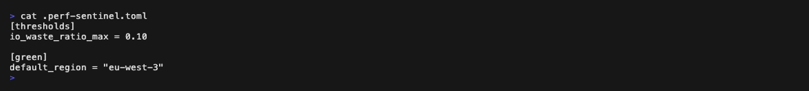

**Rapport d'analyse** (le premier GIF ci-dessus défile dans le rapport complet, les quatre images fixes ci-dessous le couvrent page par page, avec un léger recouvrement pour que chaque finding apparaisse en entier sur au moins une page) :

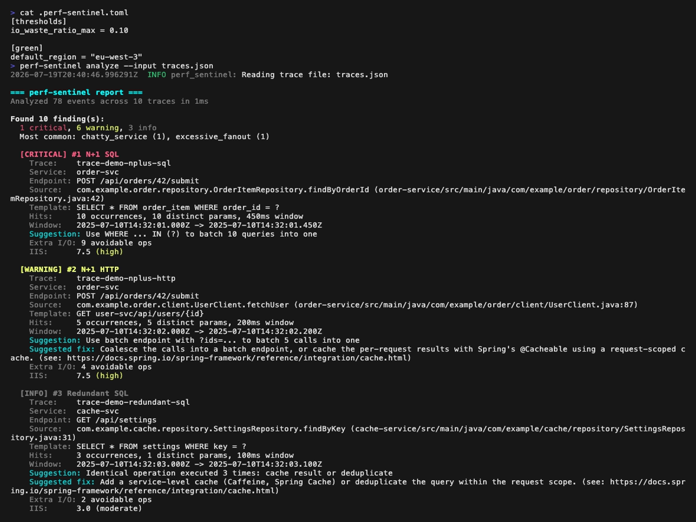

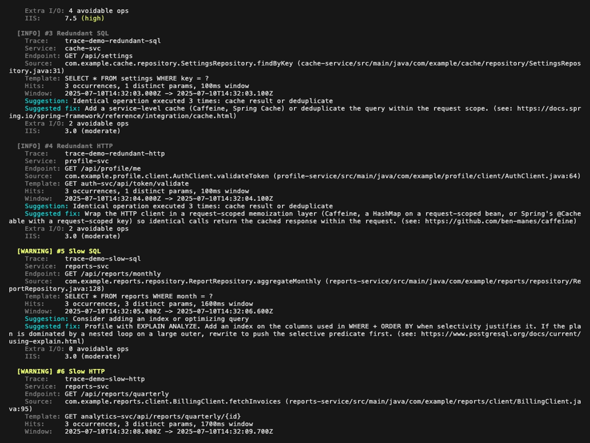

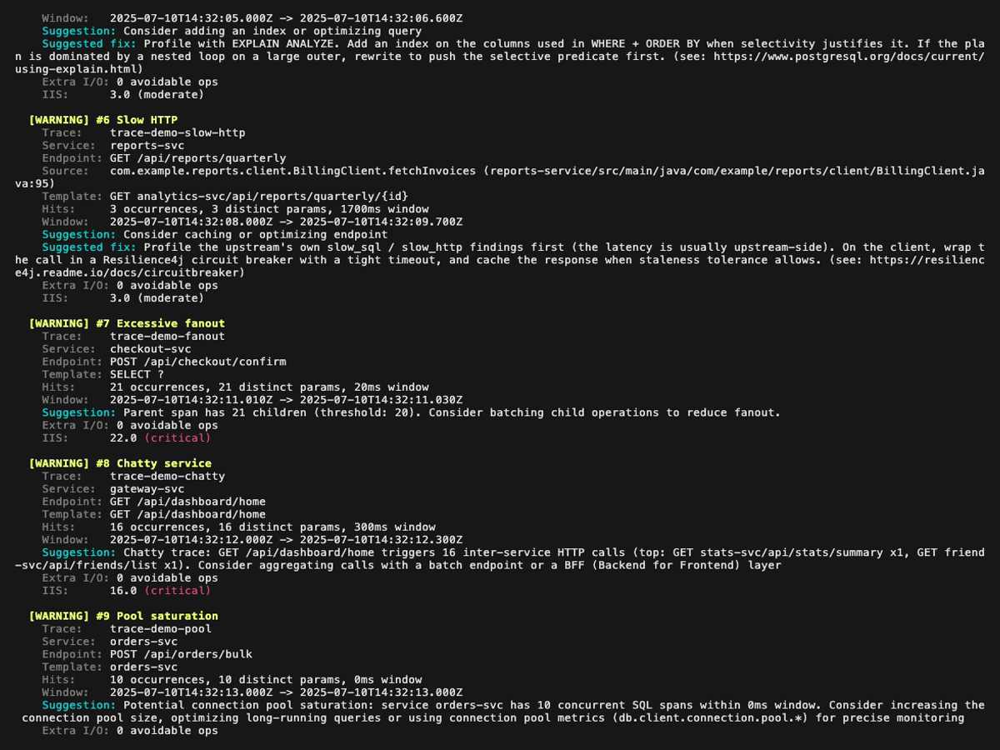

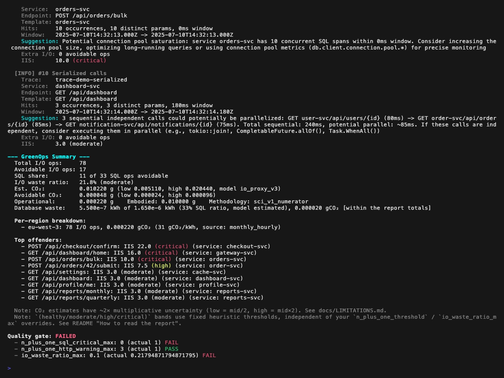

**Mode explain** (vue en arbre d'une trace unique, `perf-sentinel explain --trace-id <id>`). Les findings rattachés à un span (N+1, redondant, lent, fanout) sont affichés inline à côté du span concerné ; les findings de niveau trace (service bavard, saturation du pool, appels sérialisés) sont remontés dans une section dédiée au-dessus de l'arbre :

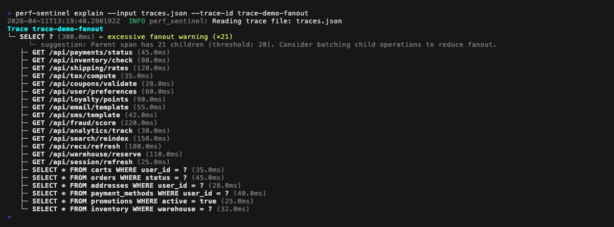

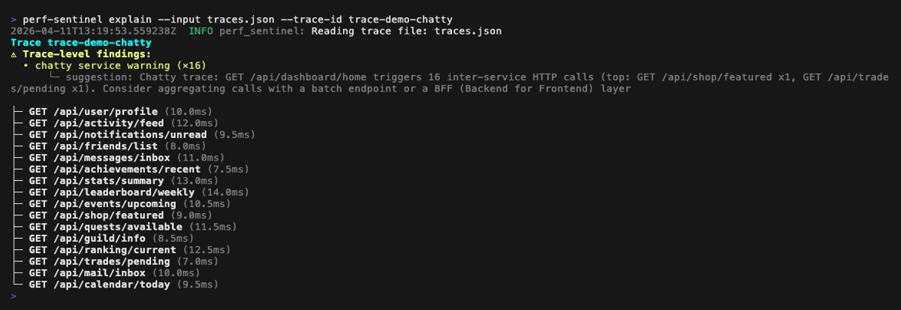

**Mode inspect** (TUI interactif, `perf-sentinel inspect`). Le header du panneau findings colore chaque finding selon sa sévérité ; les cinq images fixes ci-dessous parcourent la fixture démo à travers les trois niveaux de sévérité plus une vue du panneau détail avec sa fonction de scroll :

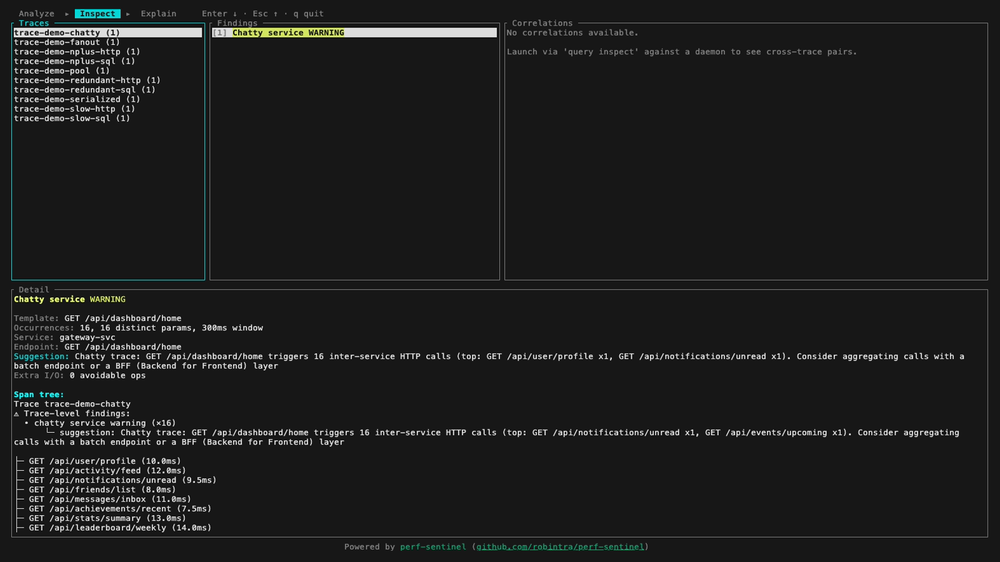

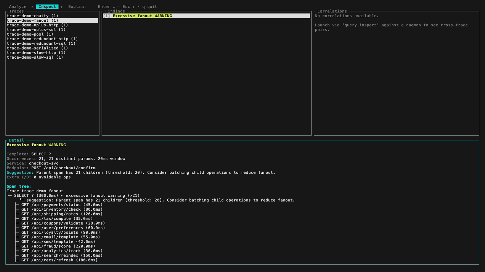

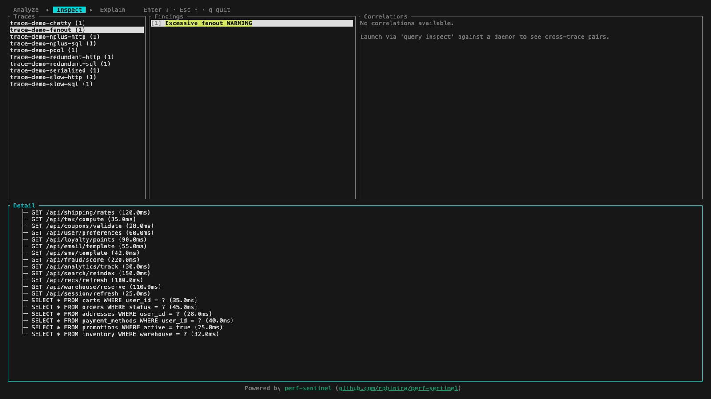

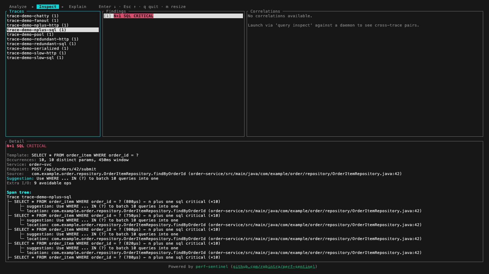

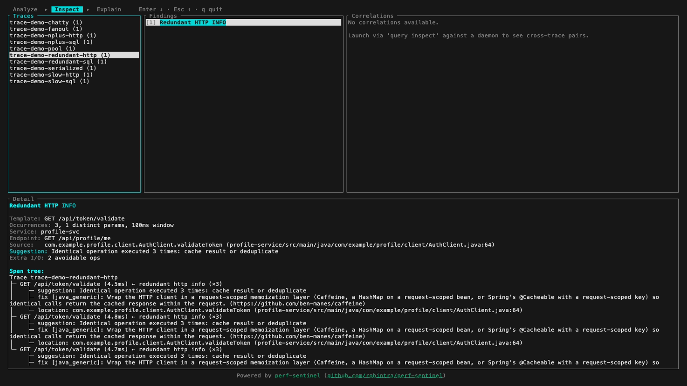

**Mode pg-stat** (`perf-sentinel pg-stat --input <pg_stat_statements.csv>`) : classe les requêtes SQL de trois manières (par temps d'exécution total, par nombre d'appels, par latence moyenne). Cross-référence avec tes traces via `--traces` pour repérer les requêtes qui dominent la DB sans apparaître dans ton instrumentation :

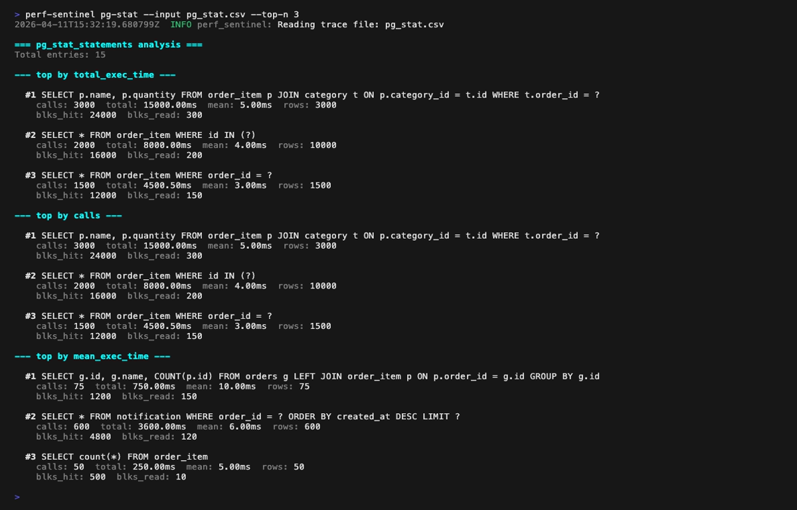

**Mode calibrate** (`perf-sentinel calibrate --traces <traces.json> --measured-energy <energy.csv>`) :

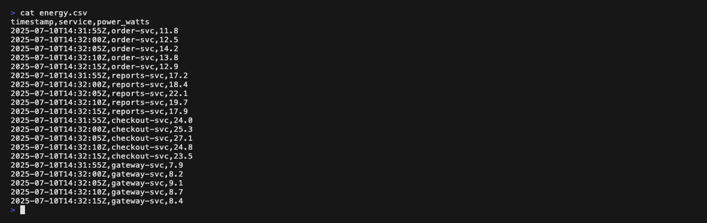

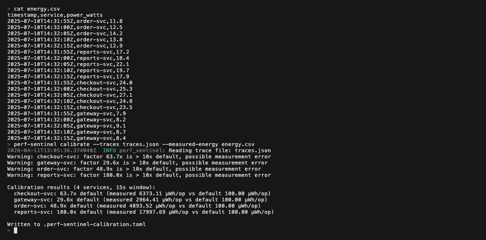

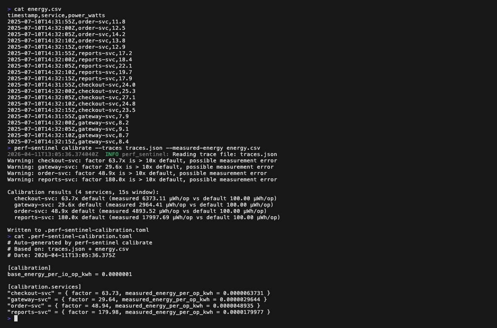

</details>

En mode CI (`perf-sentinel analyze --ci`), la sortie est un rapport JSON structuré :

<details>
<summary>Exemple de rapport JSON</summary>

```json
{
  "analysis": {
    "duration_ms": 0,
    "events_processed": 10,
    "traces_analyzed": 1
  },
  "findings": [
    {
      "type": "n_plus_one_sql",
      "severity": "critical",
      "trace_id": "trace-demo-nplus-sql",
      "service": "order-svc",
      "source_endpoint": "POST /api/orders/42/submit",
      "pattern": {
        "template": "SELECT * FROM order_item WHERE order_id = ?",
        "occurrences": 10,
        "window_ms": 450,
        "distinct_params": 10
      },
      "suggestion": "Use WHERE ... IN (?) to batch 10 queries into one",
      "first_timestamp": "2025-07-10T14:32:01.000Z",
      "last_timestamp": "2025-07-10T14:32:01.450Z",
      "green_impact": {
        "estimated_extra_io_ops": 9,
        "io_intensity_score": 10.0,
        "io_intensity_band": "critical"
      },
      "confidence": "ci_batch"
    }
  ],
  "green_summary": {
    "total_io_ops": 10,
    "avoidable_io_ops": 9,
    "io_waste_ratio": 0.9,
    "io_waste_ratio_band": "critical",
    "top_offenders": [
      {
        "endpoint": "POST /api/orders/42/submit",
        "service": "order-svc",
        "io_intensity_score": 10.0,
        "io_intensity_band": "critical"
      }
    ],
    "co2": {
      "total":     { "low": 0.000512, "mid": 0.001024, "high": 0.002048, "model": "io_proxy_v3", "methodology": "sci_v1_numerator" },
      "avoidable": { "low": 0.000011, "mid": 0.000021, "high": 0.000043, "model": "io_proxy_v3", "methodology": "sci_v1_operational_ratio" },
      "operational_gco2": 0.000024,
      "embodied_gco2":    0.001
    },
    "regions": [
      {
        "status": "known",
        "region": "eu-west-3",
        "grid_intensity_gco2_kwh": 42.0,
        "pue": 1.135,
        "io_ops": 10,
        "co2_gco2": 0.000024,
        "intensity_source": "monthly_hourly"
      }
    ]
  },
  "quality_gate": {
    "passed": false,
    "rules": [
      { "rule": "n_plus_one_sql_critical_max", "threshold": 0.0, "actual": 1.0, "passed": false },
      { "rule": "n_plus_one_http_warning_max", "threshold": 3.0, "actual": 0.0, "passed": true },
      { "rule": "io_waste_ratio_max", "threshold": 0.1, "actual": 0.9, "passed": false }
    ]
  }
}
```

</details>

### Lecture du rapport

La CLI affiche un qualificatif `(healthy / moderate / high / critical)` à côté du I/O Intensity Score et du I/O waste ratio. La même classification est émise comme champs siblings dans le rapport JSON (`io_intensity_band`, `io_waste_ratio_band`), pour que les outils downstream (convertisseurs SARIF, dashboards Grafana, extensions IDE) puissent consommer nos heuristiques ou appliquer leurs propres sur les nombres bruts.

| IIS       | Band       | Ancrage                                              |
|-----------|------------|------------------------------------------------------|
| < 2.0     | `healthy`  | baseline CRUD simple (≤ 2 I/O par requête)           |
| 2.0 – 4.9 | `moderate` | au-dessus de la baseline, à surveiller (heuristique) |
| 5.0 – 9.9 | `high`     | seuil de détection du N+1 (5 occurrences)            |
| ≥ 10.0    | `critical` | escalade CRITICAL du détecteur N+1                   |

| I/O waste ratio | Band       | Ancrage                                       |
|-----------------|------------|-----------------------------------------------|
| < 10%           | `healthy`  |                                               |
| 10 – 29%        | `moderate` |                                               |
| 30 – 49%        | `high`     | `[thresholds] io_waste_ratio_max` par défaut  |
| ≥ 50%           | `critical` | la majorité de l'I/O analysée est du gaspi    |

**Contrat de stabilité JSON :** les valeurs d'enum ci-dessus (`healthy` / `moderate` / `high` / `critical`) sont stables entre versions. Les seuils numériques qui les déclenchent sont versionnés avec le binaire et peuvent évoluer. Les consommateurs qui veulent une classification indépendante de la version doivent lire les champs bruts `io_intensity_score` et `io_waste_ratio` et appliquer leurs propres bandes.

Pour la sévérité par finding (`Critical` / `Warning` / `Info` sur chaque type de détecteur), voir [`docs/design/04-DETECTION.md`](docs/design/04-DETECTION.md). Pour le rationale complet des bandes d'interprétation, voir [`docs/LIMITATIONS.md`](docs/LIMITATIONS.md#score-interpretation).

## Démarrage rapide

### Installation depuis crates.io

```bash
cargo install sentinel-cli
```

### Télécharger un binaire précompilé

Des binaires pour Linux (amd64, arm64), macOS (arm64) et Windows (amd64) sont disponibles sur la page [GitHub Releases](https://github.com/robintra/perf-sentinel/releases). Les Mac Intel peuvent utiliser le binaire arm64 via Rosetta 2.

```bash
# Exemple : Linux amd64
curl -LO https://github.com/robintra/perf-sentinel/releases/latest/download/perf-sentinel-linux-amd64
chmod +x perf-sentinel-linux-amd64
sudo mv perf-sentinel-linux-amd64 /usr/local/bin/perf-sentinel
```

### Lancer avec Docker

```bash
docker run --rm -p 4317:4317 -p 4318:4318 ghcr.io/robintra/perf-sentinel:latest
```

### Démo rapide

```bash
perf-sentinel demo
```

### Analyse batch (CI)

```bash
perf-sentinel analyze --input traces.json --ci
```

### Expliquer une trace

```bash
perf-sentinel explain --input traces.json --trace-id abc123
```

### Export SARIF (GitHub/GitLab code scanning)

```bash
perf-sentinel analyze --input traces.json --format sarif
```

### Import depuis Jaeger ou Zipkin

```bash
# Export Jaeger JSON (auto-détecté)
perf-sentinel analyze --input jaeger-export.json

# Zipkin JSON v2 (auto-détecté)
perf-sentinel analyze --input zipkin-traces.json
```

### Analyse pg_stat_statements

```bash
# Analyser un export pg_stat_statements pour détecter les requêtes coûteuses
perf-sentinel pg-stat --input pg_stat.csv

# Référence croisée avec les findings de traces
perf-sentinel pg-stat --input pg_stat.csv --traces traces.json

# Scraper les métriques pg_stat_statements depuis un endpoint Prometheus postgres_exporter
perf-sentinel pg-stat --prometheus http://prometheus:9090
```

### Inspection interactive (TUI)

```bash
perf-sentinel inspect --input traces.json
```

### Ingestion Tempo

```bash
# Analyser une trace depuis Grafana Tempo
perf-sentinel tempo --endpoint http://tempo:3200 --trace-id abc123

# Rechercher et analyser les traces par service
perf-sentinel tempo --endpoint http://tempo:3200 --service order-svc --lookback 1h
```

### Calibration des coefficients

```bash
# Ajuster les coefficients énergie avec des mesures réelles
perf-sentinel calibrate --traces traces.json --measured-energy rapl.csv --output calibration.toml
```

### Interroger un daemon en cours d'exécution

Toutes les sous-actions affichent une sortie colorée par défaut. Utilisez `--format json` pour le scripting.

```bash
# Lister les findings récents (sortie colorée par défaut)
perf-sentinel query findings
perf-sentinel query findings --service order-svc --severity critical

# Expliquer un arbre de trace avec findings en ligne
perf-sentinel query explain --trace-id abc123

# TUI interactif avec les données live du daemon
perf-sentinel query inspect

# Afficher les corrélations cross-trace
perf-sentinel query correlations

# Vérifier l'état du daemon
perf-sentinel query status

# Sortie JSON pour le scripting
perf-sentinel query findings --format json
perf-sentinel query status --format json
```

### Mode streaming (daemon)

```bash
perf-sentinel watch
```

## Architecture

<picture>
  <source media="(prefers-color-scheme: dark)" srcset="https://raw.githubusercontent.com/robintra/perf-sentinel/main/docs/diagrams/svg/pipeline_dark.svg">
  
</picture>

## Topologies de déploiement

perf-sentinel supporte trois modèles de déploiement. Choisissez celui qui correspond à votre environnement.

### 1. Analyse batch CI (point de départ recommandé)

Analysez des fichiers de traces pré-collectés dans votre pipeline CI/CD. Le processus retourne le code 1 si le quality gate échoue.

```bash
# Dans votre job CI :
perf-sentinel analyze --ci --input traces.json --config .perf-sentinel.toml
```

Créez un `.perf-sentinel.toml` à la racine de votre projet :

```toml
[thresholds]
n_plus_one_sql_critical_max = 0    # zéro tolérance pour les N+1 SQL
io_waste_ratio_max = 0.30          # max 30% d'I/O évitables

[detection]
n_plus_one_min_occurrences = 5
slow_query_threshold_ms = 500

[green]
enabled = true
default_region = "eu-west-3"                  # optionnel : active la conversion en gCO2eq
embodied_carbon_per_request_gco2 = 0.001      # terme M SCI v1.0, défaut 0,001 g/req

# Surcharges optionnelles par service pour les déploiements multi-région
# (utilisées quand cloud.region OTel est absent des spans) :
# [green.service_regions]
# "order-svc" = "us-east-1"
# "chat-svc"  = "ap-southeast-1"
```

Formats de sortie : `--format text` (coloré, par défaut), `--format json` (structuré), `--format sarif` (GitHub/GitLab code scanning).

### 2. Collector central (recommandé pour la production)

Un [OpenTelemetry Collector](https://opentelemetry.io/docs/collector/) reçoit les traces de tous les services et les transmet à perf-sentinel. Zéro modification de code dans vos services.

```
app-1 --\
app-2 ---+--> OTel Collector --> perf-sentinel (watch)
app-3 --/
```

Des fichiers prêts à l'emploi sont fournis dans [`examples/`](examples/) :

```bash
# Démarrer le collector + perf-sentinel
docker compose -f examples/docker-compose-collector.yml up -d

# Pointez vos apps vers le collector :
#   OTEL_EXPORTER_OTLP_ENDPOINT=http://otel-collector:4317
```

perf-sentinel diffuse les findings en NDJSON sur stdout et expose des métriques Prometheus avec [Grafana Exemplars](docs/INTEGRATION.md) sur `/metrics` (port 4318).

Voir [`examples/otel-collector-config.yaml`](examples/otel-collector-config.yaml) pour la config complète du collector avec les options de sampling et filtrage.

### 3. Sidecar (diagnostic par service)

perf-sentinel tourne à côté d'un service unique, partageant son namespace réseau. Utile pour du debug isolé.

```bash
docker compose -f examples/docker-compose-sidecar.yml up -d
```

L'app envoie les traces à `localhost:4317` (pas de saut réseau). Voir [`examples/docker-compose-sidecar.yml`](examples/docker-compose-sidecar.yml).

---

Pour l'instrumentation OTLP par langage (Java, .NET, Rust), voir [docs/INTEGRATION.md](docs/INTEGRATION.md). Pour la référence complète de configuration, voir [docs/CONFIGURATION.md](docs/CONFIGURATION.md). Pour l'API HTTP de requêtage du daemon (findings, explain, corrélations, status), voir [docs/FR/QUERY-API-FR.md](docs/FR/QUERY-API-FR.md). Pour la documentation de conception détaillée, voir [docs/design/](docs/design/00-INDEX.md).

## Normes et sources de données

Les estimations carbone de perf-sentinel reposent sur une chaîne auditable de normes publiques, de jeux de données de référence et de méthodologie revue par les pairs. La liste d'autorité des citations par référence se trouve dans [`crates/sentinel-core/src/score/carbon.rs`](crates/sentinel-core/src/score/carbon.rs) (docstring de module) et dans [`crates/sentinel-core/src/score/carbon_profiles.rs`](crates/sentinel-core/src/score/carbon_profiles.rs) (commentaires de source par région sur chaque entrée de profil). Cette section est son complément narratif.

### Norme / spécification

- [Software Carbon Intensity v1.0 (ISO/IEC 21031:2024)](https://sci-guide.greensoftware.foundation/), Green Software Foundation. `co2.total` est le numérateur SCI v1.0 `(E × I) + M + T`, pas l'intensité par R. Discussion complète dans [docs/FR/design/05-GREENOPS-AND-CARBON-FR.md](docs/FR/design/05-GREENOPS-AND-CARBON-FR.md).

### Jeux de données de référence

- [Cloud Carbon Footprint (CCF)](https://www.cloudcarbonfootprint.org/) : intensité carbone annuelle par région cloud, valeurs PUE par fournisseur (AWS 1,135, GCP 1,10, Azure 1,185, générique 1,2) et les tables de coefficients SPECpower (~180 types d'instances) qui alimentent le backend énergie `cloud_specpower`.
- [Electricity Maps](https://www.electricitymaps.com/) : intensités annuelles moyennes pour plus de 30 régions (2023-2024) utilisées comme référence `io_proxy_v1`, plus l'API temps réel (backend `electricity_maps_api`, opt-in via `[green.electricity_maps]`).
- [ENTSO-E Transparency Platform](https://transparency.entsoe.eu/) : données horaires de production et de consommation utilisées pour dériver les profils mois x heure des zones de marché européennes (FR, DE, GB, IE, NL, SE, BE, FI, IT, ES, PL, NO).
- Gestionnaires de réseau nationaux : [RTE eCO2mix](https://www.rte-france.com/en/eco2mix) (France), [Fraunhofer ISE energy-charts.info](https://www.energy-charts.info/) (Allemagne), [National Grid ESO Carbon Intensity API](https://carbonintensity.org.uk/) (Royaume-Uni), [EIA Open Data API](https://www.eia.gov/opendata/) pour les balancing authorities américaines (PJM, CAISO, BPA), [rapports annuels Hydro-Québec](https://www.hydroquebec.com/sustainable-development/) (Canada), [AEMO NEM](https://www.aemo.com.au/) / [OpenNEM](https://opennem.org.au/) (Australie).
- [Scaphandre](https://github.com/hubblo-org/scaphandre) : mesure de puissance par processus via RAPL Intel / AMD, scrapée depuis son endpoint Prometheus quand la section `[green.scaphandre]` est configurée.

### Méthodologie académique

- Xu et al., *Energy-Efficient Query Processing*, VLDB 2010. Benchmark énergétique par opération DBMS fondamental qui motive les multiplicateurs `SELECT 0,5x` / `INSERT 1,5x` / `UPDATE 1,5x` / `DELETE 1,2x` du modèle proxy.
- Tsirogiannis et al., *Analyzing the Energy Efficiency of a Database Server*, SIGMOD 2010. Benchmark compagnon qui établit les coefficients par verbe.
- Siddik et al., *DBJoules: Towards Understanding the Energy Consumption of Database Management Systems*, 2023. Confirme une variance inter-opérations de 7 à 38 % entre verbes, cross-validation pour la feature `per_operation_coefficients`.
- Guo et al., *Energy-efficient Database Systems: A Systematic Survey*, ACM Computing Surveys 2022. Panorama du domaine.
- IDEAS 2025 : framework d'estimation énergétique temps réel pour les requêtes SQL, référencé comme direction de travail pour les futures évolutions de `calibrate`.
- Mytton, Lunden & Malmodin, *Estimating electricity usage of data transmission networks*, Journal of Industrial Ecology 2024. Source du défaut 0,04 kWh/GB sur le terme optionnel `include_network_transport` ; la plage 0,03-0,06 kWh/GB du papier est à l'origine du champ configurable `network_energy_per_byte_kwh`.
- [API Boavizta](https://www.boavizta.org/en/) / HotCarbon 2024 : modèle bottom-up du cycle de vie carbone embodied d'un serveur, référencé pour le calibrage par défaut de `embodied_per_request_gco2`.

### Ce que ce n'est pas

perf-sentinel est un **compteur de gaspillage directionnel**, pas un outil de comptabilité carbone réglementaire. Chaque `CarbonEstimate` porte un intervalle d'incertitude multiplicative `{ low, mid, high }` 2× parce que le proxy I/O vers énergie est approximatif par construction. N'utilisez pas ces valeurs pour le reporting CSRD, les déclarations GHG Protocol Scope 3 ou tout autre contexte de conformité. Voir [docs/FR/LIMITATIONS-FR.md](docs/FR/LIMITATIONS-FR.md#précision-des-estimations-carbone) pour la critique méthodologique complète.

## Licence

Ce projet est sous licence [GNU Affero General Public License v3.0](LICENSE).

