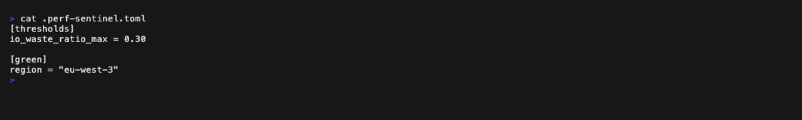
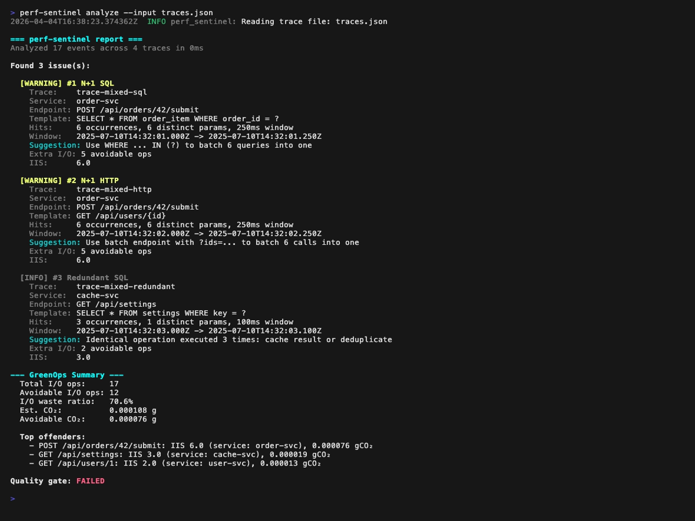

<p align="center">
  <a href="https://www.rust-lang.org/"></a>
  <a href="https://github.com/robintra/perf-sentinel/actions/workflows/ci.yml"></a>
  <a href="https://github.com/robintra/perf-sentinel/actions/workflows/security-audit.yml"></a>
  <a href="https://sonarcloud.io/summary/overall?id=robintrassard_perf-sentinel"></a>
  <a href="https://sonarcloud.io/summary/overall?id=robintrassard_perf-sentinel"></a>
</p>

<picture>
  <source media="(prefers-color-scheme: dark)" srcset="https://raw.githubusercontent.com/robintra/perf-sentinel/main/logo/logo-dark-horizontal.svg">
  
</picture>

Analyzes runtime traces (SQL queries, HTTP calls) to detect N+1 queries, redundant calls, and scores I/O intensity per endpoint (GreenOps).

## Why perf-sentinel?

Performance anti-patterns like N+1 queries exist in any application that does I/O: monoliths and microservices alike. In distributed architectures, a single user request cascades across multiple services, each with its own I/O, and nobody has visibility on the full path. Existing tools are either runtime-specific (Hypersistence Utils -> JPA only), heavy and proprietary (Datadog, New Relic), or limited to unit tests without cross-service visibility.

perf-sentinel takes a different approach: **protocol-level analysis**. It observes the traces your application produces (SQL queries, HTTP calls) regardless of language or ORM. It doesn't need to understand JPA, EF Core, or SeaORM, it sees the queries they generate.

## GreenOps: built-in carbon-aware scoring

Every finding includes an **I/O Intensity Score (IIS)**: the number of I/O operations generated per user request for a given endpoint. Reducing unnecessary I/O (N+1 queries, redundant calls) improves response times *and* reduces energy consumption, these are not competing goals.

- **I/O Intensity Score** = total I/O ops for an endpoint / number of invocations
- **I/O Waste Ratio** = avoidable I/O ops (from findings) / total I/O ops

Aligned with the **Energy** component of the [SCI model (ISO/IEC 21031:2024)](https://github.com/Green-Software-Foundation/sci) from the Green Software Foundation.

## How does it compare?

| Criteria           | [Hypersistence Utils](https://github.com/vladmihalcea/hypersistence-utils) | [Datadog APM](https://www.datadoghq.com/product/apm/) | [New Relic APM](https://newrelic.com/platform/application-monitoring) | [Digma](https://digma.ai/) | **perf-sentinel** |
|--------------------|----------------------------------------------------------------------------|-------------------------------------------------------|-----------------------------------------------------------------------|----------------------------|-------------------|
| N+1 SQL detection  | ✅ JPA only                                                                 | ✅ (runtime)                                           | ✅ (runtime)                                                           | ✅ (JVM)                    | ✅ Polyglot        |
| N+1 HTTP detection | ❌                                                                          | ✅                                                     | ✅                                                                     | ⚠️ Partial                 | ✅                 |
| Polyglot           | ❌ Java/JPA                                                                 | ✅ (per-language agents)                               | ✅ (per-language agents)                                               | ❌ JVM                      | ✅ Protocol-level  |
| Cross-service      | ❌                                                                          | ✅                                                     | ✅                                                                     | ⚠️ Partial                 | ✅ Trace ID        |
| GreenOps / SCI     | ❌                                                                          | ❌                                                     | ❌                                                                     | ❌                          | ✅ Built-in        |
| Lightweight        | N/A (lib)                                                                  | ❌ (~150 MB)                                           | ❌ (~150 MB)                                                           | ❌ (~100 MB)                | ✅ (<10 MB RSS)    |
| Open-source        | ✅ MIT                                                                      | ❌                                                     | ⚠️ Limited free tier                                                  | ⚠️ Freemium                | ✅ AGPL v3         |
| CI/CD quality gate | ⚠️ (manual assertions)                                                     | ❌                                                     | ⚠️ (alerts, no native gate)                                           | ⚠️                         | ✅ Native          |

## What does it report?

For each detected anti-pattern, perf-sentinel reports:

- **Type:** N+1 SQL, N+1 HTTP, redundant query, slow SQL, slow HTTP, or excessive fanout
- **Normalized template:** the query or URL with parameters replaced by placeholders (`?`, `{id}`)
- **Occurrences:** how many times the pattern fired within the detection window
- **Source endpoint:** which application endpoint triggered it (e.g. `GET /api/orders`)
- **Suggestion:** e.g. "batch this query", "use a batch endpoint", "consider adding an index"
- **GreenOps impact:** estimated avoidable I/O ops, I/O Intensity Score, and optional gCO2eq conversion (when a cloud region is configured)


<details>
<summary>Still frames</summary>

**Configuration** (`.perf-sentinel.toml`):



**Analysis report:**



</details>

In CI mode (`perf-sentinel analyze --ci`), the output is a structured JSON report:

<details>
<summary>Example JSON report</summary>

```json
{
  "analysis": {
    "duration_ms": 1,
    "events_processed": 6,
    "traces_analyzed": 1
  },
  "findings": [
    {
      "type": "n_plus_one_sql",
      "severity": "warning",
      "trace_id": "trace-n1-sql",
      "service": "game",
      "source_endpoint": "POST /api/game/42/start",
      "pattern": {
        "template": "SELECT * FROM player WHERE game_id = ?",
        "occurrences": 6,
        "window_ms": 250,
        "distinct_params": 6
      },
      "suggestion": "Use WHERE ... IN (?) to batch 6 queries into one",
      "first_timestamp": "2025-07-10T14:32:01.000Z",
      "last_timestamp": "2025-07-10T14:32:01.250Z",
      "green_impact": {
        "estimated_extra_io_ops": 5,
        "io_intensity_score": 6.0
      }
    }
  ],
  "green_summary": {
    "total_io_ops": 6,
    "avoidable_io_ops": 5,
    "io_waste_ratio": 0.833,
    "top_offenders": [
      {
        "endpoint": "POST /api/game/42/start",
        "service": "game",
        "io_intensity_score": 6.0,
        "io_ops_per_request": 6.0
      }
    ]
  },
  "quality_gate": {
    "passed": false,
    "rules": [
      { "rule": "n_plus_one_sql_critical_max", "threshold": 0.0, "actual": 0.0, "passed": true },
      { "rule": "n_plus_one_http_warning_max", "threshold": 3.0, "actual": 0.0, "passed": true },
      { "rule": "io_waste_ratio_max", "threshold": 0.3, "actual": 0.833, "passed": false }
    ]
  }
}
```

</details>

## Getting Started

### Install from crates.io

```bash
cargo install sentinel-cli
```

### Download a prebuilt binary

Binaries for Linux (amd64, arm64), macOS (arm64), and Windows (amd64) are available on the [GitHub Releases](https://github.com/robintra/perf-sentinel/releases) page. macOS Intel users can run the arm64 binary via Rosetta 2.

```bash
# Example: Linux amd64
curl -LO https://github.com/robintra/perf-sentinel/releases/latest/download/perf-sentinel-linux-amd64
chmod +x perf-sentinel-linux-amd64
sudo mv perf-sentinel-linux-amd64 /usr/local/bin/perf-sentinel
```

### Run with Docker

```bash
docker run --rm -p 4317:4317 -p 4318:4318 ghcr.io/robintra/perf-sentinel:latest
```

### Quick demo

```bash
perf-sentinel demo
```

### Batch analysis (CI)

```bash
perf-sentinel analyze --input traces.json --ci
```

### Explain a trace

```bash
perf-sentinel explain --input traces.json --trace-id abc123
```

### SARIF export (GitHub/GitLab code scanning)

```bash
perf-sentinel analyze --input traces.json --format sarif
```

### Import from Jaeger or Zipkin

```bash
# Jaeger JSON export (auto-detected)
perf-sentinel analyze --input jaeger-export.json

# Zipkin JSON v2 (auto-detected)
perf-sentinel analyze --input zipkin-traces.json
```

### Streaming mode (daemon)

```bash
perf-sentinel watch
```

See [docs/INTEGRATION.md](docs/INTEGRATION.md) for language-specific OTLP setup (Java, .NET, Rust), [docs/CONFIGURATION.md](docs/CONFIGURATION.md) for the full configuration reference, and [docs/design/](docs/design/00-INDEX.md) for in-depth design documentation explaining every architectural decision and micro-optimization.

## Roadmap

| Phase | Description                                                                                                                         | Status        |
|-------|-------------------------------------------------------------------------------------------------------------------------------------|---------------|
| **0** | Scaffolding: compilable workspace, CI, stubs                                                                                        | ✅ Done        |
| **1** | N+1 SQL + HTTP detection, normalization, correlation                                                                                | ✅ Done        |
| **2** | GreenOps scoring, OTLP ingestion, CI quality gate                                                                                   | ✅ Done        |
| **3** | Polish, benchmarks, v0.1.0 release                                                                                                  | ✅ Done        |
| **4** | `explain` trace viewer, SARIF export, `pg_stat_statements` ingestion, Jaeger/Zipkin import, Grafana Exemplars, TUI interactive mode | ⏳ In progress |

## License

This project is licensed under the [GNU Affero General Public License v3.0](LICENSE).

