# Architecture

perf-sentinel est un détecteur polyglotte d'anti-patterns de performance, construit sous forme de workspace Rust avec deux crates :

- **sentinel-core** : bibliothèque contenant toute la logique du pipeline
- **sentinel-cli** : binaire fournissant le point d'entrée CLI (`perf-sentinel`)

## Vue d'ensemble du pipeline

```
                         +-----------+
                         |   Entrée  |
                         | JSON/OTLP |
                         +-----+-----+
                               |
                         SpanEvent[]
                               |
                        +------v------+
                        | Normaliser  |
                        |  sql / http |
                        +------+------+
                               |
                       NormalizedEvent[]
                               |
                        +------v------+
                        |  Corréler   |
                        | par trace_id|
                        +------+------+
                               |
                           Trace[]
                               |
                        +------v------+
                        |  Détecter   |
                        | n+1 / dup / |
                        | lent/fanout |
                        +------+------+
                               |
                          Finding[]
                               |
                        +------v------+
                        |   Scorer    |
                        |  GreenOps   |
                        |    CO2      |
                        +------+------+
                               |
                   Finding[] + GreenSummary
                               |
                        +------v-------+
                        |  Rapporter   |
                        |JSON/CLI/SARIF|
                        | / Prometheus |
                        +--------------+
```

<picture>
  <source media="(prefers-color-scheme: dark)" srcset="../diagrams/svg/pipeline_dark.svg">
  
</picture>

## Modes de fonctionnement

### Mode batch (`perf-sentinel analyze`)

Traite un ensemble complet d'événements et produit un rapport unique avec évaluation du quality gate.

```
Vec<SpanEvent>
  -> normalize::normalize_all()        -> Vec<NormalizedEvent>
  -> correlate::correlate()            -> Vec<Trace>
  -> detect::detect()                  -> Vec<Finding>
  -> score::score_green()              -> (Vec<Finding>, GreenSummary)
  -> quality_gate::evaluate()          -> QualityGate
  -> Report { analysis, findings, green_summary, quality_gate }
```

En mode CI (`--ci`), le processus se termine avec le code 1 si le quality gate échoue.

### Mode streaming (`perf-sentinel watch`)

<picture>
  <source media="(prefers-color-scheme: dark)" srcset="../diagrams/svg/daemon_dark.svg">
  
</picture>

Fonctionne comme un daemon, recevant les événements en temps réel et émettant les findings au fur et à mesure de leur détection.

```
OTLP gRPC (port 4317)  \
OTLP HTTP (port 4318)   +---> canal mpsc ---> TraceWindow (LRU + TTL)
Socket unix JSON       /                               |
                                              +--------+--------+
                                              |                 |
                                        Éviction LRU    Éviction TTL
                                              |                 |
                                              +--------+--------+
                                                       |
                                          normalize -> detect -> score
                                                       |
                                              NDJSON findings (stdout)
                                              Prometheus /metrics
```

- Les événements sont normalisés en dehors du verrou TraceWindow pour minimiser le temps de détention du verrou.
- Les traces sont évincées lorsque le cache LRU est plein (`max_active_traces`) ou lorsque le TTL expire (`trace_ttl_ms`).
- À l'éviction, la trace est analysée via les étapes detect et score.
- Les findings sont émis en JSON délimité par des sauts de ligne sur stdout.
- Les métriques Prometheus sont exposées sur le même port HTTP (4318) à `/metrics`.

### API de requête du daemon

<picture>
  <source media="(prefers-color-scheme: dark)" srcset="../diagrams/svg/query-api_dark.svg">
  
</picture>

En mode `watch`, le daemon expose son état interne via des endpoints HTTP sur le port 4318 aux côtés de `/v1/traces` et `/metrics` :

- `GET /api/findings` (filtrable, plafonné à 1000)
- `GET /api/findings/{trace_id}`
- `GET /api/explain/{trace_id}` (arbre de trace avec findings en ligne, depuis la mémoire du daemon)
- `GET /api/correlations` (corrélations cross-trace, plafonné à 1000)
- `GET /api/status` (uptime, traces actives, nombre de findings stockés)

Un `FindingsStore` (ring buffer) retient les findings récents pour l'API (dimensionné par `[daemon] max_retained_findings`, défaut 10k). La sous-commande compagnon `perf-sentinel query` rend ces endpoints en sortie coloré terminal. Gated par `[daemon] api_enabled` (défaut true). Voir [`docs/FR/LIMITATIONS-FR.md`](LIMITATIONS-FR.md#api-de-requêtage-du-daemon) pour le threat model sans authentification.

## Responsabilités des modules

| Module           | Chemin            | Responsabilité                                                                                                                                                                                                                                                                                                                                                                                                                                                                                                                                                                                                                      |
|------------------|-------------------|-------------------------------------------------------------------------------------------------------------------------------------------------------------------------------------------------------------------------------------------------------------------------------------------------------------------------------------------------------------------------------------------------------------------------------------------------------------------------------------------------------------------------------------------------------------------------------------------------------------------------------------|
| **event**        | `event.rs`        | Type central `SpanEvent` (variantes SQL et HTTP) avec timestamp, IDs trace/span, service, opération, cible, durée                                                                                                                                                                                                                                                                                                                                                                                                                                                                                                                   |
| **ingest**       | `ingest/`         | Sources d'entrée : parseur JSON avec auto-détection du format (`json.rs`), import Jaeger JSON (`jaeger.rs`), import Zipkin JSON v2 (`zipkin.rs`), récepteur OTLP gRPC+HTTP (`otlp.rs`). Implémente le trait `IngestSource`. Parseur PostgreSQL `pg_stat_statements` (`pg_stat.rs`) pour l'analyse de hotspots                                                                                                                                                                                                                                                                                                                       |
| **normalize**    | `normalize/`      | Produit des `NormalizedEvent` avec template + paramètres extraits. Tokenizer SQL (`sql.rs`) : remplace les littéraux, UUIDs, listes IN. Normaliseur HTTP (`http.rs`) : remplace les segments numériques/UUID, supprime les paramètres de requête                                                                                                                                                                                                                                                                                                                                                                                    |
| **correlate**    | `correlate/`      | Regroupe les événements par `trace_id`. Mode batch (`mod.rs`) : agrégation par HashMap. Mode streaming (`window.rs`) : cache LRU avec buffer circulaire par trace et éviction TTL                                                                                                                                                                                                                                                                                                                                                                                                                                                   |
| **detect**       | `detect/`         | Détection de patterns sur les traces corrélées. N+1 (`n_plus_one.rs`) : même template, paramètres différents, dans une fenêtre. Redondant (`redundant.rs`) : même template et paramètres. Lent (`slow.rs`) : durée au-dessus du seuil avec template récurrent. Fanout (`fanout.rs`) : span parent avec trop de spans enfants. Service bavard (`chatty.rs`) : trop d'appels HTTP sortants par trace. Saturation du pool (`pool_saturation.rs`) : spans SQL concurrents dépassant le seuil via algorithme de balayage. Appels sérialisés (`serialized.rs`) : appels siblings séquentiels indépendants potentiellement parallélisables |
| **score**        | `score/`          | Scoring GreenOps (`mod.rs`) : IIS par endpoint, ratio de gaspillage, top offenders, green_impact par finding. Pipeline carbone réparti entre `carbon.rs` (table d'intensité grid embarquée, profils, constantes SCI), `carbon_compute.rs` (boucle d'accumulation par span) et `region_breakdown.rs` (fold par région, sélection du model-tag, finalisation du `CarbonReport`). Intégration optionnelle Scaphandre par-processus (`scaphandre.rs`), estimation d'énergie cloud via CPU% + interpolation SPECpower (`cloud_energy/`). Multi-région SCI v1.0 via attribut OTel `cloud.region`, intervalles de confiance, profils horaires pour FR/DE/GB/US-East                                                                                                 |
| **report**       | `report/`         | Formatage de sortie. Rapport JSON (`json.rs`), export SARIF v2.1.0 (`sarif.rs`), sortie CLI colorée (`mod.rs`), métriques Prometheus avec exemplars OpenMetrics (`metrics.rs`)                                                                                                                                                                                                                                                                                                                                                                                                                                                      |
| **quality_gate** | `quality_gate.rs` | Évalue des règles de seuils configurables par rapport aux findings et au résumé green                                                                                                                                                                                                                                                                                                                                                                                                                                                                                                                                               |
| **pipeline**     | `pipeline.rs`     | Connecte toutes les étapes pour le mode batch : normalize -> correlate -> detect -> score -> quality_gate -> Report                                                                                                                                                                                                                                                                                                                                                                                                                                                                                                                 |
| **daemon**       | `daemon/`         | Mode streaming : `mod.rs` héberge `DaemonError` et l'orchestrateur `run()`. Responsabilités réparties entre `event_loop.rs` (boucle tokio::select, éviction TraceWindow, flush detect/score), `listeners.rs` (spawn OTLP gRPC/HTTP, scrapers énergie optionnels), `tls.rs` (chargement certs, `MaybeTlsStream`, boucle HTTPS avec cap de concurrence sur les handshakes), `json_socket.rs` (ingestion NDJSON Unix, cfg(unix)), `sampling.rs` (échantillonnage par hash de trace-id), `findings_store.rs` + `query_api.rs` (findings retenus et endpoints HTTP de requête)                                                                                                                                                                                                                                                                                                                                                                                                                                                                                                  |
| **config**       | `config.rs`       | Parse `.perf-sentinel.toml` avec format sectionné ([thresholds], [detection], [green], [daemon]) et rétrocompatibilité avec le format plat legacy                                                                                                                                                                                                                                                                                                                                                                                                                                                                                   |
| **time**         | `time.rs`         | Helpers de conversion timestamp partagés (`nanos_to_iso8601`, `micros_to_iso8601`). Utilisé par l'ingestion OTLP, Jaeger et Zipkin                                                                                                                                                                                                                                                                                                                                                                                                                                                                                                  |
| **explain**      | `explain.rs`      | Visualiseur d'arbre de trace : construit l'arbre des spans à partir de `parent_span_id`, annote les findings. Sortie texte et JSON                                                                                                                                                                                                                                                                                                                                                                                                                                                                                                  |

## Types principaux

| Type              | Module           | Description                                                                                                                                            |
|-------------------|------------------|--------------------------------------------------------------------------------------------------------------------------------------------------------|
| `SpanEvent`       | event            | Événement I/O brut (requête SQL ou appel HTTP) avec métadonnées et parent_span_id optionnel                                                            |
| `NormalizedEvent` | normalize        | SpanEvent enrichi d'un template normalisé et de paramètres extraits                                                                                    |
| `Trace`           | correlate        | Collection de NormalizedEvents partageant le même trace_id                                                                                             |
| `Finding`         | detect           | Anti-pattern détecté avec type, sévérité, détails du pattern, timestamps, green_impact et `confidence` (CI batch / daemon staging / daemon production) |
| `GreenSummary`    | score            | Statistiques I/O agrégées : total ops, ops évitables, ratio de gaspillage, top offenders, CO2 optionnel                                                |
| `QualityGate`     | quality_gate     | Résultat pass/fail avec évaluations individuelles des règles                                                                                           |
| `Report`          | report           | Sortie d'analyse complète : métadonnées d'analyse, findings, résumé green, quality gate                                                                |
| `Config`          | config           | Configuration parsée avec toutes les sections et champs validés                                                                                        |
| `TraceWindow`     | correlate/window | Cache LRU de traces actives pour le mode streaming avec éviction TTL                                                                                   |

## Frontières des crates

```
sentinel-cli (binaire)
  |
  +-- CLI clap : sous-commandes analyze / explain / watch / demo / bench / inspect / pg-stat / tempo / calibrate
  |
  +-- dépend de sentinel-core (bibliothèque)
        |
        +-- Toute la logique du pipeline
        +-- Traits uniquement aux frontières : IngestSource, ReportSink
        +-- Fonctions pures entre les étapes
```

Le crate CLI est intentionnellement léger : il parse les arguments, charge la configuration et délègue aux fonctions de sentinel-core. Toute la logique métier réside dans sentinel-core.
