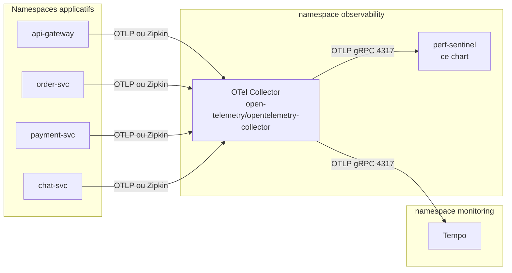

# Guide de déploiement Helm

Ce guide décrit le déploiement de perf-sentinel sur Kubernetes via le chart Helm packagé sous [`charts/perf-sentinel/`](../../charts/perf-sentinel/). Le chart déploie le daemon (`perf-sentinel watch`) derrière un Service `ClusterIP` qui expose OTLP gRPC (4317) et OTLP HTTP plus `/metrics` plus `/api/*` (4318).

Pour une alternative sans Helm, voir les manifests bruts dans [`docs/FR/INSTRUMENTATION-FR.md`](./INSTRUMENTATION-FR.md#déploiement-kubernetes).

## Sommaire

- [TL;DR](#tldr) : commande d'installation en un bloc.
- [Topologie](#topologie) : pourquoi le chart est sentinel-only par design.
- [Installation depuis le registre OCI](#installation-depuis-le-registre-oci) : chemin d'installation production avec vérification Cosign.
- [Artifact Hub](#artifact-hub) : référencement et métadonnées.
- [Chaîne d'approvisionnement logicielle](#chaîne-dapprovisionnement-logicielle) : signatures Cosign keyless, provenance SLSA, SBOM, attestation public-good.
- [Installation depuis un checkout local](#installation-depuis-un-checkout-local) : pour les contributeurs et le bisect.
- [Couper une nouvelle release de chart](#couper-une-nouvelle-release-de-chart) : tâche mainteneur, renvoie vers RELEASE-PROCEDURE.
- [Modes de workload](#modes-de-workload) : trois valeurs de `workload.kind` au choix.
- [Surface de configuration](#surface-de-configuration) : valeurs du chart pour `.perf-sentinel.toml`, plus secrets, TLS et NetworkPolicy.
- [Observabilité](#observabilité) : Prometheus ServiceMonitor, tableau de bord Grafana, alertes et exemplars.
- [Mise à jour](#mise-à-jour) : flux `helm upgrade`.
- [Désinstallation](#désinstallation) : flux `helm uninstall`.
- [Exemple bout en bout](#exemple-bout-en-bout) : exemple complet composant le chart avec le chart upstream OpenTelemetry Collector.

## TL;DR

```bash
helm install perf-sentinel oci://ghcr.io/robintra/charts/perf-sentinel \
  --version 0.2.0 \
  --namespace observability --create-namespace
kubectl --namespace observability get pods -l app.kubernetes.io/name=perf-sentinel
```

Chaque release publiée est signée Cosign en mode keyless, livrée avec une attestation de provenance de build SLSA v1.0, et livrée avec un SBOM SPDX. Voir [Chaîne d'approvisionnement logicielle](#chaîne-dapprovisionnement-logicielle) ci-dessous pour les contrôles avant installation.

Une fois le pod prêt, pointez votre OpenTelemetry Collector vers `perf-sentinel.observability.svc.cluster.local:4317` (gRPC) ou `:4318` (HTTP). Un exemple complet qui compose perf-sentinel avec le chart upstream OTel Collector vit sous [`examples/helm/`](../../examples/helm/).

## Topologie

Le chart est sentinel-only par construction. Les utilisateurs composent perf-sentinel avec le chart upstream [open-telemetry/opentelemetry-collector](https://github.com/open-telemetry/opentelemetry-helm-charts) plutôt que d'embarquer un collector qui dériverait des releases upstream.



## Installation depuis le registre OCI

Le chart est publié en tant qu'artifact OCI sous `oci://ghcr.io/robintra/charts/perf-sentinel`. Chaque version reçoit une signature Cosign keyless (GitHub OIDC, log de transparence Rekor), une attestation de provenance de build SLSA v1.0 stockée sur l'attestation store du repo, et un SBOM SPDX livré à la fois en asset de GitHub Release et en tant qu'attestation signée.

### Pinner une version

```bash
helm install perf-sentinel oci://ghcr.io/robintra/charts/perf-sentinel \
  --version 0.2.0 \
  --namespace observability --create-namespace \
  -f my-values.yaml
```

Le `version` du chart et l'`appVersion` sont découplés : `version` désigne la release du chart, `appVersion` désigne le tag de l'image daemon livrée avec. Chaque release bumpe les deux en lockstep, donc un `--version` pinné donne déjà un `appVersion` connu. N'overridez `image.tag` que pour faire tourner un build daemon précis avec un autre chart.

### Utilisation en subchart ou depuis Argo CD

`oci://ghcr.io/robintra/charts/perf-sentinel` est l'URL complète du chart, la forme attendue par `helm install`. Une entrée `dependencies:` attend au contraire le namespace parent, car Helm concatène `name` à `repository` :

```yaml
dependencies:
  - name: perf-sentinel
    version: 0.9.14
    repository: oci://ghcr.io/robintra/charts   # le namespace, pas l'URL du chart
```

Même découpage pour une `Application` Argo CD : `repoURL: ghcr.io/robintra/charts` plus `chart: perf-sentinel`.

Répéter le nom du chart dans `repository` résout vers `charts/perf-sentinel/perf-sentinel`, qui n'existe pas. En anonyme, ghcr.io répond `403 denied` plutôt que `404` sur un chemin manquant : l'échec ressemble donc à un problème de registre privé alors que c'est un problème de chemin. Pour confirmer que l'artifact est bien public, récupérez un token anonyme et tirez le manifest :

```bash
token=$(curl -s "https://ghcr.io/token?scope=repository%3Arobintra%2Fcharts%2Fperf-sentinel%3Apull&service=ghcr.io" | jq -r .token)
curl -s -o /dev/null -w '%{http_code}\n' -H "Authorization: Bearer $token" \
  -H 'Accept: application/vnd.oci.image.manifest.v1+json' \
  https://ghcr.io/v2/robintra/charts/perf-sentinel/manifests/0.9.14
```

## Artifact Hub

Le chart est indexé sur [Artifact Hub](https://artifacthub.io), où
les utilisateurs peuvent le découvrir, explorer son values schema
et consulter le changelog.

Flow d'enregistrement (réalisé une fois par le mainteneur du chart) :

1. Connectez-vous sur artifacthub.io avec un compte GitHub.
2. Dans le panel de contrôle, ajoutez un repository de kind "Helm
   charts (OCI)" pointant vers
   `oci://ghcr.io/robintra/charts/perf-sentinel`.
3. Artifact Hub délivre un `repositoryID` (UUID).
4. Éditez `charts/perf-sentinel/artifacthub-repo.yml`, remplacez le
   placeholder `REPLACE_AFTER_ARTIFACTHUB_REGISTRATION` par l'UUID,
   committez et poussez.
5. Taggez une nouvelle release de chart (patch bump) pour que le
   workflow de release pousse le `artifacthub-repo.yml` mis à jour
   sur le registry OCI sous le tag spécial `artifacthub.io`.
6. Artifact Hub scrute le registry et récupère les nouvelles
   métadonnées en moins de 30 minutes. Le badge "Verified
   publisher" apparaît au prochain cycle de traitement.

## Chaîne d'approvisionnement logicielle

> **Voir aussi.** L'[introduction à Sigstore](SUPPLY-CHAIN-FR.md#introduction-à-sigstore) dans la doc supply-chain définit Cosign, Fulcio, Rekor, in-toto, OIDC, SLSA et SBOM utilisés dans cette section.

Chaque release publiée est signée Cosign en mode keyless, livrée
avec une attestation de provenance de build SLSA v1.0, et livrée
avec un SBOM SPDX attesté sous le prédicat SPDX. Vérifiez au minimum
la signature Cosign avant d'installer, et l'ensemble en
environnement régulé.

### Vérifier la signature Cosign

La vérification Cosign keyless relie chaque release à un run spécifique du workflow GitHub Actions. L'identité du certificat doit matcher le workflow de release publié, et l'OIDC issuer doit être GitHub Actions :

```bash
cosign verify \
  --certificate-identity-regexp '^https://github.com/robintra/perf-sentinel/\.github/workflows/helm-release\.yml@refs/tags/chart-v' \
  --certificate-oidc-issuer https://token.actions.githubusercontent.com \
  ghcr.io/robintra/charts/perf-sentinel:0.2.0
```

Un run réussi affiche l'entrée du log Rekor et les détails du certificat. Un mismatch ou une absence de signature retourne un code non nul.

### Vérifier la provenance de build SLSA

Chaque tarball de chart publié porte une attestation de provenance de build SLSA v1.0 produite par `actions/attest-build-provenance` et stockée sur l'attestation store du repo (pas sur le registry OCI). L'attestation est interrogeable via `gh` :

```bash
gh release download chart-v0.2.0 \
  --repo robintra/perf-sentinel \
  --pattern 'perf-sentinel-*.tgz'

gh attestation verify perf-sentinel-0.2.0.tgz \
  --repo robintra/perf-sentinel
```

Si vous avez déjà récupéré l'artifact OCI et préférez ne pas fetcher
le tarball, vérifiez la provenance de build directement contre la
référence OCI :

```bash
docker login ghcr.io
gh attestation verify oci://ghcr.io/robintra/charts/perf-sentinel:0.2.0 \
  --repo robintra/perf-sentinel
```

Les deux recettes produisent la même assurance. Associez celle que
vous choisissez au contrôle de signature Cosign ci-dessus pour
confirmer à la fois l'identité du signataire sur l'artifact OCI et
la provenance de build sur le tarball.

### Vérifier le SBOM

Chaque release livre un SBOM SPDX en tant qu'asset de GitHub Release
et en tant qu'attestation signée sur l'attestation store du repo.

Le sujet de l'attestation SBOM est le tarball du chart, pas le fichier SBOM,
donc vérifiez-la contre le tarball, exactement comme le contrôle de provenance
ci-dessus. Le filtre `--predicate-type` sélectionne l'attestation SBOM SPDX
plutôt que celle de provenance de build :

```bash
gh release download chart-v0.2.0 --repo robintra/perf-sentinel \
  --pattern 'perf-sentinel-*.tgz' \
  --pattern 'perf-sentinel-chart-*.spdx.json'

gh attestation verify perf-sentinel-0.2.0.tgz \
  --repo robintra/perf-sentinel \
  --predicate-type https://spdx.dev/Document/v2.3
```

Le `perf-sentinel-chart-0.2.0.spdx.json` téléchargé est la copie lisible de ce
SBOM attesté. Il capture les dépendances déclarées du chart au moment de la
release.

## Installation depuis un checkout local

Pour les contributeurs et les utilisateurs qui veulent inspecter, patcher ou bisect le chart avant de l'installer, un clone local fonctionne toujours :

```bash
git clone https://github.com/robintra/perf-sentinel.git
cd perf-sentinel

# Inspectez ou surchargez les valeurs par défaut avant install.
helm show values ./charts/perf-sentinel > my-values.yaml

helm install perf-sentinel ./charts/perf-sentinel \
  --namespace observability --create-namespace \
  -f my-values.yaml
```

Gardez le path OCI pour les installs de production. Le path local contourne volontairement les contrôles Cosign et SLSA, il ne devrait pas être utilisé sur des clusters partagés sauf si vous avez buildé le chart vous-même.

## Couper une nouvelle release de chart

Publier une nouvelle version du chart est une tâche mainteneur, pas une étape de déploiement. La procédure complète (bump du chart en lockstep, puis `scripts/release-chart.sh chart-vA.B.C`, qui gate sur la publication de l'image daemon) est dans [`RELEASE-PROCEDURE-FR.md`](./RELEASE-PROCEDURE-FR.md).

## Modes de workload

Le chart accepte trois valeurs pour `workload.kind`. Choisissez-en une par installation.

### `Deployment` (par défaut)

Un daemon unique derrière un Service `ClusterIP`. C'est la topologie recommandée. perf-sentinel est stateful par trace (la `TraceWindow` vit en mémoire), donc exécuter un seul daemon et scaler verticalement est le bon premier mouvement. La [topologie shardée](../../examples/docker-compose-sharded.yml) est disponible pour des déploiements multi-daemon. Elle repose sur un consistent hashing par `trace_id` dans le `loadbalancingexporter` du Collector OTel afin que toutes les spans d'une trace atterrissent sur la même instance daemon.

```yaml
workload:
  kind: Deployment
  replicas: 1
```

> **Scalabilité et état.** Les replicas ne partagent jamais d'état. La
> détection par trace reste correcte entre replicas uniquement avec le
> load balancing par `trace_id` décrit ci-dessus. La corrélation
> cross-service est mono-processus et ne voit que ce qu'un daemon met en
> tampon, donc faites-la tourner sur une instance unique qui reçoit tous
> les services à corréler. Le daemon draine sa fenêtre en vol sur
> SIGTERM, donc un rolling update ou un scale-down normal ne perd rien.
> Seul un kill non gracieux (SIGKILL après la période de grâce, OOM)
> jette la fenêtre, et cela coûte au plus `trace_ttl_ms` de détection de
> patterns récurrents. Détails dans
> [LIMITATIONS-FR.md](./LIMITATIONS-FR.md#modèle-détat-du-daemon-en-mémoire-mono-processus-sans-état-partagé).

### `DaemonSet`

Rare. Utile uniquement si vous avez une exigence dure d'avoir un daemon sur chaque noeud (par exemple pour remplacer un forwarder de traces node-local existant). Un DaemonSet répartit les traces sur plusieurs noeuds, ce qui casse la détection N+1 sauf si un collector en amont garantit que toutes les spans d'une trace rejoignent le même daemon. La plupart des utilisateurs n'ont pas besoin de ce mode.

```yaml
workload:
  kind: DaemonSet
```

### `StatefulSet`

Utilisez ce mode quand vous voulez que les acks runtime
(`POST /api/findings/{sig}/ack`, depuis 0.5.20) survivent aux redémarrages de pod. Le daemon écrit le store JSONL des acks à
`~/.local/share/perf-sentinel/acks.jsonl` par défaut, ce qui résout vers un chemin du système de fichiers du pod, perdu au restart. Montez un PersistentVolume et pointez `[daemon.ack] storage_path` dessus pour conserver l'audit trail. Les acks TOML CI
(`.perf-sentinel-acknowledgments.toml`) sont en lecture seule au runtime et n'ont pas besoin de PVC, seul le JSONL côté daemon en a besoin.

```yaml
workload:
  kind: StatefulSet
  replicas: 1
  statefulset:
    persistence:
      enabled: true
      size: 5Gi
      storageClass: gp3
      mountPath: /var/lib/perf-sentinel

config:
  toml: |
    [daemon.ack]
    storage_path = "/var/lib/perf-sentinel/acks.jsonl"
```

En mode `Deployment` (par défaut), le JSONL est créé au premier ack et perdu au redémarrage suivant du pod. Acceptable pour des acks à courte durée de vie (différés au prochain sprint), pas pour des acks permanents qui doivent de toute façon vivre dans la baseline TOML CI.

## Surface de configuration

Le chart monte une unique ConfigMap sur `/etc/perf-sentinel/.perf-sentinel.toml`. Éditez le contenu via `values.yaml` :

```yaml
config:
  toml: |
    [thresholds]
    n_plus_one_sql_critical_max = 0
    io_waste_ratio_max = 0.25

    [green]
    enabled = true
    default_region = "eu-west-3"

    [daemon]
    listen_address = "0.0.0.0"
    environment = "production"
```

Référence complète des champs : [`docs/FR/CONFIGURATION-FR.md`](./CONFIGURATION-FR.md).

### Secrets

Le fichier TOML ne doit jamais contenir de secrets (le daemon rejette les champs credentiels au chargement de la config). Injectez les valeurs sensibles via des variables d'environnement alimentées par un Secret :

```bash
kubectl -n observability create secret generic perf-sentinel-secrets \
  --from-literal=PERF_SENTINEL_EMAPS_TOKEN=sk-your-token
```

```yaml
extraEnvFrom:
  - secretRef:
      name: perf-sentinel-secrets
```

perf-sentinel ne lit pas directement les variables d'environnement pour sa configuration. Le pattern est donc : le Secret entre dans l'environnement du pod, et le fichier de configuration référence les variables via `env:VAR_NAME` pour les quelques champs qui supportent cette forme (par exemple `api_key` pour Electricity Maps). Voir la section "Environment variables" de `docs/FR/CONFIGURATION-FR.md`.

### Fichiers de calibration et certificats TLS

Les deux passent par `extraVolumes` plus `extraVolumeMounts` :

```yaml
extraVolumes:
  - name: tls
    secret:
      secretName: perf-sentinel-tls
      defaultMode: 0400
extraVolumeMounts:
  - name: tls
    mountPath: /etc/tls
    readOnly: true

config:
  toml: |
    [daemon]
    tls_cert_path = "/etc/tls/tls.crt"
    tls_key_path = "/etc/tls/tls.key"
```

### Store d'acks runtime du daemon

Le daemon 0.5.20 ajoute trois endpoints d'ack runtime
(`POST` / `DELETE /api/findings/{signature}/ack` et `GET /api/acks`) sur le port existant de l'API de requêtage. Ils partagent la posture loopback par défaut de `/api/findings`, mais ils mutent l'état, donc trois décisions opérateur s'imposent quand le chart est déployé sur un `listen_address` non-loopback.

**Authentifier les écritures quand le daemon est exposé sur le réseau du pod.** Les snippets `values.yaml` plus haut utilisent `listen_address = "0.0.0.0"` pour la joignabilité cluster-wide. Sans mTLS en frontal, configurez `[daemon.ack] api_key` avec un secret de 16+ caractères injecté par un Secret Kubernetes, sans quoi les nouveaux verbes `POST` et `DELETE` sont exposés :

```yaml
extraEnvFrom:
  - secretRef:
      name: perf-sentinel-secrets

config:
  toml: |
    [daemon]
    listen_address = "0.0.0.0"
    [daemon.ack]
    api_key = "env:PERF_SENTINEL_ACK_API_KEY"
```

Le daemon hard-rejette au config load les clés de moins de 12 caractères. Les lectures (`GET /api/findings`, `GET /api/acks`) restent non authentifiées par design, l'api_key ne protège que les écritures.

**Faire survivre les acks aux redémarrages de pod.** Chemin de stockage par défaut : `~/.local/share/perf-sentinel/acks.jsonl`, dans le système de fichiers du pod, perdu au restart. Bascule en mode `StatefulSet` (cf. ci-dessus) et remappage de `[daemon.ack] storage_path` sur un mount PVC.

**Attention au plancher du `securityContext`.** Le daemon ouvre le JSONL avec `O_NOFOLLOW` et rejette les fichiers pré-existants dont le mode autorise des accès group/other (`mode & 0o077 != 0`). Définir `runAsUser` et `fsGroup` de telle sorte que l'UID du daemon n'est pas propriétaire du mount PVC, ou adopter une `PodSecurityPolicy` restrictive qui force un umask plus large sur les volume mounts, fera apparaître `InsecurePermissions` au démarrage et le store d'acks sera indisponible. Le daemon reste up sans lui (les trois endpoints ack renvoient 503), donc c'est une défaillance soft, vérifiez quand même la ligne de log WARN au premier rollout.

**Charger la baseline TOML CI depuis une ConfigMap.** Montez `.perf-sentinel-acknowledgments.toml` via `extraVolumes` et pointez `[daemon.ack] toml_path` dessus pour que le daemon ait une vue unifiée des acks permanents (TOML) et runtime (JSONL). Le POST runtime renvoie `409 Conflict` sur les signatures déjà couvertes par un ack TOML actif, ce qui empêche le daemon de masquer silencieusement la baseline validée par l'équipe.

```yaml
extraVolumes:
  - name: ack-toml
    configMap:
      name: perf-sentinel-acks
extraVolumeMounts:
  - name: ack-toml
    mountPath: /etc/perf-sentinel/acks
    readOnly: true

config:
  toml: |
    [daemon.ack]
    toml_path = "/etc/perf-sentinel/acks/.perf-sentinel-acknowledgments.toml"
```

Voir `docs/FR/QUERY-API-FR.md` et `docs/FR/CONFIGURATION-FR.md` pour la référence complète des endpoints et le catalogue des champs `[daemon.ack]`.

### NetworkPolicy

Le chart peut rendre une `NetworkPolicy` qui restreint qui peut joindre les
ports d'ingestion et de métriques du daemon. Elle est désactivée par défaut
et fail-closed : l'activer sans selectors bloque tout ingress, vous devez
donc allow-lister les namespaces ou pods qui parlent légitimement à
perf-sentinel, typiquement le collecteur OTel (OTLP 4317 et 4318) et
Prometheus (`/metrics` sur 4318).

```yaml
networkPolicy:
  enabled: true
  ingress:
    fromNamespaceSelectors:
      - matchLabels:
          kubernetes.io/metadata.name: observability
    fromPodSelectors:
      - matchLabels:
          app.kubernetes.io/name: otel-collector
```

Les deux listes de selectors sont combinées en OU : une source d'ingress qui
correspond à n'importe quelle entrée de l'une ou l'autre liste est autorisée.
Laissez une liste vide pour ignorer cette dimension de correspondance.

## Observabilité

> **Voir aussi.** L'[introduction à Prometheus et OpenMetrics](METRICS-FR.md#introduction-à-prometheus-et-openmetrics) définit le scraping, les exemplars et les types Counter/Gauge/Histogram référencés ci-dessous.

### ServiceMonitor Prometheus

Quand le Prometheus Operator est installé, basculez `serviceMonitor.enabled` à `true` pour scraper `/metrics` sur le port 4318 :

```yaml
serviceMonitor:
  enabled: true
  interval: 15s
  scrapeTimeout: 10s
  labels:
    # Adaptez au sélecteur de votre ressource Prometheus.
    release: prometheus
```

#### Dashboards qui scrapent `/api/findings`

Depuis 0.5.20, `GET /api/findings` filtre par défaut les findings acquittés. Les dashboards ou règles d'alerte existants qui interrogent l'endpoint et comptent les résultats vont silencieusement passer à côté de findings critiques si ceux-ci ont été acquittés au runtime ou par la baseline TOML CI. Deux options pour câbler un panel Prometheus ou Grafana sur l'endpoint :

- Passer `?include_acked=true` et s'appuyer sur l'annotation `acknowledged_by` de la réponse pour filtrer ou colorer les lignes côté client. Garde le compteur visiblement haut quand un ack a atterri tout en laissant l'opérateur voir ce qui est silencé.
- Garder la shape par défaut filtrée et documenter l'alerte comme "findings actifs uniquement", avec un panel séparé qui liste `GET /api/acks` pour rendre l'ensemble acquitté reviewable.

Les compteurs `/metrics` (`perf_sentinel_findings_total`, `perf_sentinel_io_waste_ratio`) ne sont pas affectés, ils enregistrent les événements de détection bruts sans aucun filtre d'ack.

### Tableau de bord Grafana

Un tableau de bord prêt à l'emploi est fourni dans le dépôt à
[`examples/grafana-dashboard.json`](../../examples/grafana-dashboard.json)
(titre `perf-sentinel overview`, uid `perf-sentinel-overview`, 20 panneaux :
opérations d'E/S et ratio de gaspillage, types de findings par sévérité,
p95 des requêtes lentes, traces actives, santé du daemon, plus les jauges
d'énergie, de carbone et de marge runtime issues des compteurs `/metrics`
scrapés ci-dessus). Le chart ne l'embarque pas, pour la même raison qu'il
n'embarque pas de collecteur : un tableau de bord figé dans le chart dérive
du Grafana que vous exploitez déjà. Importez-le de deux façons.

Import manuel : dans Grafana, ouvrez Dashboards puis Import, téléversez le
JSON, et mappez l'entrée `DS_PROMETHEUS` sur votre datasource Prometheus.

Import par sidecar (kube-prometheus-stack et similaires) : chargez le JSON
dans une ConfigMap étiquetée pour que le sidecar Grafana la découvre
automatiquement.

```bash
kubectl -n observability create configmap perf-sentinel-grafana \
  --from-file=perf-sentinel-overview.json=examples/grafana-dashboard.json
kubectl -n observability label configmap perf-sentinel-grafana \
  grafana_dashboard=1
```

La clé d'étiquette (`grafana_dashboard` ici) doit correspondre au
`dashboards.sidecar.label` configuré pour votre sidecar Grafana.

### Règles d'alerte (PrometheusRule)

Le chart fournit une `PrometheusRule` pour que les alertes de perte et de
saturation soient livrées, plutôt qu'un exercice de câblage à faire soi-même.
Elle est conditionnée comme le ServiceMonitor et désactivée par défaut :

```yaml
prometheusRule:
  enabled: true
  labels:
    # Adaptez au ruleSelector de votre ressource Prometheus.
    release: prometheus
  # N'ajoutez les alertes de péremption des scrapers d'énergie par backend
  # que lorsqu'un backend énergie (Alumet, Scaphandre, Kepler, Redfish, cloud_energy)
  # est configuré.
  energyScrapers: false
  scraperStaleSeconds: 120
```

Le groupe par défaut `perf-sentinel.rules` couvre le daemon injoignable
(`absent(perf_sentinel_active_traces)`), le rejet OTLP, le délestage d'analyse
et la saturation de file, l'éviction de paires du corrélateur, et le
débordement de cardinalité de services. La `description` de chaque alerte
nomme le paramètre `[daemon]` à relever. Ajoutez les vôtres via
`prometheusRule.additionalRules` (les règles sont passées telles quelles dans
le même groupe), sans fork.

### PodDisruptionBudget

Le défaut est mono-réplique, où un PDB a peu d'effet : `maxUnavailable: 1` autorise
quand même l'éviction et `minAvailable: 1` bloquerait chaque drain de nœud. Quand la
collecte sans interruption compte (par exemple des données carbone sans trou pour
`disclose`), passez à une topologie shardée multi-répliques avec `minAvailable`, et
utilisez le mode StatefulSet pour que les fenêtres archivées survivent aux redémarrages.

```yaml
podDisruptionBudget:
  enabled: true
  maxUnavailable: 1
```

### Exemplars

perf-sentinel émet des exemplars Prometheus sur `perf_sentinel_findings_total`, `perf_sentinel_io_waste_ratio` et `perf_sentinel_slow_duration_seconds`. Activez le stockage des exemplars côté Prometheus :

```yaml
prometheus:
  prometheusSpec:
    enableFeatures:
      - exemplar-storage
```

Puis configurez Grafana pour cliquer de la métrique vers la trace :

```yaml
datasources:
  - name: Prometheus
    type: prometheus
    jsonData:
      exemplarTraceIdDestinations:
        - name: trace_id
          datasourceUid: tempo
```

### Sans le Prometheus Operator

Si vous utilisez un Prometheus vanilla sans operator, ajoutez une entrée de scrape statique :

```yaml
scrape_configs:
  - job_name: perf-sentinel
    kubernetes_sd_configs:
      - role: service
        namespaces:
          names: [observability]
    relabel_configs:
      - source_labels: [__meta_kubernetes_service_label_app_kubernetes_io_name]
        regex: perf-sentinel
        action: keep
      - source_labels: [__meta_kubernetes_endpoint_port_name]
        regex: otlp-http
        action: keep
```

## Mise à jour

```bash
helm upgrade perf-sentinel ./charts/perf-sentinel \
  --namespace observability \
  -f my-values.yaml
```

Le daemon ne recharge pas sa config à chaud, donc les modifications de `config.toml` exigent un redémarrage du pod. Le chart gère cela automatiquement : une annotation `checksum/config` sur le pod template calcule un hash de la ConfigMap rendue, donc chaque édition de config bump l'annotation et déclenche un rolling restart. Aucun `kubectl rollout restart` manuel n'est nécessaire.

Lors d'un bump du chart vers un nouveau `appVersion`, pinnez `image.tag` explicitement et relisez `CHANGELOG.md` pour repérer les breaking changes de config. Le chart ne valide pas encore que la version du daemon corresponde à la version du chart, cette responsabilité incombe à l'opérateur.

## Désinstallation

```bash
helm uninstall perf-sentinel --namespace observability
```

Cela supprime le Deployment, le Service, la ConfigMap, le ServiceAccount et (quand ils sont créés) le ServiceMonitor et la NetworkPolicy. Le mode StatefulSet avec persistance conserve les PersistentVolumeClaims sous-jacents par défaut, conformément à la sémantique Kubernetes. Supprimez-les explicitement si vous voulez nettoyer l'état :

```bash
kubectl --namespace observability delete pvc \
  -l app.kubernetes.io/instance=perf-sentinel
```

## Exemple bout en bout

[`examples/helm/`](../../examples/helm/) fournit deux fichiers de valeurs qui composent le chart perf-sentinel avec le chart upstream OTel Collector dans une topologie fanout Zipkin + OTLP vers Tempo et perf-sentinel. Suivez le README de ce répertoire pour la recette complète d'installation et de vérification.
