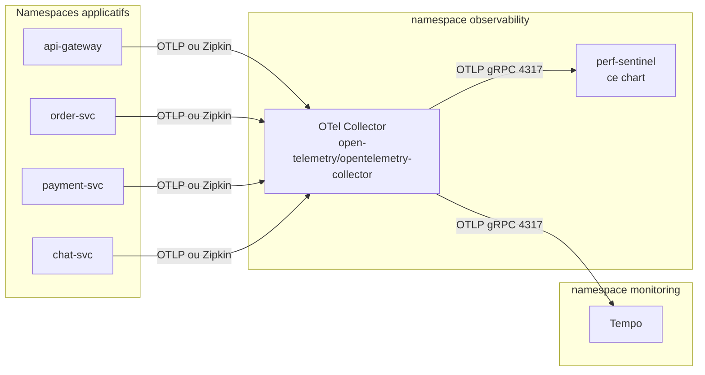

# Guide de déploiement Helm

Ce guide décrit le déploiement de perf-sentinel sur Kubernetes via le chart Helm packagé sous [`charts/perf-sentinel/`](../../charts/perf-sentinel/). Le chart déploie le daemon (`perf-sentinel watch`) derrière un Service `ClusterIP` qui expose OTLP gRPC (4317) et OTLP HTTP plus `/metrics` plus `/api/*` (4318).

Pour une alternative sans Helm, voir les manifests bruts dans [`docs/FR/INTEGRATION-FR.md`](./INTEGRATION-FR.md#déploiement-kubernetes).

## TL;DR

```bash
helm install perf-sentinel oci://ghcr.io/robintra/charts/perf-sentinel \
  --version 0.2.0 \
  --namespace observability --create-namespace
kubectl --namespace observability get pods -l app.kubernetes.io/name=perf-sentinel
```

Chaque release publiée est signée Cosign en mode keyless, livrée avec une attestation de provenance de build SLSA v1.0, et livrée avec un SBOM SPDX. Voir [Chaîne d'approvisionnement logicielle](#chaîne-dapprovisionnement-logicielle) ci-dessous pour les contrôles avant installation.

Une fois le pod prêt, pointez votre OpenTelemetry Collector vers `perf-sentinel.observability.svc.cluster.local:4317` (gRPC) ou `:4318` (HTTP). Un exemple complet qui compose perf-sentinel avec le chart upstream OTel Collector vit sous [`examples/helm/`](../../examples/helm/).

## Topologie

Le chart est sentinel-only par construction. Les utilisateurs composent perf-sentinel avec le chart upstream [open-telemetry/opentelemetry-collector](https://github.com/open-telemetry/opentelemetry-helm-charts) plutôt que d'embarquer un collector qui dériverait des releases upstream.



## Installation depuis le registre OCI

Le chart est publié en tant qu'artifact OCI sous `oci://ghcr.io/robintra/charts/perf-sentinel`. Chaque version reçoit une signature Cosign keyless (GitHub OIDC, log de transparence Rekor), une attestation de provenance de build SLSA v1.0 stockée sur l'attestation store du repo, et un SBOM SPDX livré à la fois en asset de GitHub Release et en tant qu'attestation signée.

### Pinner une version

```bash
helm install perf-sentinel oci://ghcr.io/robintra/charts/perf-sentinel \
  --version 0.2.0 \
  --namespace observability --create-namespace \
  -f my-values.yaml
```

Le `version` du chart et l'`appVersion` sont découplés : `version` désigne la release du chart, `appVersion` désigne le tag de l'image daemon livrée avec. En production, pinnez explicitement le tag via `image.tag` pour éviter la dérive quand une nouvelle version du chart est publiée.

## Artifact Hub

Le chart est indexé sur [Artifact Hub](https://artifacthub.io), où
les utilisateurs peuvent le découvrir, explorer son values schema
et consulter le changelog.

Flow d'enregistrement (réalisé une fois par le mainteneur du chart) :

1. Connectez-vous sur artifacthub.io avec un compte GitHub.
2. Dans le panel de contrôle, ajoutez un repository de kind "Helm
   charts (OCI)" pointant vers
   `oci://ghcr.io/robintra/charts/perf-sentinel`.
3. Artifact Hub délivre un `repositoryID` (UUID).
4. Éditez `charts/perf-sentinel/artifacthub-repo.yml`, remplacez le
   placeholder `REPLACE_AFTER_ARTIFACTHUB_REGISTRATION` par l'UUID,
   committez et poussez.
5. Taggez une nouvelle release de chart (patch bump) pour que le
   workflow de release pousse le `artifacthub-repo.yml` mis à jour
   sur le registry OCI sous le tag spécial `artifacthub.io`.
6. Artifact Hub scrute le registry et récupère les nouvelles
   métadonnées en moins de 30 minutes. Le badge "Verified
   publisher" apparaît au prochain cycle de traitement.

## Chaîne d'approvisionnement logicielle

Chaque release publiée est signée Cosign en mode keyless, livrée
avec une attestation de provenance de build SLSA v1.0, et livrée
avec un SBOM SPDX attesté sous le prédicat SPDX. Vérifiez au minimum
la signature Cosign avant d'installer, et l'ensemble en
environnement régulé.

### Vérifier la signature Cosign

La vérification Cosign keyless relie chaque release à un run spécifique du workflow GitHub Actions. L'identité du certificat doit matcher le workflow de release publié, et l'OIDC issuer doit être GitHub Actions :

```bash
cosign verify \
  --certificate-identity-regexp '^https://github.com/robintra/perf-sentinel/\.github/workflows/helm-release\.yml@refs/tags/chart-v' \
  --certificate-oidc-issuer https://token.actions.githubusercontent.com \
  ghcr.io/robintra/charts/perf-sentinel:0.2.0
```

Un run réussi affiche l'entrée du log Rekor et les détails du certificat. Un mismatch ou une absence de signature retourne un code non nul.

### Vérifier la provenance de build SLSA

Chaque tarball de chart publié porte une attestation de provenance de build SLSA v1.0 produite par `actions/attest-build-provenance` et stockée sur l'attestation store du repo (pas sur le registry OCI). L'attestation est interrogeable via `gh` :

```bash
gh release download chart-v0.2.0 \
  --repo robintra/perf-sentinel \
  --pattern 'perf-sentinel-*.tgz'

gh attestation verify perf-sentinel-0.2.0.tgz \
  --repo robintra/perf-sentinel
```

Si vous avez déjà récupéré l'artifact OCI et préférez ne pas fetcher
le tarball, vérifiez la provenance de build directement contre la
référence OCI :

```bash
docker login ghcr.io
gh attestation verify oci://ghcr.io/robintra/charts/perf-sentinel:0.2.0 \
  --repo robintra/perf-sentinel
```

Les deux recettes produisent la même assurance. Associez celle que
vous choisissez au contrôle de signature Cosign ci-dessus pour
confirmer à la fois l'identité du signataire sur l'artifact OCI et
la provenance de build sur le tarball.

### Vérifier le SBOM

Chaque release livre un SBOM SPDX en tant qu'asset de GitHub Release
et en tant qu'attestation signée sur l'attestation store du repo.

Récupération et vérification :

```bash
gh release download chart-v0.2.0 --repo robintra/perf-sentinel \
  --pattern 'perf-sentinel-chart-*.spdx.json'

gh attestation verify perf-sentinel-chart-0.2.0.spdx.json \
  --repo robintra/perf-sentinel \
  --predicate-type https://spdx.dev/Document/v2.3
```

Le SBOM capture les dépendances déclarées du chart au moment de la
release.

## Installation depuis un checkout local

Pour les contributeurs et les utilisateurs qui veulent inspecter, patcher ou bisect le chart avant de l'installer, un clone local fonctionne toujours :

```bash
git clone https://github.com/robintra/perf-sentinel.git
cd perf-sentinel

# Inspectez ou surchargez les valeurs par défaut avant install.
helm show values ./charts/perf-sentinel > my-values.yaml

helm install perf-sentinel ./charts/perf-sentinel \
  --namespace observability --create-namespace \
  -f my-values.yaml
```

Gardez le path OCI pour les installs de production. Le path local contourne volontairement les contrôles Cosign et SLSA, il ne devrait pas être utilisé sur des clusters partagés sauf si vous avez buildé le chart vous-même.

## Couper une nouvelle release de chart

Le workflow de release (`.github/workflows/helm-release.yml`) se déclenche sur les tags qui matchent `chart-v*`. Le premier gate (`scripts/check-helm-tag-version.sh`) vérifie l'égalité stricte entre le tag et `charts/perf-sentinel/Chart.yaml:version`, y compris tout suffixe semver de prerelease. Le flow pour une release :

1. Sur une branche, bump `charts/perf-sentinel/Chart.yaml:version` vers la cible (par exemple `0.3.0-rc.1` pour une release candidate, `0.3.0` pour la finale). Les suffixes semver de prerelease sont supportés.
2. Ajoutez une section correspondante à `charts/perf-sentinel/CHANGELOG.md`.
3. Ouvrez une PR. Le workflow helm-ci lance lint, template + kubeconform sur les trois modes de workload, et un garde-fou de bump qui échoue si le chart a été modifié sans bump correspondant du `version:`.
4. Mergez la PR, puis taggez :
   ```bash
   git tag chart-v0.3.0-rc.1
   git push origin chart-v0.3.0-rc.1
   ```
5. Le workflow helm-release package le chart, le pousse en OCI, le signe avec Cosign, génère la provenance SLSA, et ouvre une GitHub Release en **draft**. Les tags de prerelease (`-rc`, `-beta`, `-alpha`) reçoivent automatiquement le flag `prerelease: true`.
6. Relisez la draft release et l'artifact OCI, puis publiez.

## Modes de workload

Le chart accepte trois valeurs pour `workload.kind`. Choisissez-en une par installation.

### `Deployment` (par défaut)

Un daemon unique derrière un Service `ClusterIP`. C'est la topologie recommandée. perf-sentinel est stateful par trace (la `TraceWindow` vit en mémoire), donc exécuter un seul daemon et scaler verticalement est le bon premier mouvement. La [topologie shardée](../../examples/docker-compose-sharded.yml) est disponible pour des déploiements multi-daemon. Elle repose sur un consistent hashing par `trace_id` dans le `loadbalancingexporter` du Collector OTel afin que toutes les spans d'une trace atterrissent sur la même instance daemon.

```yaml
workload:
  kind: Deployment
  replicas: 1
```

### `DaemonSet`

Rare. Utile uniquement si vous avez une exigence dure d'avoir un daemon sur chaque noeud (par exemple pour remplacer un forwarder de traces node-local existant). Un DaemonSet répartit les traces sur plusieurs noeuds, ce qui casse la détection N+1 sauf si un collector en amont garantit que toutes les spans d'une trace rejoignent le même daemon. La plupart des utilisateurs n'ont pas besoin de ce mode.

```yaml
workload:
  kind: DaemonSet
```

### `StatefulSet`

Réservé à une future persistance sur disque. Le chart provisionne le volumeClaimTemplate de bout en bout pour que le toggle fonctionne dès aujourd'hui, mais aucune feature daemon n'écrit actuellement sous `/var/lib/perf-sentinel`. N'utilisez ce mode que si vous prototypez une extension de persistance.

```yaml
workload:
  kind: StatefulSet
  replicas: 1
  statefulset:
    persistence:
      enabled: true
      size: 5Gi
      storageClass: gp3
```

## Surface de configuration

Le chart monte une unique ConfigMap sur `/etc/perf-sentinel/.perf-sentinel.toml`. Éditez le contenu via `values.yaml` :

```yaml
config:
  toml: |
    [thresholds]
    n_plus_one_sql_critical_max = 0
    io_waste_ratio_max = 0.25

    [green]
    enabled = true
    default_region = "eu-west-3"

    [daemon]
    listen_address = "0.0.0.0"
    environment = "production"
```

Référence complète des champs : [`docs/FR/CONFIGURATION-FR.md`](./CONFIGURATION-FR.md).

### Secrets

Le fichier TOML ne doit jamais contenir de secrets (le daemon rejette les champs credentiels au chargement de la config). Injectez les valeurs sensibles via des variables d'environnement alimentées par un Secret :

```bash
kubectl -n observability create secret generic perf-sentinel-secrets \
  --from-literal=PERF_SENTINEL_EMAPS_TOKEN=sk-your-token
```

```yaml
extraEnvFrom:
  - secretRef:
      name: perf-sentinel-secrets
```

perf-sentinel ne lit pas directement les variables d'environnement pour sa configuration. Le pattern est donc : le Secret entre dans l'environnement du pod, et le fichier de configuration référence les variables via `env:VAR_NAME` pour les quelques champs qui supportent cette forme (par exemple `api_key` pour Electricity Maps). Voir la section "Environment variables" de `docs/FR/CONFIGURATION-FR.md`.

### Fichiers de calibration et certificats TLS

Les deux passent par `extraVolumes` plus `extraVolumeMounts` :

```yaml
extraVolumes:
  - name: tls
    secret:
      secretName: perf-sentinel-tls
      defaultMode: 0400
extraVolumeMounts:
  - name: tls
    mountPath: /etc/tls
    readOnly: true

config:
  toml: |
    [daemon]
    tls_cert_path = "/etc/tls/tls.crt"
    tls_key_path = "/etc/tls/tls.key"
```

## Observabilité

### ServiceMonitor Prometheus

Quand le Prometheus Operator est installé, basculez `serviceMonitor.enabled` à `true` pour scraper `/metrics` sur le port 4318 :

```yaml
serviceMonitor:
  enabled: true
  interval: 15s
  scrapeTimeout: 10s
  labels:
    # Adaptez au sélecteur de votre ressource Prometheus.
    release: prometheus
```

### Exemplars

perf-sentinel émet des exemplars Prometheus sur `perf_sentinel_findings_total`, `perf_sentinel_io_waste_ratio` et `perf_sentinel_slow_duration_seconds`. Activez le stockage des exemplars côté Prometheus :

```yaml
prometheus:
  prometheusSpec:
    enableFeatures:
      - exemplar-storage
```

Puis configurez Grafana pour cliquer de la métrique vers la trace :

```yaml
datasources:
  - name: Prometheus
    type: prometheus
    jsonData:
      exemplarTraceIdDestinations:
        - name: trace_id
          datasourceUid: tempo
```

### Sans le Prometheus Operator

Si vous utilisez un Prometheus vanilla sans operator, ajoutez une entrée de scrape statique :

```yaml
scrape_configs:
  - job_name: perf-sentinel
    kubernetes_sd_configs:
      - role: service
        namespaces:
          names: [observability]
    relabel_configs:
      - source_labels: [__meta_kubernetes_service_label_app_kubernetes_io_name]
        regex: perf-sentinel
        action: keep
      - source_labels: [__meta_kubernetes_endpoint_port_name]
        regex: otlp-http
        action: keep
```

## Mise à jour

```bash
helm upgrade perf-sentinel ./charts/perf-sentinel \
  --namespace observability \
  -f my-values.yaml
```

Le daemon ne recharge pas sa config à chaud, donc les modifications de `config.toml` exigent un redémarrage du pod. Le chart gère cela automatiquement : une annotation `checksum/config` sur le pod template calcule un hash de la ConfigMap rendue, donc chaque édition de config bump l'annotation et déclenche un rolling restart. Aucun `kubectl rollout restart` manuel n'est nécessaire.

Lors d'un bump du chart vers un nouveau `appVersion`, pinnez `image.tag` explicitement et relisez `CHANGELOG.md` pour repérer les breaking changes de config. Le chart ne valide pas encore que la version du daemon corresponde à la version du chart, cette responsabilité incombe à l'opérateur.

## Désinstallation

```bash
helm uninstall perf-sentinel --namespace observability
```

Cela supprime le Deployment, le Service, la ConfigMap, le ServiceAccount et (quand ils sont créés) le ServiceMonitor et la NetworkPolicy. Le mode StatefulSet avec persistance conserve les PersistentVolumeClaims sous-jacents par défaut, conformément à la sémantique Kubernetes. Supprimez-les explicitement si vous voulez nettoyer l'état :

```bash
kubectl --namespace observability delete pvc \
  -l app.kubernetes.io/instance=perf-sentinel
```

## Exemple bout en bout

[`examples/helm/`](../../examples/helm/) fournit deux fichiers de valeurs qui composent le chart perf-sentinel avec le chart upstream OTel Collector dans une topologie fan-out Zipkin + OTLP vers Tempo et perf-sentinel. Suivez le README de ce répertoire pour la recette complète d'installation et de vérification.
