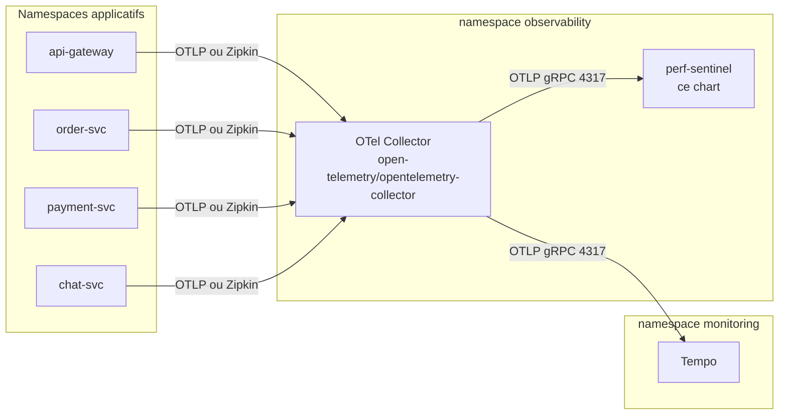

# Guide de déploiement Helm

Ce guide décrit le déploiement de perf-sentinel sur Kubernetes via le chart Helm packagé sous [`charts/perf-sentinel/`](../../charts/perf-sentinel/). Le chart déploie le daemon (`perf-sentinel watch`) derrière un Service `ClusterIP` qui expose OTLP gRPC (4317) et OTLP HTTP plus `/metrics` plus `/api/*` (4318).

Pour une alternative sans Helm, voir les manifests bruts dans [`docs/FR/INSTRUMENTATION-FR.md`](./INSTRUMENTATION-FR.md#déploiement-kubernetes).

## Sommaire

- [TL;DR](#tldr) : commande d'installation en un bloc.
- [Topologie](#topologie) : pourquoi le chart est sentinel-only par design, et [où placer le sampling du collector](#sampling-du-collector-et-ce-qui-atteint-le-daemon) par rapport au daemon.
- [Installation depuis le registre OCI](#installation-depuis-le-registre-oci) : chemin d'installation production avec vérification Cosign.
- [Artifact Hub](#artifact-hub) : référencement et métadonnées.
- [Chaîne d'approvisionnement logicielle](#chaîne-dapprovisionnement-logicielle) : signatures Cosign keyless, provenance SLSA, SBOM, attestation public-good.
- [Installation depuis un checkout local](#installation-depuis-un-checkout-local) : pour les contributeurs et le bisect.
- [Couper une nouvelle release de chart](#couper-une-nouvelle-release-de-chart) : tâche mainteneur, renvoie vers RELEASE-PROCEDURE.
- [Modes de workload](#modes-de-workload) : trois valeurs de `workload.kind` au choix.
- [Surface de configuration](#surface-de-configuration) : valeurs du chart pour `.perf-sentinel.toml`, plus [fragments](#fragments-de-configuration), secrets, TLS et NetworkPolicy.
- [Observabilité](#observabilité) : Prometheus ServiceMonitor, tableau de bord Grafana, alertes et exemplars.
- [Mise à jour](#mise-à-jour) : flux `helm upgrade`.
- [Désinstallation](#désinstallation) : flux `helm uninstall`.
- [Exemple bout en bout](#exemple-bout-en-bout) : exemple complet composant le chart avec le chart upstream OpenTelemetry Collector.

## TL;DR

```bash
helm install perf-sentinel oci://ghcr.io/robintra/charts/perf-sentinel \
  --version 0.9.21 \
  --namespace observability --create-namespace
kubectl --namespace observability get pods -l app.kubernetes.io/name=perf-sentinel
```

Chaque release publiée est signée Cosign en mode keyless, livrée avec une attestation de provenance de build SLSA v1.0, et livrée avec un SBOM SPDX. Voir [Chaîne d'approvisionnement logicielle](#chaîne-dapprovisionnement-logicielle) ci-dessous pour les contrôles avant installation.

Une fois le pod prêt, pointez votre OpenTelemetry Collector vers `perf-sentinel.observability.svc.cluster.local:4317` (gRPC) ou `:4318` (HTTP). Un exemple complet qui compose perf-sentinel avec le chart upstream OTel Collector vit sous [`examples/helm/`](../../examples/helm/).

## Topologie

Le chart est sentinel-only par construction. Les utilisateurs composent perf-sentinel avec le chart upstream [open-telemetry/opentelemetry-collector](https://github.com/open-telemetry/opentelemetry-helm-charts) plutôt que d'embarquer un collector qui dériverait des releases upstream.


```mermaid
flowchart LR
    subgraph apps [Namespaces applicatifs]
        A[api-gateway]
        B[order-svc]
        C[payment-svc]
        D[chat-svc]
    end
    subgraph obs [namespace observability]
        OC[OTel Collector<br/>open-telemetry/opentelemetry-collector]
        PS[perf-sentinel<br/>ce chart]
    end
    subgraph mon [namespace monitoring]
        T[Tempo]
    end
    A -->|OTLP ou Zipkin| OC
    B -->|OTLP ou Zipkin| OC
    C -->|OTLP ou Zipkin| OC
    D -->|OTLP ou Zipkin| OC
    OC -->|OTLP gRPC 4317| T
    OC -->|OTLP gRPC 4317| PS
```

### Sampling du collector et ce qui atteint le daemon

La plupart des collectors de production samplent. Si le processeur qui
s'en charge se trouve entre les applications et perf-sentinel, le daemon
analyse une fraction du trafic et **n'a aucun moyen de le savoir** : une
trace samplée qui a été conservée ressemble exactement à une trace
complète, et le rapport ne laisse rien deviner du fait que ses chiffres
couvrent un dixième des requêtes.

Ce qui survit au sampling et ce qui n'y survit pas :

| | Effet d'un sampling amont |
|---|---|
| Détecteurs par trace (`n_plus_one`, `chatty_service`, `excessive_fanout`, `serialized_calls`, `pool_saturation`) | **Intacts sur les traces qui arrivent.** Les politiques head comme tail gardent ou jettent des traces entières, donc une trace conservée contient toujours sa boucle N+1 complète. |
| Couverture | Dégradée. Un pattern présent sur une petite part du trafic peut être entièrement écarté et ne jamais remonter. |
| Comptes absolus (findings, occurrences, totaux Prometheus) | Sous-estimés, silencieusement. Ils décrivent l'échantillon, et rien ne les remet à l'échelle. |
| Ratios (ratio de gaspillage I/O, et les chiffres GreenOps qui en dérivent) | Non biaisés sous un sampler uniforme, qui touche numérateur et dénominateur de la même façon. Les politiques `errors` et `slow` d'un tail sampler biaisent la rétention vers les traces lourdes, et le ratio dérive avec elles. |
| Corrélation cross-trace | De fait inactive. `[daemon.correlation] min_co_occurrences` exige qu'une paire se répète dans la fenêtre, ce qui survit rarement à un échantillon de 10%. |

**Donnez à perf-sentinel son propre pipeline non samplé.** Le sampling
existe pour borner un coût de stockage, et perf-sentinel ne stocke
rien : il tient une fenêtre par trace en mémoire pendant `trace_ttl_ms`
puis la jette. Répartissez donc depuis le même receiver et n'appliquez
`tail_sampling` que sur la branche qui alimente le magasin de traces :

```yaml
service:
  pipelines:
    # Stockage : samplé, parce que Tempo se paie à l'octet retenu.
    traces/tempo:
      receivers: [otlp]
      processors: [k8sattributes, filter/drop_noise, tail_sampling, batch]
      exporters: [otlp/tempo]
    # Analyse : non samplé, parce que c'est la qualité de détection qui paie.
    traces/perf-sentinel:
      receivers: [otlp]
      processors: [k8sattributes, filter/drop_noise, batch]
      exporters: [otlp/perf-sentinel]
```

Gardez le filtre de bruit sur les deux branches. Écarter les
health checks, les migrations Liquibase et les spans d'export du
collector lui-même retire des findings sur lesquels personne n'agira.
Attention aux expressions régulières trop larges à cet endroit : un
motif DDL non ancré comme `.*DROP\s+.*` écarte aussi des requêtes
applicatives qui contiennent seulement le mot.

Si le volume supplémentaire pose problème, restreignez la branche
d'analyse **par périmètre plutôt que par hasard** : ne routez que les
namespaces ou les services sur lesquels vous travaillez, ce qui garde
leurs chiffres entiers, au lieu d'un échantillon probabiliste qui rend
partiels les chiffres de tous les services. `filter/drop_noise` retire
déjà les spans que perf-sentinel écarterait de toute façon (pas de
`db.statement`, pas de `http.url`), donc cette branche porte d'emblée
moins que celle du stockage.

Deux contraintes si vous ne pouvez pas éviter un sampling devant le
daemon :

- Préférez le **tail-based**. Il décide par trace entière après coup,
  donc les traces arrivent complètes, et ses politiques habituelles
  (garder les erreurs, garder les traces lentes) biaisent la rétention
  vers l'endroit où vit le gaspillage structurel. Un head-sampling à
  1-10% est le pire cas pour la détection.
- Lisez les comptes comme un échantillon, et ne les publiez pas comme
  des chiffres de trafic complet. Un tail sampler biaise aussi les
  ratios, puisque garder les erreurs et les traces lentes
  sur-représente les traces lourdes. Cela compte pour `disclose` : un
  rapport de divulgation publique bâti sur une fenêtre samplée dit faux
  sur le gaspillage qu'il prétend mesurer. Le knob
  `[daemon] sampling_rate` du daemon lève un avertissement `tuning` dans
  `Report.warning_details` exactement pour cette raison, mais il ne peut
  pas voir ce qu'un collector a écarté avant l'arrivée des spans.

Quand plusieurs réplicas du daemon se trouvent derrière le pipeline,
l'intégrité des traces dépend du routage par trace ID, voir
[`DaemonSet`](#daemonset) et
[`workload.replicas`](#deployment-par-défaut).

## Installation depuis le registre OCI

Le chart est publié en tant qu'artifact OCI sous `oci://ghcr.io/robintra/charts/perf-sentinel`. Chaque version reçoit une signature Cosign keyless (GitHub OIDC, log de transparence Rekor), une attestation de provenance de build SLSA v1.0 stockée sur l'attestation store du repo, et un SBOM SPDX livré à la fois en asset de GitHub Release et en tant qu'attestation signée.

### Pinner une version

```bash
helm install perf-sentinel oci://ghcr.io/robintra/charts/perf-sentinel \
  --version 0.9.21 \
  --namespace observability --create-namespace \
  -f my-values.yaml
```

Le `version` du chart et l'`appVersion` sont découplés : `version` désigne la release du chart, `appVersion` désigne le tag de l'image daemon livrée avec. Une release applicative bumpe les deux ensemble, un correctif chart seul ne bumpe que `version` et laisse l'`appVersion` en arrière (cas des `0.9.16`, `0.9.18`, `0.9.19`, `0.9.20` et `0.9.21`), donc un `--version` pinné donne toujours un `appVersion` connu. N'overridez `image.tag` que pour faire tourner un build daemon précis avec un autre chart.

### Utilisation en subchart ou depuis Argo CD

`oci://ghcr.io/robintra/charts/perf-sentinel` est l'URL complète du chart, la forme attendue par `helm install`. Une entrée `dependencies:` attend au contraire le namespace parent, car Helm concatène `name` à `repository` :

```yaml
dependencies:
  - name: perf-sentinel
    version: 0.9.21
    repository: oci://ghcr.io/robintra/charts   # le namespace, pas l'URL du chart
```

Même découpage pour une `Application` Argo CD : `repoURL: ghcr.io/robintra/charts` plus `chart: perf-sentinel`.

Répéter le nom du chart dans `repository` résout vers `charts/perf-sentinel/perf-sentinel`, qui n'existe pas. En anonyme, ghcr.io répond `403 denied` plutôt que `404` sur un chemin manquant : l'échec ressemble donc à un problème de registre privé alors que c'est un problème de chemin. Pour confirmer que l'artifact est bien public, récupérez un token anonyme et tirez le manifest :

```bash
token=$(curl -s "https://ghcr.io/token?scope=repository%3Arobintra%2Fcharts%2Fperf-sentinel%3Apull&service=ghcr.io" | jq -r .token)
curl -s -o /dev/null -w '%{http_code}\n' -H "Authorization: Bearer $token" \
  -H 'Accept: application/vnd.oci.image.manifest.v1+json' \
  https://ghcr.io/v2/robintra/charts/perf-sentinel/manifests/0.9.21
```

## Artifact Hub

Le chart est indexé sur [Artifact Hub](https://artifacthub.io), où
les utilisateurs peuvent le découvrir, explorer son values schema
et consulter le changelog.

L'enregistrement est fait, `charts/perf-sentinel/artifacthub-repo.yml`
porte le `repositoryID` délivré et chaque release de chart le pousse
sur le registry OCI sous le tag réservé `artifacthub.io`. Le flow, pour
référence ou pour le refaire sur un autre registry :

1. Connectez-vous sur artifacthub.io avec un compte GitHub.
2. Dans le panel de contrôle, ajoutez un repository de kind "Helm
   charts (OCI)" pointant vers
   `oci://ghcr.io/robintra/charts/perf-sentinel`.
3. Artifact Hub délivre un `repositoryID` (UUID).
4. Placez cet UUID dans `charts/perf-sentinel/artifacthub-repo.yml`,
   committez et poussez.
5. Taggez une nouvelle release de chart (patch bump) pour que le
   workflow de release pousse le `artifacthub-repo.yml` mis à jour
   sur le registry OCI sous le tag spécial `artifacthub.io`.
6. Artifact Hub scrute le registry et récupère les nouvelles
   métadonnées en moins de 30 minutes. Le badge "Verified
   publisher" apparaît au prochain cycle de traitement.

Le statut `official` est un sujet distinct : il se demande par une issue
sur le dépôt artifacthub/hub, une fois que le repository porte déjà le
badge verified publisher. Aucune annotation de chart ne le confère.

## Chaîne d'approvisionnement logicielle

> **Voir aussi.** L'[introduction à Sigstore](SUPPLY-CHAIN-FR.md#introduction-à-sigstore) dans la doc supply-chain définit Cosign, Fulcio, Rekor, in-toto, OIDC, SLSA et SBOM utilisés dans cette section.

Chaque release publiée est signée Cosign en mode keyless, livrée
avec une attestation de provenance de build SLSA v1.0, et livrée
avec un SBOM SPDX attesté sous le prédicat SPDX. Vérifiez au minimum
la signature Cosign avant d'installer, et l'ensemble en
environnement régulé.

### Vérifier la signature Cosign

La vérification Cosign keyless relie chaque release à un run spécifique du workflow GitHub Actions. L'identité du certificat doit matcher le workflow de release publié, et l'OIDC issuer doit être GitHub Actions :

```bash
cosign verify \
  --certificate-identity-regexp '^https://github.com/robintra/perf-sentinel/\.github/workflows/helm-release\.yml@refs/tags/chart-v' \
  --certificate-oidc-issuer https://token.actions.githubusercontent.com \
  ghcr.io/robintra/charts/perf-sentinel:0.9.21
```

**Nécessite cosign 3.0 ou plus récent.** La signature est un bundle Sigstore attaché au digest du chart comme referrer OCI 1.1, et non un tag `sha256-<digest>.sig` de l'ancien format. cosign 2.x ne lit pas les referrers et répond `Error: no signatures found` sur un chart pourtant correctement signé : vérifiez `cosign version` avant de tirer une conclusion de ce message. Testé sur le chart `0.9.21` avec cosign `v3.1.2`.

Sous Windows, lancez cette commande depuis PowerShell ou WSL plutôt que depuis Git Bash : MSYS réécrit les échappements antislash de la regex (`\.` arrive en `/.`) et la vérification échoue alors sur un trompeur `no matching CertificateIdentity`. Écrire les échappements sous la forme `[.]` est équivalent et résiste à tous les shells.

Un run réussi affiche l'entrée du log Rekor et les détails du certificat. Un mismatch ou une absence de signature retourne un code non nul.

**Il n'y a pas de fichier `.prov`, donc `helm install --verify` n'est pas disponible.** C'est un choix délibéré, pas un oubli. Le mécanisme de provenance natif de Helm suppose une clé PGP de longue durée conservée en secret de CI, avec la charge de rotation, de révocation et de publication d'empreinte qui va avec. La signature Cosign keyless et l'attestation SLSA répondent à la même question, cet artefact vient-il bien du workflow de release de ce dépôt, sans qu'aucune clé de signature statique existe nulle part. Vérifiez avec la commande `cosign verify` ci-dessus plutôt qu'avec `helm --verify`.

### Vérifier la provenance de build SLSA

Chaque tarball de chart publié porte une attestation de provenance de build SLSA v1.0 produite par `actions/attest-build-provenance` et stockée sur l'attestation store du repo (pas sur le registry OCI). L'attestation est interrogeable via `gh` :

```bash
gh release download chart-v0.9.21 \
  --repo robintra/perf-sentinel \
  --pattern 'perf-sentinel-*.tgz'

gh attestation verify perf-sentinel-0.9.21.tgz \
  --repo robintra/perf-sentinel
```

Si vous avez déjà récupéré l'artifact OCI et préférez ne pas fetcher
le tarball, vérifiez la provenance de build directement contre la
référence OCI :

```bash
docker login ghcr.io
gh attestation verify oci://ghcr.io/robintra/charts/perf-sentinel:0.9.21 \
  --repo robintra/perf-sentinel
```

Les deux recettes produisent la même assurance. Associez celle que
vous choisissez au contrôle de signature Cosign ci-dessus pour
confirmer à la fois l'identité du signataire sur l'artifact OCI et
la provenance de build sur le tarball.

### Vérifier le SBOM

Chaque release livre un SBOM SPDX en tant qu'asset de GitHub Release
et en tant qu'attestation signée sur l'attestation store du repo.

Le sujet de l'attestation SBOM est le tarball du chart, pas le fichier SBOM,
donc vérifiez-la contre le tarball, exactement comme le contrôle de provenance
ci-dessus. Le filtre `--predicate-type` sélectionne l'attestation SBOM SPDX
plutôt que celle de provenance de build :

```bash
gh release download chart-v0.9.21 --repo robintra/perf-sentinel \
  --pattern 'perf-sentinel-*.tgz' \
  --pattern 'perf-sentinel-chart-*.spdx.json'

gh attestation verify perf-sentinel-0.9.21.tgz \
  --repo robintra/perf-sentinel \
  --predicate-type https://spdx.dev/Document/v2.3
```

Le `perf-sentinel-chart-0.9.21.spdx.json` téléchargé est la copie lisible de ce
SBOM attesté. Il capture les dépendances déclarées du chart au moment de la
release.

## Installation depuis un checkout local

Pour les contributeurs et les utilisateurs qui veulent inspecter, patcher ou bisect le chart avant de l'installer, un clone local fonctionne toujours :

```bash
git clone https://github.com/robintra/perf-sentinel.git
cd perf-sentinel

# Inspectez ou surchargez les valeurs par défaut avant install.
helm show values ./charts/perf-sentinel > my-values.yaml

helm install perf-sentinel ./charts/perf-sentinel \
  --namespace observability --create-namespace \
  -f my-values.yaml
```

Gardez le path OCI pour les installs de production. Le path local contourne volontairement les contrôles Cosign et SLSA, il ne devrait pas être utilisé sur des clusters partagés sauf si vous avez buildé le chart vous-même.

## Couper une nouvelle release de chart

Publier une nouvelle version du chart est une tâche mainteneur, pas une étape de déploiement. La procédure complète (bump du chart en lockstep, puis `scripts/release-chart.sh chart-vA.B.C`, qui gate sur la publication de l'image daemon) est dans [`RELEASE-PROCEDURE-FR.md`](./RELEASE-PROCEDURE-FR.md).

## Modes de workload

Le chart accepte trois valeurs pour `workload.kind`. Choisissez-en une par installation.

### `Deployment` (par défaut)

Un daemon unique derrière un Service `ClusterIP`. C'est la topologie recommandée. perf-sentinel est stateful par trace (la `TraceWindow` vit en mémoire), donc exécuter un seul daemon et scaler verticalement est le bon premier mouvement. La [topologie shardée](../../examples/docker-compose-sharded.yml) est disponible pour des déploiements multi-daemon. Elle repose sur un consistent hashing par `trace_id` dans le `loadbalancingexporter` du Collector OTel afin que toutes les spans d'une trace atterrissent sur la même instance daemon.

```yaml
workload:
  kind: Deployment
  replicas: 1
```

> **Scalabilité et état.** Les replicas ne partagent jamais d'état. La
> détection par trace reste correcte entre replicas uniquement avec le
> load balancing par `trace_id` décrit ci-dessus. La corrélation
> cross-service est mono-processus et ne voit que ce qu'un daemon met en
> tampon, donc faites-la tourner sur une instance unique qui reçoit tous
> les services à corréler. Le daemon draine sa fenêtre en vol sur
> SIGTERM, donc un rolling update ou un scale-down normal ne perd rien.
> Seul un kill non gracieux (SIGKILL après la période de grâce, OOM)
> jette la fenêtre, et cela coûte au plus `trace_ttl_ms` de détection de
> patterns récurrents. Détails dans
> [LIMITATIONS-FR.md](./LIMITATIONS-FR.md#modèle-détat-du-daemon-en-mémoire-mono-processus-sans-état-partagé).

### `DaemonSet`

Rare. Utile uniquement si vous avez une exigence dure d'avoir un daemon sur chaque noeud (par exemple pour remplacer un forwarder de traces node-local existant). Un DaemonSet répartit les traces sur plusieurs noeuds, ce qui casse la détection N+1 sauf si un collector en amont garantit que toutes les spans d'une trace rejoignent le même daemon. La plupart des utilisateurs n'ont pas besoin de ce mode.

Comme cette casse est silencieuse (les groupes passent sous leur seuil et les findings n'apparaissent tout simplement pas, sans erreur ni métrique), le mode exige une affirmation explicite que ce routage est en place. Le rendu échoue sans elle :

```yaml
workload:
  kind: DaemonSet
  daemonset:
    # Vrai uniquement si un collector en amont route par trace ID vers ces
    # pods, par exemple l'exporter `loadbalancing` d'OTel avec
    # `routing_key: traceID`. Un Service ordinaire fait du tourniquet et
    # découpe les traces, ce que ce garde-fou attrape précisément.
    spanRoutingByTraceId: true
```

### `StatefulSet`

Le seul mode où les acks runtime (`POST /api/findings/{sig}/ack`, depuis 0.5.20) fonctionnent. Activer la persistance monte un PVC sur `/var/lib/perf-sentinel`, et le chart pointe lui-même `[daemon.ack] storage_path` et `[daemon.archive] path` dessus, de sorte que l'audit trail des acks et l'archive de divulgation survivent aux redémarrages et aux replanifications de pod. Les acks TOML CI
(`.perf-sentinel-acknowledgments.toml`) sont en lecture seule au runtime et n'ont pas besoin de PVC, seul le JSONL côté daemon en a besoin.

> **Monter le TOML d'acks CI : un montage ConfigMap classique suffit.** Une ConfigMap projette chaque clé sous forme de symlink (`clé -> ..data/clé`). Le loader suit un symlink qui résout sous son propre répertoire, c'est-à-dire exactement cette projection, et refuse celui qui résout ailleurs, le durcissement contre un lien hostile pointant vers un fichier sensible (`caused by: Acknowledgments file is a symlink resolving outside its own directory, refusing to follow`). Montez la ConfigMap comme un répertoire et pointez `[daemon.ack] toml_path` sur la clé projetée :
>
> ```yaml
> volumeMounts:
>   - name: ci-acks
>     mountPath: /etc/perf-sentinel/acks
> ```
>
> Avec `toml_path = "/etc/perf-sentinel/acks/acknowledgments.toml"`, le daemon relit le fichier chaque minute, donc une modification de la ConfigMap s'applique sans redémarrer le pod. `subPath` fonctionne toujours et matérialise un vrai fichier, mais il fige le contenu au moment du montage : un changement de ConfigMap demande alors un rollout.

```yaml
workload:
  kind: StatefulSet
  replicas: 1
  statefulset:
    persistence:
      enabled: true
      size: 5Gi
      storageClass: gp3
```

Pour posséder ces tables vous-même, par exemple pour `[daemon.ack] toml_path` ou `[daemon.archive] max_size_mb`, posez `persistence.manageDaemonPaths: false` et écrivez les deux chemins durables sous `/var/lib/perf-sentinel` dans `config.toml`. TOML ne peut pas ouvrir deux fois la même table, et une table s'ouvre aussi bien par un en-tête que par une clé pointée (`ack.storage_path = ...` sous `[daemon]`) ou une table inline, donc tant que `manageDaemonPaths` vaut true le chart refuse de rendre dès que `config.toml` mentionne l'une de ces tables sous l'une de ces formes. Le message nomme le drapeau à basculer. Il refuse par excès, parce que l'alternative est une configuration que le daemon ne sait pas parser et un pod en CrashLoop.

`[daemon.archive]` est entièrement sautée quand `config.toml` pose `[green] enabled = false` : le daemon rejette cette combinaison au démarrage, une archive de fenêtres sans énergie ni carbone rendrait la sortie de `disclose` dénuée de sens. Déclarer l'archive vous-même avec le scoring green désactivé fait échouer le rendu dans tous les modes de workload, pas seulement sous persistance, puisque le daemon la refuse de toute façon.

Le chemin de montage est figé à `/var/lib/perf-sentinel`, `persistence` n'accepte aucune clé `mountPath`, et l'activer sur un `Deployment` ou un `DaemonSet` fait échouer le rendu au lieu de ne monter silencieusement rien.

En mode `Deployment` et `DaemonSet`, les acks runtime sont indisponibles, pas seulement éphémères. Le chemin de stockage par défaut est résolu via `dirs::data_local_dir()`, et l'image du conteneur est `FROM scratch` sans `HOME` ni `/etc/passwd`, donc le chemin ne peut pas être résolu du tout. Le daemon logge un WARN au démarrage, reste debout, et les deux routes d'écriture d'ack renvoient `503 Service Unavailable`. `GET /api/acks` n'est gardé que par l'authentification, par conception, et répond toujours `200` avec une liste vide : ce n'est donc pas une sonde valable pour détecter cet état.

Cet arbitrage se fait délibérément. Si vos opérateurs doivent acquitter des findings au runtime, depuis le dashboard, la CLI `ack` ou une alerte à 3h du matin, la topologie par défaut en est incapable et c'est `StatefulSet` avec `persistence.enabled` qu'il vous faut installer. La baseline TOML CI ne s'y substitue pas : elle porte les décisions permanentes de l'équipe, revues en pull request et partagées par tous les environnements, pas le report d'astreinte pendant un incident. Elle couvre en revanche le cas où chaque acquittement est une décision durable d'équipe, et elle n'a besoin d'aucun PVC puisqu'elle est en lecture seule au runtime. Voir [`docs/FR/ACK-WORKFLOW-FR.md`](./ACK-WORKFLOW-FR.md#choisir-entre-toml-et-daemon) pour savoir quel acquittement va où.

## Surface de configuration

Le chart monte une unique ConfigMap sur `/etc/perf-sentinel/.perf-sentinel.toml`. Éditez le contenu via `values.yaml` :

```yaml
config:
  toml: |
    [thresholds]
    n_plus_one_sql_critical_max = 0
    io_waste_ratio_max = 0.25

    [green]
    enabled = true
    default_region = "eu-west-3"

    [daemon]
    listen_address = "0.0.0.0"
    environment = "production"
```

Référence complète des champs : [`docs/FR/CONFIGURATION-FR.md`](./CONFIGURATION-FR.md).

### Fragments de configuration

`config.toml` est un document unique. `config.fragments` est une map de documents TOML supplémentaires, rendus dans une seconde ConfigMap et montés comme répertoire sur `/etc/perf-sentinel/.perf-sentinel.d/`. Le daemon les fusionne par priorité de nom croissante, puis applique `config.toml` en dernier comme override final ([Fragments de configuration](./CONFIGURATION-FR.md#fragments-de-configuration)).

```yaml
config:
  toml: |
    [green]
    enabled = true
    default_region = "eu-west-3"
  fragments:
    33-green-kepler.toml: |
      [green.kepler]
      endpoint = "http://kepler.kube-system.svc.cluster.local:9102/metrics"
      metric_kind = "container"

      [green.kepler.service_mappings]
      "order-svc" = "order-svc"
```

C'est ainsi que les fichiers prêts à copier de `examples/` atteignent un cluster : gardez le nom de fichier, son préfixe `NN` porte déjà l'ordre de fusion. `examples/helm/` fournit un overlay de values par backend énergétique, empilable sur les values de base avec un second `-f`.

Deux règles sont vérifiées au rendu, parce que le daemon les applique au démarrage et que l'image est `FROM scratch` : un échec de boot ne laisse aucun shell pour aller lire l'erreur.

- **Noms.** `NN-lowercase-name.toml`, `NN` sur deux chiffres, le reste en `[a-z0-9-]` sans tiret initial, final ni doublé. Deux fragments ne peuvent pas partager un `NN`, leur ordre de fusion serait indéfini.
- **Clés réservées.** `listen_port_*` et la désactivation de `[green]` restent dans `config.toml`, toujours. `[daemon.ack]` et `[daemon.archive]` ne sont refusées que lorsque la persistance amène le chart à les écrire lui-même, seul cas où un fragment rouvrirait une table déjà ouverte ; sans persistance, ou avec `manageDaemonPaths=false`, vous possédez les deux chemins et un fragment convient très bien. Le chart croise ces clés avec `service.ports.*`, les probes et le PVC en ne lisant que `config.toml` : un fragment qui en redéfinirait une passerait un contrôle au vert tout en produisant un pod qui écoute là où rien ne route. Le contrôle ramène d'abord à une seule forme les orthographes que TOML autorise, si bien qu'un en-tête espacé (`[ green ]`), un nom de clé entre guillemets ou une table inline est détecté comme la forme simple, et qu'une clé réservée seulement citée dans un commentaire ne l'est pas.

Éditer un fragment déplace l'annotation `checksum/config`, donc `helm upgrade` fait rouler les pods. Le répertoire est monté en entier plutôt que clé par clé, donc ajouter ou retirer un fragment atteint aussi un pod déjà en cours d'exécution.

Aucun secret dans un fragment : il est rendu dans une ConfigMap, lisible par quiconque dispose de `get` sur le namespace. Utilisez le motif Secret ci-dessous.

### Secrets

Le fichier TOML ne doit jamais contenir de secrets (le daemon rejette les champs credentiels au chargement de la config). Injectez les valeurs sensibles via des variables d'environnement alimentées par un Secret :

```bash
kubectl -n observability create secret generic perf-sentinel-secrets \
  --from-literal=PERF_SENTINEL_EMAPS_TOKEN=sk-your-token
```

```yaml
extraEnvFrom:
  - secretRef:
      name: perf-sentinel-secrets
```

Les valeurs de config adossées à un Secret suivent un seul pattern : le Secret entre dans l'environnement du pod, et une variable d'environnement dédiée surcharge le champ de config correspondant quand elle est définie (`PERF_SENTINEL_EMAPS_TOKEN` pour Electricity Maps, `PERF_SENTINEL_ACK_API_KEY` pour la clé ack, et les en-têtes d'auth des scrapers). Voir la section "Environment variables" de `docs/FR/CONFIGURATION-FR.md`.

### Fichiers de calibration et certificats TLS

Les deux passent par `extraVolumes` plus `extraVolumeMounts` :

```yaml
extraVolumes:
  - name: tls
    secret:
      secretName: perf-sentinel-tls
      defaultMode: 0400
extraVolumeMounts:
  - name: tls
    mountPath: /etc/tls
    readOnly: true

config:
  toml: |
    [daemon]
    tls_cert_path = "/etc/tls/tls.crt"
    tls_key_path = "/etc/tls/tls.key"
```

### Store d'acks runtime du daemon

Le daemon 0.5.20 ajoute trois endpoints d'ack runtime
(`POST` / `DELETE /api/findings/{signature}/ack` et `GET /api/acks`) sur le port existant de l'API de requêtage. Ils partagent la posture loopback par défaut de `/api/findings`, mais ils mutent l'état, donc trois décisions opérateur s'imposent quand le chart est déployé sur un `listen_address` non-loopback.

**Authentifier les écritures quand le daemon est exposé sur le réseau du pod.** Les snippets `values.yaml` plus haut utilisent `listen_address = "0.0.0.0"` pour la joignabilité cluster-wide. Sans mTLS en frontal, posez une clé ack de 16+ caractères via un Secret Kubernetes dont l'entrée `PERF_SENTINEL_ACK_API_KEY` est votre clé, exposé par `extraEnvFrom`, sans quoi les verbes `POST` et `DELETE` sont exposés :

```yaml
extraEnvFrom:
  - secretRef:
      name: perf-sentinel-secrets   # entrée PERF_SENTINEL_ACK_API_KEY
```

La variable d'environnement `PERF_SENTINEL_ACK_API_KEY` surcharge le champ de config `[daemon.ack] api_key`, donc la clé vient du Secret et jamais du ConfigMap ; un Secret monté vide est rejeté au config load. Le daemon hard-rejette aussi les clés de moins de 12 caractères. Quand une clé est définie, elle garde les écritures (`POST` / `DELETE`) **et** `GET /api/acks` (la piste d'audit) ; `GET /api/findings` reste non authentifié.

**Les acks runtime ont besoin d'un PVC pour exister tout court.** Sans lui, le chemin de stockage par défaut ne peut pas être résolu dans l'image scratch et les routes d'écriture d'ack renvoient 503. Basculez en mode `StatefulSet` avec `persistence.enabled: true` (cf. ci-dessus), ce qui câble `[daemon.ack] storage_path` sur le PVC pour vous.

**Attention au plancher du `securityContext`.** Le daemon ouvre le JSONL avec `O_NOFOLLOW` et rejette les fichiers pré-existants dont le mode autorise des accès group/other (`mode & 0o077 != 0`). Définir `runAsUser` et `fsGroup` de telle sorte que l'UID du daemon n'est pas propriétaire du mount PVC, ou tourner sous une politique d'admission mutante (Kyverno, OPA Gatekeeper) qui réécrit `fsGroup` ou `runAsUser` sur le pod, fera apparaître `InsecurePermissions` au démarrage et le store d'acks sera indisponible. Le daemon reste up sans lui (les routes d'écriture d'ack renvoient 503, `GET /api/acks` une liste vide), donc c'est une défaillance soft, vérifiez quand même la ligne de log WARN au premier rollout.

**Charger la baseline TOML CI depuis une ConfigMap.** Montez `.perf-sentinel-acknowledgments.toml` via `extraVolumes` et pointez `[daemon.ack] toml_path` dessus pour que le daemon ait une vue unifiée des acks permanents (TOML) et runtime (JSONL). Le POST runtime renvoie `409 Conflict` sur les signatures déjà couvertes par un ack TOML actif, ce qui empêche le daemon de masquer silencieusement la baseline validée par l'équipe.

```yaml
extraVolumes:
  - name: ack-toml
    configMap:
      name: perf-sentinel-acks
extraVolumeMounts:
  - name: ack-toml
    mountPath: /etc/perf-sentinel/acks
    readOnly: true

# Sous persistance StatefulSet, déclarer la table vous-même implique de
# reprendre les deux chemins. Sans persistance, ce drapeau est sans objet.
workload:
  statefulset:
    persistence:
      manageDaemonPaths: false

config:
  toml: |
    [daemon.ack]
    toml_path = "/etc/perf-sentinel/acks/.perf-sentinel-acknowledgments.toml"
    storage_path = "/var/lib/perf-sentinel/acks.jsonl"

    [daemon.archive]
    path = "/var/lib/perf-sentinel/archive.ndjson"
```

Voir `docs/FR/QUERY-API-FR.md` et `docs/FR/CONFIGURATION-FR.md` pour la référence complète des endpoints et le catalogue des champs `[daemon.ack]`.

### NetworkPolicy

Le chart peut rendre une `NetworkPolicy` qui restreint qui peut joindre les
ports d'ingestion et de métriques du daemon. Elle est désactivée par défaut
et fail-closed : l'activer sans selectors bloque tout ingress, vous devez
donc allow-lister les namespaces ou pods qui parlent légitimement à
perf-sentinel, typiquement le collecteur OTel (OTLP 4317 et 4318) et
Prometheus (`/metrics` sur 4318).

```yaml
networkPolicy:
  enabled: true
  ingress:
    fromNamespaceSelectors:
      - matchLabels:
          kubernetes.io/metadata.name: observability
    fromPodSelectors:
      - matchLabels:
          app.kubernetes.io/name: otel-collector
```

Les deux listes de selectors sont combinées en OU : une source d'ingress qui
correspond à n'importe quelle entrée de l'une ou l'autre liste est autorisée.
Laissez une liste vide pour ignorer cette dimension de correspondance.

## Observabilité

> **Voir aussi.** L'[introduction à Prometheus et OpenMetrics](METRICS-FR.md#introduction-à-prometheus-et-openmetrics) définit le scraping, les exemplars et les types Counter/Gauge/Histogram référencés ci-dessous.

### ServiceMonitor Prometheus

Quand le Prometheus Operator est installé, basculez `serviceMonitor.enabled` à `true` pour scraper `/metrics` sur le port 4318 :

```yaml
serviceMonitor:
  enabled: true
  interval: 15s
  scrapeTimeout: 10s
  labels:
    # Adaptez au sélecteur de votre ressource Prometheus.
    release: prometheus
```

`honorLabels` vaut `true` par défaut depuis la version 0.17.1 du chart, et ce défaut compte. L'opérateur attache un label de cible nommé `service`, tiré du nom du Service, et quand honor labels est désactivé Prometheus renomme le label homonyme exposé par la cible : le `service` du daemon était stocké en `exported_service`. La variable `Service` du tableau de bord ne proposait plus que le nom de la release, et son panneau par service réduisait tous les services analysés à une seule ligne. Le daemon n'expose ni `job`, ni `instance`, ni `namespace`, donc rien d'autre ne change de main et `Namespace` lit toujours ce que le scrape attache. Honor labels tranche une collision, il ne remplace rien : `perf_sentinel_service_io_ops_total` est la seule métrique qui expose un `service` propre, donc toutes les autres séries reçoivent toujours le `service` de l'opérateur attaché à la cible, et tout ce qui route sur ce label reste intact. Ce qui bouge, c'est une requête écrite sur la forme produite par le bug : filtrer `service="<nom complet de la release>"` sur la métrique par service ne renvoie plus rien, les vrais noms de services ont pris la place. Sur une installation qui a déjà stocké les séries renommées, `helm upgrade` corrige le scrape suivant et laisse l'historique en l'état.

#### Dashboards qui scrapent `/api/findings`

Depuis 0.5.20, `GET /api/findings` filtre par défaut les findings acquittés. Les dashboards ou règles d'alerte existants qui interrogent l'endpoint et comptent les résultats vont silencieusement passer à côté de findings critiques si ceux-ci ont été acquittés au runtime ou par la baseline TOML CI. Deux options pour câbler un panel Prometheus ou Grafana sur l'endpoint :

- Passer `?include_acked=true` et s'appuyer sur l'annotation `acknowledged_by` de la réponse pour filtrer ou colorer les lignes côté client. Garde le compteur visiblement haut quand un ack a atterri tout en laissant l'opérateur voir ce qui est silencé.
- Garder la shape par défaut filtrée et documenter l'alerte comme "findings actifs uniquement", avec un panel séparé qui liste `GET /api/acks` pour rendre l'ensemble acquitté reviewable.

Les compteurs `/metrics` (`perf_sentinel_findings_total`, `perf_sentinel_io_waste_ratio`) ne sont pas affectés, ils enregistrent les événements de détection bruts sans aucun filtre d'ack.

### Tableau de bord Grafana

Un tableau de bord prêt à l'emploi est fourni dans le dépôt à
[`examples/grafana-dashboard.json`](../../examples/grafana-dashboard.json)
(titre `perf-sentinel overview`, uid `perf-sentinel-overview`, 21 panneaux :
opérations d'E/S et ratio de gaspillage, types de findings par sévérité,
p95 des requêtes lentes, traces actives, santé du daemon, plus les jauges
d'énergie, de carbone et de marge runtime issues des compteurs `/metrics`
scrapés ci-dessus). Le chart ne l'embarque pas, pour la même raison qu'il
n'embarque pas de collecteur : un tableau de bord figé dans le chart dérive
du Grafana que vous exploitez déjà. Importez-le de deux façons.

Import manuel : dans Grafana, ouvrez Dashboards puis Import, téléversez le
JSON, et mappez l'entrée `DS_PROMETHEUS` sur votre datasource Prometheus.

**Trois variables de template** surmontent les panneaux. `Job` choisit le
job Prometheus à lire, ce qui compte quand plusieurs daemons sont scrapés
par le même Prometheus, staging et production par exemple. `Namespace`
restreint les vingt et un panneaux à un ou plusieurs namespaces
Kubernetes, et vaut `All` par défaut, la vue globale que le tableau de
bord offrait jusqu'ici. Le namespace est celui où tourne chaque daemon,
pas celui des charges qu'il analyse, la variable choisit donc une
installation et non une tranche du trafic. C'est le seul label que le
daemon n'exporte pas : il est attaché par le scrape, donc Prometheus
Operator le renseigne en lisant le ServiceMonitor du chart, et un scrape
qui n'en attache aucun reste couvert par `All`, ce qui laisse le tableau
de bord inchangé hors Kubernetes. `Service` filtre le panneau d'I/O par
service, et lui seul : toutes les autres métriques exportées par le
daemon sont globales par conception, les valeurs de labels Prometheus
venant ici d'un ensemble borné à la compilation pour maîtriser la
cardinalité. Un filtre service qui paraîtrait restreindre tout le
tableau de bord mentirait sur vingt de ses panneaux.

**Tous les panneaux suivent le sélecteur de plage**, avec une règle et
une exception assumée. Les panneaux de taux utilisent `$__rate_interval`
et les panneaux à fenêtre utilisent `$__range` : choisir `Last 6 hours`
signifie donc que le classement, la répartition et la table de détail
répondent tous sur ces six heures et ne se contredisent jamais. Jusqu'à
la 0.10.0, trois panneaux portaient une fenêtre figée dans la requête
(`1h`, `1h`, `24h`) pendant que tout autour s'adaptait, ce qui donnait
l'impression d'un dashboard ignorant à moitié le sélecteur.

L'exception, ce sont les quelques panneaux `stat` qui affichent une
valeur instantanée (`Active traces`, `Daemon health`) ou un total depuis
le démarrage (`Total findings (cumulative)`, `Traces analyzed
(cumulative)`, `Total I/O ops processed`). Un compteur cumulé depuis le
démarrage du daemon est précisément ce qu'ils rapportent, ils le disent
donc dans leur titre ou leur description, et ils repartent de zéro au
redémarrage du pod.

`I/O waste ratio` est calculé dans le panneau, en
`sum(increase(avoidable_io_ops[$__range])) / sum(increase(total_io_ops[$__range]))`,
plutôt que lu sur la gauge `perf_sentinel_io_waste_ratio` exportée par le
daemon. Cette gauge est un rapport de compteurs cumulés : elle ignore le
sélecteur de plage, dilue un problème actuel dans tout ce qui s'est passé
depuis le démarrage du pod, et affiche un cadran par réplica. La forme
calculée répond sur la plage sélectionnée et pour toute la flotte, avec
deux décimales, parce qu'une flotte à 1 % d'I/O évitables sur un million
d'opérations mérite d'être vue là où un pourcentage entier l'arrondit à
zéro. La gauge exportée reste disponible pour l'alerting.

Chaque série qu'une requête renvoie une fois par réplica porte
`{{instance}}` en légende, et les panneaux qui agrègent sur toute la
flotte nomment plutôt ce qu'ils ont agrégé. Au-delà d'un réplica, les
légendes répétaient sinon la même entrée une fois par pod (`events/s`,
`events/s`, `events/s`), et les panneaux `stat` affichaient quatre
nombres côte à côte sans moyen de savoir lequel venait de quel pod.

Import par sidecar (kube-prometheus-stack et similaires) : chargez le JSON
dans une ConfigMap étiquetée pour que le sidecar Grafana la découvre
automatiquement.

```bash
kubectl -n observability create configmap perf-sentinel-grafana \
  --from-file=perf-sentinel-overview.json=examples/grafana-dashboard.json
kubectl -n observability label configmap perf-sentinel-grafana \
  grafana_dashboard=1
```

La clé d'étiquette (`grafana_dashboard` ici) doit correspondre au
`dashboards.sidecar.label` configuré pour votre sidecar Grafana.

### Règles d'alerte (PrometheusRule)

Le chart fournit une `PrometheusRule` pour que les alertes qui comptent soient
livrées, plutôt qu'un exercice de câblage à faire soi-même. Elle est
conditionnée comme le ServiceMonitor et désactivée par défaut :

```yaml
prometheusRule:
  enabled: true
  labels:
    # Adaptez au ruleSelector de votre ressource Prometheus.
    release: prometheus
  # N'ajoutez les alertes de péremption des scrapers d'énergie par backend
  # que lorsqu'un backend énergie (Alumet, Scaphandre, Kepler, Redfish, cloud_energy)
  # est configuré.
  energyScrapers: false
  scraperStaleSeconds: 120
```

Le groupe par défaut `perf-sentinel.rules` porte cinq règles, et chacune se
déclenche sur une donnée que le daemon a perdue sans pouvoir la retrouver : le
daemon qui n'est plus collecté (`up{job="<fullname> de la release"} == 0`),
l'ingestion abandonnée sur un canal saturé, l'ingestion refusée sous pression
mémoire, les traces délestées avant analyse, et une fenêtre d'archive de
divulgation perdue. La `description` de chaque alerte nomme le paramètre
`[daemon]` à relever. Ajoutez les vôtres via `prometheusRule.additionalRules`,
passées telles quelles dans le même groupe, sans fork.

La saturation de file, l'éviction de paires du corrélateur et le débordement de
cardinalité de services ne sont délibérément **pas** des alertes. Chacune se
déclencherait sur un état que le daemon atteint en fonctionnant normalement, et
chacune est déjà un panneau du tableau de bord Grafana livré. La saturation en
particulier prédisait l'alerte de délestage, donc un incident produisait deux
notifications et la première ne portait aucun remède que la seconde n'avait pas.

`PerfSentinelDown` lit le nom de job que l'opérateur Prometheus dérive du
Service, c'est-à-dire le fullname de la release. Collecter avec votre propre
`scrape_config` sous un autre `job_name` laisse cette règle muette, redéfinissez
-la alors via `additionalRules`.

### PodDisruptionBudget

Le défaut est mono-réplique, où un PDB a peu d'effet : `maxUnavailable: 1` autorise
quand même l'éviction et `minAvailable: 1` bloquerait chaque drain de nœud. Quand la
collecte sans interruption compte (par exemple des données carbone sans trou pour
`disclose`), passez à une topologie shardée multi-répliques avec `minAvailable`, et
utilisez le mode StatefulSet pour que les fenêtres archivées survivent aux redémarrages.

```yaml
podDisruptionBudget:
  enabled: true
  maxUnavailable: 1
```

### Exemplars

perf-sentinel émet des exemplars Prometheus sur `perf_sentinel_findings_total`, `perf_sentinel_io_waste_ratio` et `perf_sentinel_slow_duration_seconds`. Activez le stockage des exemplars côté Prometheus :

```yaml
prometheus:
  prometheusSpec:
    enableFeatures:
      - exemplar-storage
```

Puis configurez Grafana pour cliquer de la métrique vers la trace :

```yaml
datasources:
  - name: Prometheus
    type: prometheus
    jsonData:
      exemplarTraceIdDestinations:
        - name: trace_id
          datasourceUid: tempo
```

### Sans le Prometheus Operator

Si vous utilisez un Prometheus vanilla sans operator, ajoutez une entrée de scrape statique :

```yaml
scrape_configs:
  - job_name: perf-sentinel
    kubernetes_sd_configs:
      - role: endpoints
        namespaces:
          names: [observability]
    relabel_configs:
      - source_labels: [__meta_kubernetes_service_label_app_kubernetes_io_name]
        regex: perf-sentinel
        action: keep
      - source_labels: [__meta_kubernetes_endpoint_port_name]
        regex: otlp-http
        action: keep
      - source_labels: [__meta_kubernetes_namespace]
        target_label: namespace
```

Le rôle est `endpoints` parce que `__meta_kubernetes_endpoint_port_name`
n'existe que là, et un `keep` sur un label que le rôle ne pose jamais
écarte toutes les cibles. La dernière règle est ce que lit la variable
`Namespace` du tableau de bord : Prometheus Operator attache ce label de
lui-même, un scrape écrit à la main doit le demander.

## Mise à jour

```bash
helm upgrade perf-sentinel ./charts/perf-sentinel \
  --namespace observability \
  -f my-values.yaml
```

Le daemon ne recharge pas sa config à chaud, donc les modifications de `config.toml` exigent un redémarrage du pod. Le chart gère cela automatiquement : une annotation `checksum/config` sur le pod template calcule un hash de la ConfigMap rendue, donc chaque édition de config bump l'annotation et déclenche un rolling restart. Aucun `kubectl rollout restart` manuel n'est nécessaire.

Lors d'un bump du chart vers un nouveau `appVersion`, pinnez `image.tag` explicitement et relisez `CHANGELOG.md` pour repérer les breaking changes de config. Le chart ne valide pas encore que la version du daemon corresponde à la version du chart, cette responsabilité incombe à l'opérateur.

## Désinstallation

```bash
helm uninstall perf-sentinel --namespace observability
```

Cela supprime le Deployment, le Service, la ConfigMap, le ServiceAccount et (quand ils sont créés) le ServiceMonitor et la NetworkPolicy. Le mode StatefulSet avec persistance conserve les PersistentVolumeClaims sous-jacents par défaut, conformément à la sémantique Kubernetes. Supprimez-les explicitement si vous voulez nettoyer l'état :

```bash
kubectl --namespace observability delete pvc \
  -l app.kubernetes.io/instance=perf-sentinel
```

## Exemple bout en bout

[`examples/helm/`](../../examples/helm/) fournit deux fichiers de valeurs qui composent le chart perf-sentinel avec le chart upstream OTel Collector dans une topologie fanout Zipkin + OTLP vers Tempo et perf-sentinel. Suivez le README de ce répertoire pour la recette complète d'installation et de vérification.
