# Guide d'intégration

perf-sentinel accepte les traces OpenTelemetry via OTLP (gRPC sur le port 4317, HTTP sur le port 4318). Ce guide vous accompagne de zéro jusqu'à votre premier finding pour chaque topologie de déploiement.

## Choisissez votre topologie

| Topologie                                                     | Idéal pour                        | Effort         | Modifications des services      |
|---------------------------------------------------------------|-----------------------------------|----------------|---------------------------------|
| **[CI batch](#démarrage-rapide--ci-batch)**                   | Pipelines CI, vérifications de PR | Le plus faible | Aucune (fichiers de traces)     |
| **[Collector central](#démarrage-rapide--collector-central)** | Production, multi-services        | Faible         | Aucune (config YAML uniquement) |
| **[Sidecar](#démarrage-rapide--sidecar)**                     | Dev/staging, debug d'un service   | Faible         | Aucune (Docker uniquement)      |
| **[Daemon direct](#démarrage-rapide--daemon-direct)**         | Dev local, expérimentations       | Moyen          | Variables d'env par langage     |

---

## Démarrage rapide : CI batch

**Cas d'usage :** exécuter perf-sentinel dans votre pipeline CI pour détecter les requêtes N+1 avant la production. Pas de daemon, pas de Docker, un binaire qui lit un fichier de traces et retourne le code 1 si le quality gate échoue.

### Étape 1 : Installation

```bash
curl -LO https://github.com/robintra/perf-sentinel/releases/latest/download/perf-sentinel-linux-amd64
chmod +x perf-sentinel-linux-amd64
sudo mv perf-sentinel-linux-amd64 /usr/local/bin/perf-sentinel
```

### Étape 2 : Configurer les seuils

Créez `.perf-sentinel.toml` à la racine de votre projet :

```toml
[thresholds]
n_plus_one_sql_critical_max = 0    # zéro tolérance pour les N+1 SQL
io_waste_ratio_max = 0.30          # max 30% d'I/O évitables

[detection]
n_plus_one_min_occurrences = 5
slow_query_threshold_ms = 500

[green]
enabled = true
default_region = "eu-west-3"       # optionnel : active les estimations gCO2eq
# : surcharges par service pour les déploiements multi-région
# [green.service_regions]
# "api-us"   = "us-east-1"
# "api-asia" = "ap-southeast-1"
```

> La sortie CO₂ est structurée : `green_summary.co2.total.{low,mid,high}` plus un tag de méthodologie SCI v1.0, avec un intervalle d'incertitude multiplicative 2× (`low = mid/2`, `high = mid×2`). Le scoring multi-région est automatique quand les spans OTel portent l'attribut `cloud.region`. Voir `docs/FR/CONFIGURATION-FR.md` et `docs/FR/LIMITATIONS-FR.md#précision-des-estimations-carbone` pour les détails.

### Étape 3 : Collecter les traces

Exportez les traces depuis vos tests d'intégration. Si vos tests tournent avec l'instrumentation OTel, sauvegardez la sortie dans un fichier JSON. Vous pouvez aussi exporter depuis l'UI Jaeger ou Zipkin, perf-sentinel détecte automatiquement le format.

### Étape 4 : Analyser

```bash
perf-sentinel analyze --ci --input traces.json --config .perf-sentinel.toml
```

Le processus affiche un rapport JSON sur stdout et retourne le code 0 (succès) ou 1 (échec). Ajoutez ceci à votre job CI :

```yaml
# Exemple GitLab CI
perf:sentinel:
  stage: quality
  script:
    - perf-sentinel analyze --ci --input traces.json --config .perf-sentinel.toml
  artifacts:
    paths: [perf-sentinel-report.json]
    when: always
  allow_failure: true   # commencez en warning, retirez une fois les seuils calibrés
```

### Étape 5 : Investiguer les findings

```bash
# Rapport coloré en terminal
perf-sentinel analyze --input traces.json --config .perf-sentinel.toml

# Vue arborescente d'une trace spécifique
perf-sentinel explain --input traces.json --trace-id <trace-id>

# TUI interactif
perf-sentinel inspect --input traces.json

# SARIF pour GitHub/GitLab code scanning
perf-sentinel analyze --input traces.json --format sarif > results.sarif
```

---

## Démarrage rapide : collector central

**Cas d'usage :** déploiement production où les services envoient déjà des traces à un OpenTelemetry Collector (ou vous souhaitez en ajouter un). Zéro modification de code, uniquement de la configuration YAML.

### Étape 1 : Démarrer perf-sentinel + collector

```bash
docker compose -f examples/docker-compose-collector.yml up -d
```

Cela démarre :
- Un **OTel Collector** qui écoute sur les ports 4317 (gRPC) et 4318 (HTTP)
- **perf-sentinel** en mode watch, recevant les traces du collector

### Étape 2 : Pointer vos services vers le collector

Définissez ces variables d'environnement dans vos conteneurs applicatifs :

```bash
OTEL_EXPORTER_OTLP_ENDPOINT=http://otel-collector:4317
OTEL_EXPORTER_OTLP_PROTOCOL=grpc
```

Si vos services exportent déjà vers un collector, ajoutez perf-sentinel comme exporteur supplémentaire dans votre `otel-collector-config.yaml` existant :

```yaml
exporters:
  otlp/perf-sentinel:
    endpoint: perf-sentinel:4317
    tls:
      insecure: true

service:
  pipelines:
    traces:
      exporters: [otlp/perf-sentinel, otlp/votre-backend-existant]
```

### Étape 3 : Générer du trafic

Utilisez votre application normalement. Après l'expiration du TTL des traces (30 secondes par défaut), perf-sentinel émet les findings en NDJSON sur stdout :

```bash
docker compose -f examples/docker-compose-collector.yml logs -f perf-sentinel
```

### Étape 4 : Monitoring avec Prometheus + Grafana

perf-sentinel expose des métriques Prometheus à `http://localhost:14318/metrics` avec des exemplars OpenMetrics (clic direct depuis Grafana vers votre backend de traces) :

```bash
curl -s http://localhost:14318/metrics | grep perf_sentinel
```

Ajoutez-le comme cible de scrape Prometheus :

```yaml
# prometheus.yml
scrape_configs:
  - job_name: perf-sentinel
    static_configs:
      - targets: ['perf-sentinel:4318']
```

Métriques clés :
- `perf_sentinel_findings_total{type, severity}` : findings avec exemplar `trace_id` pour le clic direct
- `perf_sentinel_io_waste_ratio` : ratio de gaspillage I/O avec exemplar `trace_id`
- `perf_sentinel_events_processed_total` : total de spans ingérés
- `perf_sentinel_traces_analyzed_total` : total de traces complétées
- `perf_sentinel_slow_duration_seconds{type}` : histogram des durées de spans lents (utiliser `histogram_quantile()` pour des percentiles globaux sur des instances shardées)

Voir [`examples/otel-collector-config.yaml`](../examples/otel-collector-config.yaml) pour la config complète avec les options de sampling et filtrage.

---

## Démarrage rapide : sidecar

**Cas d'usage :** debug d'un service unique en dev/staging. perf-sentinel tourne à côté du service, partageant son namespace réseau.

### Étape 1 : Démarrer le sidecar

```bash
docker compose -f examples/docker-compose-sidecar.yml up -d
```

### Étape 2 : Configurer votre app

Votre app envoie les traces à `localhost:4318` (HTTP), pas de saut réseau puisque perf-sentinel partage le même namespace réseau :

```bash
OTEL_EXPORTER_OTLP_ENDPOINT=http://localhost:4318
OTEL_EXPORTER_OTLP_PROTOCOL=http/protobuf
```

### Étape 3 : Voir les findings

```bash
docker compose -f examples/docker-compose-sidecar.yml logs -f perf-sentinel
```

Voir [`examples/docker-compose-sidecar.yml`](../examples/docker-compose-sidecar.yml) pour la configuration complète.

---

## Démarrage rapide : daemon direct

**Cas d'usage :** développement local. Exécutez perf-sentinel sur votre machine et pointez vos services vers lui.

### Étape 1 : Démarrer le daemon

```bash
perf-sentinel watch
```

Par défaut, il écoute sur `127.0.0.1:4317` (gRPC) et `127.0.0.1:4318` (HTTP). Pour que les conteneurs Docker puissent atteindre l'hôte, utilisez :

```toml
# .perf-sentinel.toml
[daemon]
listen_address = "0.0.0.0"
```

### Étape 2 : Instrumenter votre service

Définissez l'endpoint OTLP dans votre service (voir les [guides par langage](#devstaging--instrumentation-par-langage) ci-dessous) :

```bash
# Pour les services sur l'hôte
OTEL_EXPORTER_OTLP_ENDPOINT=http://127.0.0.1:4317

# Pour les services dans Docker
OTEL_EXPORTER_OTLP_ENDPOINT=http://host.docker.internal:4317
```

### Étape 3 : Voir les findings

Les findings sont émis sur stdout en NDJSON. Les métriques Prometheus sont disponibles à `http://localhost:4318/metrics`.

---

## Déploiement Kubernetes

perf-sentinel se déploie comme un Deployment Kubernetes standard derrière un Service. L'OTel Collector tourne en DaemonSet (par noeud) ou Deployment (centralisé), transmettant les traces à perf-sentinel.

### Manifests minimaux

```yaml
# Deployment perf-sentinel
apiVersion: apps/v1
kind: Deployment
metadata:
  name: perf-sentinel
  namespace: monitoring
spec:
  replicas: 1
  selector:
    matchLabels:
      app: perf-sentinel
  template:
    metadata:
      labels:
        app: perf-sentinel
    spec:
      containers:
        - name: perf-sentinel
          image: ghcr.io/robintra/perf-sentinel:latest
          ports:
            - containerPort: 4317   # OTLP gRPC
            - containerPort: 4318   # OTLP HTTP + /metrics
          readinessProbe:
            httpGet:
              path: /metrics
              port: 4318
            initialDelaySeconds: 5
          resources:
            requests:
              memory: "16Mi"
              cpu: "50m"
            limits:
              memory: "64Mi"
              cpu: "200m"
          securityContext:
            readOnlyRootFilesystem: true
            allowPrivilegeEscalation: false
            runAsNonRoot: true
---
apiVersion: v1
kind: Service
metadata:
  name: perf-sentinel
  namespace: monitoring
spec:
  selector:
    app: perf-sentinel
  ports:
    - name: otlp-grpc
      port: 4317
    - name: otlp-http
      port: 4318
```

### Config exporteur OTel Collector

Dans votre config Collector existante (DaemonSet ou Deployment), ajoutez perf-sentinel comme exporteur :

```yaml
exporters:
  otlp/perf-sentinel:
    endpoint: perf-sentinel.monitoring:4317
    tls:
      insecure: true

service:
  pipelines:
    traces:
      exporters: [otlp/perf-sentinel, otlp/votre-backend]
```

### Instrumentation des applications

Les services envoient les traces au Collector via la variable d'env standard `OTEL_EXPORTER_OTLP_ENDPOINT`. Si vous utilisez l'OTel Operator, elle est injectée automatiquement. Sinon, définissez-la dans le spec de votre Deployment :

```yaml
env:
  - name: OTEL_EXPORTER_OTLP_ENDPOINT
    value: "http://otel-collector.monitoring:4317"
  - name: OTEL_EXPORTER_OTLP_PROTOCOL
    value: "grpc"
  - name: OTEL_SERVICE_NAME
    valueFrom:
      fieldRef:
        fieldPath: metadata.labels['app']
```

### ServiceMonitor Prometheus

Si vous utilisez le Prometheus Operator, scrapez les métriques perf-sentinel avec un ServiceMonitor :

```yaml
apiVersion: monitoring.coreos.com/v1
kind: ServiceMonitor
metadata:
  name: perf-sentinel
  namespace: monitoring
spec:
  selector:
    matchLabels:
      app: perf-sentinel
  endpoints:
    - port: otlp-http
      path: /metrics
      interval: 15s
```

---

## Intégrations cloud

perf-sentinel est agnostique au cloud : il reçoit des traces OTLP standard. L'essentiel est de router une copie de vos traces vers perf-sentinel en parallèle de votre backend de traces cloud.

### AWS (X-Ray + OTel Collector)

AWS X-Ray utilise un format propriétaire, mais l'[AWS Distro for OpenTelemetry (ADOT)](https://aws-otel.github.io/) Collector peut exporter à la fois vers X-Ray et vers perf-sentinel :

```yaml
# Config ADOT Collector
exporters:
  awsxray:
    region: eu-west-1
  otlp/perf-sentinel:
    endpoint: perf-sentinel:4317
    tls:
      insecure: true

service:
  pipelines:
    traces:
      receivers: [otlp]
      exporters: [awsxray, otlp/perf-sentinel]
```

Déployez perf-sentinel comme tâche ECS ou Deployment EKS. Pour ECS, utilisez l'image Docker basée sur `scratch` (`ghcr.io/robintra/perf-sentinel:latest`).

### GCP (Cloud Trace + OTel Collector)

GCP Cloud Trace supporte l'ingestion OTLP nativement. Utilisez l'OTel Collector standard avec l'exporteur `googlecloud` et l'exporteur perf-sentinel :

```yaml
exporters:
  googlecloud:
    project: mon-projet-gcp
  otlp/perf-sentinel:
    endpoint: perf-sentinel:4317
    tls:
      insecure: true

service:
  pipelines:
    traces:
      receivers: [otlp]
      exporters: [googlecloud, otlp/perf-sentinel]
```

Déployez perf-sentinel comme service Cloud Run ou Deployment GKE. Pour Cloud Run, exposez les ports 4317 (gRPC) et 4318 (HTTP).

### Azure (Application Insights + OTel Collector)

Azure Monitor supporte OTLP via l'[Azure Monitor OpenTelemetry Exporter](https://learn.microsoft.com/en-us/azure/azure-monitor/app/opentelemetry-configuration). Routez les traces vers Azure et perf-sentinel :

```yaml
exporters:
  azuremonitor:
    connection_string: ${APPLICATIONINSIGHTS_CONNECTION_STRING}
  otlp/perf-sentinel:
    endpoint: perf-sentinel:4317
    tls:
      insecure: true

service:
  pipelines:
    traces:
      receivers: [otlp]
      exporters: [azuremonitor, otlp/perf-sentinel]
```

Déployez perf-sentinel comme Deployment AKS ou Azure Container Instance.

### Auto-hébergé (Jaeger, Tempo, Zipkin)

Si vous utilisez un backend de traces auto-hébergé, l'approche OTel Collector fonctionne de manière identique. Ajoutez perf-sentinel comme exporteur OTLP supplémentaire à côté de votre exporteur backend existant. Alternativement, utilisez le mode batch de perf-sentinel avec des fichiers de traces exportés depuis l'UI Jaeger (`--input jaeger-export.json`) ou Zipkin (`--input zipkin-traces.json`), les formats sont auto-détectés.

---

## Production : via OpenTelemetry Collector

Si vous avez déjà un [OTel Collector](https://opentelemetry.io/docs/collector/), vous pourrez ajouter perf-sentinel comme exporteur OTLP supplémentaire. Votre pipeline de tracing existant (Jaeger, Tempo, etc.) continue de fonctionner, perf-sentinel analyse une copie des mêmes spans.

```yaml
# otel-collector-config.yaml
exporters:
  otlp/perf-sentinel:
    endpoint: "perf-sentinel:4317"
    tls:
      insecure: true

service:
  pipelines:
    traces:
      receivers: [otlp]
      exporters: [otlp/perf-sentinel, otlp/jaeger]   # envoyer aux deux
```

Cette approche est recommandée pour les déploiements en production car :
- Zero modification de code dans vos services
- Pas de rebuild, pas de redéploiement
- Fonctionne quel que soit le langage (Java, C#, Rust, Go, Python, Node.js)
- Le sampling et le filtrage se font au niveau du collector
- perf-sentinel peut être ajouté ou retiré sans toucher au code applicatif

Une configuration de référence complète est fournie dans [`examples/otel-collector-config.yaml`](../examples/otel-collector-config.yaml) avec un fichier Docker Compose associé dans [`examples/docker-compose-collector.yml`](../examples/docker-compose-collector.yml).

### Mise en place de bout en bout avec Docker Compose

1. Démarrer la stack :

```bash
docker compose -f examples/docker-compose-collector.yml up -d
```

2. Configurer vos applications pour exporter les traces OTLP vers le collector :
   - gRPC : `localhost:4317`
   - HTTP : `localhost:4318`

3. Vérifier que perf-sentinel reçoit des spans :

```bash
curl -s http://localhost:14318/metrics | grep perf_sentinel_events_processed_total
```

4. Voir les findings émis par perf-sentinel sur stdout :

```bash
docker compose -f examples/docker-compose-collector.yml logs -f perf-sentinel
```

### Sampling et filtrage

Pour les environnements à fort trafic, l'OTel Collector supporte le sampling tail-based et le filtrage pour réduire le volume de traces transmises à perf-sentinel.

**Sampling tail-based** : conserve les traces complètes selon des critères évalués après l'arrivée de tous les spans :

```yaml
processors:
  tail_sampling:
    decision_wait: 10s
    policies:
      - name: errors
        type: status_code
        status_code:
          status_codes: [ERROR]
      - name: specific-services
        type: string_attribute
        string_attribute:
          key: service.name
          values: [game, account, gateway]
      - name: probabilistic
        type: probabilistic
        probabilistic:
          sampling_percentage: 10
```

**Processeur filter** : supprime les spans correspondant à des conditions spécifiques :

```yaml
processors:
  filter:
    error_mode: ignore
    traces:
      span:
        - 'attributes["service.name"] == "health-check"'
```

Ajouter le processeur au pipeline :

```yaml
service:
  pipelines:
    traces:
      receivers: [otlp]
      processors: [tail_sampling, batch]
      exporters: [otlp/perf-sentinel]
```

> **Note :** le sampling tail-based nécessite l'image `otel/opentelemetry-collector-contrib` (pas l'image core). Un sampling inférieur à 100% fera que perf-sentinel manquera certains anti-patterns dans les traces non échantillonnées.

---

## Attributs de span requis

perf-sentinel détecte les anti-patterns I/O en examinant des attributs de span spécifiques. Les conventions sémantiques legacy et stables d'[OpenTelemetry](https://opentelemetry.io/docs/specs/semconv/) sont toutes deux supportées.

| Usage             | Attribut legacy (pre-1.21) | Attribut stable (1.21+)     | Exemple                                   |
|-------------------|----------------------------|-----------------------------|-------------------------------------------|
| Texte requête SQL | `db.statement`             | `db.query.text`             | `SELECT * FROM player WHERE game_id = 42` |
| Système SQL       | `db.system`                | `db.system`                 | `postgresql`, `mysql`                     |
| URL cible HTTP    | `http.url`                 | `url.full`                  | `http://account-svc:5000/api/account/123` |
| Méthode HTTP      | `http.method`              | `http.request.method`       | `GET`, `POST`                             |
| Statut HTTP       | `http.status_code`         | `http.response.status_code` | `200`, `404`                              |
| Endpoint source   | `http.route`               | `http.route`                | `POST /api/game/{id}/start`               |
| Nom du service    | `service.name` (ressource) | `service.name` (ressource)  | `game`, `account-svc`                     |

Les spans qui n'ont ni attribut SQL ni attribut HTTP sont ignorés. Les agents OTel modernes (v2.x) émettent la convention stable par défaut. Les agents plus anciens émettent la convention legacy. perf-sentinel gère les deux de manière transparente.

---

## Dev/staging : instrumentation par langage

Quand aucun OTel Collector n'est disponible, instrumentez les services directement. Les guides ci-dessous sont ordonnes du plus simple au plus complexe.

### Java (OpenTelemetry Java Agent)

Le [Java Agent OTel](https://opentelemetry.io/docs/zero-code/java/agent/) instrumente JDBC, R2DBC, les clients HTTP, Spring Web et la plupart des frameworks automatiquement, sans modification de code. C'est l'approche la plus proche du plug and play.

#### 1. Téléchargez l'agent

```bash
curl -L -o opentelemetry-javaagent.jar \
  https://github.com/open-telemetry/opentelemetry-java-instrumentation/releases/latest/download/opentelemetry-javaagent.jar
```

#### 2. Lancez votre application avec l'agent

```bash
export JAVA_TOOL_OPTIONS="-javaagent:/path/to/opentelemetry-javaagent.jar"
export OTEL_SERVICE_NAME=mon-service
export OTEL_EXPORTER_OTLP_ENDPOINT=http://127.0.0.1:4317
export OTEL_EXPORTER_OTLP_PROTOCOL=grpc
export OTEL_TRACES_SAMPLER=always_on
export OTEL_METRICS_EXPORTER=none
export OTEL_LOGS_EXPORTER=none
java -jar my-app.jar
```

L'agent capture automatiquement :
- `db.query.text` depuis JDBC (Spring Data JPA, Hibernate) et R2DBC (Spring WebFlux réactif)
- `url.full` depuis les clients HTTP (WebClient, RestTemplate, HttpClient)
- `http.route` depuis Spring MVC et Spring WebFlux (requêtes entrantes)
- Propagation du trace context entre les appels asynchrones, les chaînes réactives et les appels inter-services

Validé sur Spring Boot 4 avec WebFlux/R2DBC, Virtual Threads/JPA et MVC/JDBC standard.

#### Limitations connues

**Incompatibilité Project Leyden / AOT cache.** Le flag `-javaagent:` est incompatible avec les AOT caches JEP 483. Désactivez le cache AOT quand l'agent est actif :

```bash
if echo "$JAVA_TOOL_OPTIONS" | grep -q "javaagent"; then
  exec java -jar /app/my-app.jar
else
  exec java -XX:AOTCache=/app/app.aot -jar /app/my-app.jar
fi
```

**Le starter Spring Boot ne suffit pas.** Le `spring-boot-starter-opentelemetry` (Spring Boot 4) n'instrumente pas les appels sortants `WebClient` ou `RestTemplate` avec propagation du trace context. Utilisez le Java Agent pour une détection N+1 HTTP complète.

---

### Java (Quarkus + quarkus-opentelemetry)

Pour les applications Quarkus (y compris les images natives GraalVM où le Java Agent ne peut pas être utilisé), ajoutez l'extension `quarkus-opentelemetry` :

```xml
<dependency>
    <groupId>io.quarkus</groupId>
    <artifactId>quarkus-opentelemetry</artifactId>
</dependency>
```

Configurez dans `application.properties` :

```properties
quarkus.otel.exporter.otlp.endpoint=${OTLP_GRPC_ENDPOINT:http://localhost:4317}
quarkus.otel.exporter.otlp.protocol=grpc
quarkus.otel.service.name=mon-service
quarkus.otel.enabled=${OTEL_ENABLED:false}
quarkus.otel.metrics.exporter=none
quarkus.otel.logs.exporter=none
```

Activez le tracing en définissant `OTEL_ENABLED=true` et `OTLP_GRPC_ENDPOINT` dans votre environnement. Pour les images natives, utilisez le préfixe `QUARKUS_` pour les surcharges au runtime.

---

### .NET (ASP.NET Core + OpenTelemetry SDK)

Compatible NativeAOT (`PublishAot=true`). Nécessite l'ajout de packages NuGet et ~15 lignes dans `Program.cs`.

```xml
<PackageReference Include="OpenTelemetry.Extensions.Hosting" Version="1.12.0" />
<PackageReference Include="OpenTelemetry.Instrumentation.AspNetCore" Version="1.12.0" />
<PackageReference Include="OpenTelemetry.Instrumentation.Http" Version="1.12.0" />
<PackageReference Include="OpenTelemetry.Exporter.OpenTelemetryProtocol" Version="1.12.0" />
```

Pour les projets .NET 8, utilisez la version 1.9.0 au lieu de 1.12.0 pour éviter les conflits de dépendances.

```csharp
var otlpEndpoint = Environment.GetEnvironmentVariable("OTLP_GRPC_ENDPOINT");
if (!string.IsNullOrEmpty(otlpEndpoint))
{
    builder.Services.AddOpenTelemetry()
        .ConfigureResource(r => r.AddService("mon-service"))
        .WithTracing(tracing => tracing
            .AddAspNetCoreInstrumentation()
            .AddHttpClientInstrumentation()
            .AddOtlpExporter(o =>
            {
                o.Endpoint = new Uri(otlpEndpoint);
                o.Protocol = OpenTelemetry.Exporter.OtlpExportProtocol.Grpc;
            }));
}
```

Pour la détection des requêtes SQL, ajoutez l'instrumentation correspondant à votre couche d'accès aux données :

- **Entity Framework Core** (MySQL, PostgreSQL, SQLite) : `.AddEntityFrameworkCoreInstrumentation(o => o.SetDbStatementForText = true)` avec `OpenTelemetry.Instrumentation.EntityFrameworkCore`
- **SqlClient** (SQL Server) : `.AddSqlClientInstrumentation(o => o.SetDbStatementForText = true)` avec `OpenTelemetry.Instrumentation.SqlClient`

L'option `SetDbStatementForText = true` est requise pour que perf-sentinel voie le texte des requêtes. Sans elle, les spans SQL sont émis mais `db.statement` est vide.

Note : Entity Framework Core utilise des paramètres nommés (`@__param_0`). Les valeurs réelles n'étant pas visibles dans le template, perf-sentinel peut detecter des requêtes répétées comme `redundant_sql` plutôt que `n_plus_one_sql`.

---

### Rust (tracing + opentelemetry-otlp)

Nécessite l'ajout de 4 crates et ~20 lignes de code d'initialisation. Utilisez `provider.tracer()` (pas `global::tracer()`) pour éviter le problème de trait bound `PreSampledTracer`.

```toml
[dependencies]
tracing = "0.1"
tracing-subscriber = { version = "0.3", features = ["env-filter", "registry"] }
tracing-opentelemetry = "0.31"
opentelemetry = { version = "0.30", features = ["trace"] }
opentelemetry_sdk = { version = "0.30", features = ["rt-tokio", "trace"] }
opentelemetry-otlp = { version = "0.30", features = ["grpc-tonic"] }
```

```rust
use opentelemetry::trace::TracerProvider as _;
use opentelemetry_otlp::WithExportConfig;
use tracing_subscriber::layer::SubscriberExt;
use tracing_subscriber::util::SubscriberInitExt;

let exporter = opentelemetry_otlp::SpanExporter::builder()
    .with_tonic()
    .with_endpoint("http://127.0.0.1:4317")
    .build()
    .expect("failed to create OTLP exporter");

let provider = opentelemetry_sdk::trace::SdkTracerProvider::builder()
    .with_batch_exporter(exporter)
    .build();

let tracer = provider.tracer("mon-service");
let otel_layer = tracing_opentelemetry::layer().with_tracer(tracer);

tracing_subscriber::registry()
    .with(tracing_subscriber::fmt::layer())
    .with(otel_layer)
    .init();
```

Pour que perf-sentinel détecte les anti-patterns SQL, ajoutez `db.statement` à vos spans de requêtes manuellement :

```rust
let _span = tracing::info_span!("db.query",
    db.statement = "SELECT * FROM player WHERE game_id = 42",
    db.system = "mysql"
);
```

---

## Mode CI (analyse batch)

Pour les pipelines CI, utilisez le mode batch au lieu du mode daemon :

```bash
perf-sentinel analyze --ci --input traces.json
```

Le code de sortie est non-zero si le quality gate echoue. Configurez les seuils dans `.perf-sentinel.toml` :

```toml
[thresholds]
n_plus_one_sql_critical_max = 0
n_plus_one_http_warning_max = 3
io_waste_ratio_max = 0.30
```

---

## Recettes d'intégration CI

Des templates prêts à copier pour les trois principaux fournisseurs CI sont
disponibles dans [`docs/ci-templates/`](../ci-templates/). Choisissez celui
qui correspond à votre fournisseur, déposez-le dans votre dépôt, adaptez
les trois variables identifiées dans le bloc de commentaire en tête du
template (version pinnée, chemin du fichier de traces, chemin de la
config) et c'est terminé.

| Fournisseur       | Template                                                          | Ce qui apparaît                                            |
|-------------------|-------------------------------------------------------------------|------------------------------------------------------------|
| GitHub Actions    | [`github-actions.yml`](../ci-templates/github-actions.yml)        | SARIF dans GitHub Code Scanning + commentaire sticky sur la PR |
| GitLab CI         | [`gitlab-ci.yml`](../ci-templates/gitlab-ci.yml)                  | Artifact SARIF + widget Code Quality sur la MR             |
| Jenkins           | [`jenkinsfile.groovy`](../ci-templates/jenkinsfile.groovy)        | Arbre de findings Warnings Next Generation + courbe de tendance |

### Philosophie du quality gate

Les trois templates exécutent `perf-sentinel analyze --ci` comme étape de
gating. Le flag `--ci` ne fait qu'une seule chose : si l'un des seuils
définis dans la section `[thresholds]` de `.perf-sentinel.toml` est
dépassé, le processus sort avec le code `1`. Le fournisseur CI traduit cela
en build rouge, ce qui est le signal recherché sur une pull request.

La configuration recommandée exécute perf-sentinel **deux fois** dans le
même job : une fois sans `--ci` pour toujours produire un artifact SARIF
(les reviewers peuvent inspecter les findings même quand le gate échoue),
et une fois avec `--ci` pour appliquer le gate. Les templates Jenkins et
GitLab font cela explicitement. Le template GitHub utilise
`continue-on-error` pour obtenir le même effet en une seule invocation.

### Où SARIF apparaît selon le fournisseur

- **GitHub Code Scanning** liste chaque finding dans l'onglet Security du
  dépôt, avec des annotations en ligne sur le diff de la PR quand le champ
  `code_location` est présent. Nécessite `permissions.security-events:
  write` sur le workflow.
- **Le widget Code Quality de GitLab** apparaît sur la page de merge
  request, avec des couleurs de sévérité dérivées du champ `severity` de
  perf-sentinel (`critical -> critical`, `warning -> major`, `info ->
  info`).
- **Jenkins Warnings Next Generation** publie un arbre de findings
  structuré avec une courbe de tendance par build. Le plugin comprend
  nativement SARIF v2.1.0 et supporte sa propre déclaration `qualityGates`
  comme défense en profondeur en plus du code de sortie `--ci` de
  perf-sentinel.

Pour un exemple complet Spring Boot + Maven + Jenkins avec la shared
library `kinexoPipeline`, voir
[`ENTERPRISE-JAVA-INTEGRATION-FR.md`](../../ENTERPRISE-JAVA-INTEGRATION-FR.md).

---

## Formats d'ingestion

perf-sentinel auto-détecte le format d'entrée avec `perf-sentinel analyze --input` :

| Format                         | Détection                                             | Exemple                    |
|--------------------------------|-------------------------------------------------------|----------------------------|
| **Natif** (perf-sentinel JSON) | Tableau d'objets avec champ `"type"`                  | Format par défaut          |
| **Jaeger JSON**                | Objet avec clé `"data"` contenant `"spans"`           | Exporté depuis l'UI Jaeger |
| **Zipkin JSON v2**             | Tableau d'objets avec `"traceId"` + `"localEndpoint"` | Exporté depuis l'UI Zipkin |

Aucun flag `--format` n'est nécessaire pour l'entrée : le format est détecté automatiquement depuis les premiers octets du fichier.

```bash
# Export Jaeger
perf-sentinel analyze --input jaeger-export.json --ci

# Export Zipkin
perf-sentinel analyze --input zipkin-traces.json --ci
```

## Mode explain

Pour débugger une trace spécifique, utilisez la sous-commande `explain` :

```bash
perf-sentinel explain --input traces.json --trace-id abc123-def456
```

Cela produit une vue arborescente de la trace avec les findings annotés en ligne. Utilisez `--format json` pour une sortie structurée.

## Export SARIF

Pour l'intégration avec GitHub ou GitLab code scanning, exportez les findings en SARIF v2.1.0 :

```bash
perf-sentinel analyze --input traces.json --format sarif > results.sarif
```

Chaque finding est mappé vers un résultat SARIF avec `ruleId`, `level`, `logicalLocations` (service + endpoint), un tag custom `properties.confidence` et une valeur standard `rank` SARIF (0-100) dérivée de la confiance.

## Champ de confiance sur les findings

Chaque finding émis en JSON ou SARIF porte un champ `confidence` indiquant le contexte source de la détection. Les consommateurs en aval, en particulier [perf-lint](https://github.com/robintra/perf-lint), utilisent ce champ pour augmenter ou réduire la sévérité affichée dans l'IDE selon le degré de confiance à accorder au finding.

Valeurs :

| Valeur                | Quand émise                                                            | SARIF `rank` | Interprétation                                                                             |
|-----------------------|------------------------------------------------------------------------|--------------|--------------------------------------------------------------------------------------------|
| `"ci_batch"`          | `perf-sentinel analyze` (mode batch, toujours)                         | `30`         | Confiance faible : la trace vient d'un run CI contrôlé avec des patterns de trafic limités |
| `"daemon_staging"`    | `perf-sentinel watch` avec `[daemon] environment = "staging"` (défaut) | `60`         | Confiance moyenne : patterns de trafic réels observés sur un déploiement staging           |
| `"daemon_production"` | `perf-sentinel watch` avec `[daemon] environment = "production"`       | `90`         | Confiance la plus élevée : trafic réel, échelle réelle, vrais utilisateurs                 |

**Exemple de finding JSON :**

```json
{
  "type": "n_plus_one_sql",
  "severity": "warning",
  "trace_id": "abc123",
  "service": "order-svc",
  "source_endpoint": "POST /api/orders/{id}/submit",
  "pattern": { "template": "SELECT * FROM order_item WHERE order_id = ?", "occurrences": 6, "window_ms": 250, "distinct_params": 6 },
  "suggestion": "Use WHERE ... IN (?) to batch 6 queries into one",
  "first_timestamp": "2026-04-08T03:14:01.050Z",
  "last_timestamp": "2026-04-08T03:14:01.300Z",
  "confidence": "daemon_production"
}
```

**Fragment de résultat SARIF :**

```json
{
  "ruleId": "n_plus_one_sql",
  "level": "warning",
  "message": { "text": "n_plus_one_sql in order-svc on POST /api/orders/{id}/submit..." },
  "properties": { "confidence": "daemon_production" },
  "rank": 90
}
```

**Configuration dans le daemon :**

```toml
[daemon]
# "staging" (défaut) → confidence = daemon_staging, rank = 60
# "production"       → confidence = daemon_production, rank = 90
environment = "production"
```

La valeur est tamponnée sur chaque finding émis par cette instance de daemon. Les valeurs invalides (tout sauf `staging`/`production`, insensible à la casse) sont rejetées au chargement de la config avec une erreur claire. Le mode batch `analyze` ignore ce champ et émet toujours `ci_batch`.

**Interop perf-lint.** perf-lint lit le champ `confidence` sur les findings runtime importés et applique un multiplicateur de sévérité : les findings `ci_batch` sont affichés en hints, `daemon_staging` en warnings, `daemon_production` en errors. Ainsi un finding observé sur du trafic production réel apparaît plus bruyamment dans l'IDE qu'un finding observé uniquement dans une fixture CI.

---

## API de requêtage du daemon

Le daemon expose une API HTTP de requêtage sur le même port que OTLP HTTP et `/metrics` (défaut `4318`). Elle permet à des systèmes externes de récupérer les findings récents, les explications de traces, les corrélations cross-trace et la liveness du daemon sans parser les logs NDJSON. Utile pour l'alerting Prometheus, des panels Grafana custom ou des runbooks SRE.

```bash
# Liveness du daemon
curl -sS http://127.0.0.1:4318/api/status

# Findings critiques récents
curl -sS "http://127.0.0.1:4318/api/findings?severity=critical&limit=10"
```

Voir [`docs/FR/QUERY-API-FR.md`](./QUERY-API-FR.md) pour la référence complète par endpoint, des exemples de réponses réelles capturées, des cas d'usage (alerting Prometheus, dashboard Grafana, runbook SRE) et le contrat de stabilité.

---

## Configuration avancée du scoring carbone

### Scoring multi-région

Si vos services couvrent plusieurs régions cloud, perf-sentinel peut appliquer des coefficients d'intensité carbone par région. Le mécanisme principal est l'attribut OTel `cloud.region`, que la plupart des SDKs OTel cloud émettent automatiquement. Quand cet attribut est absent (ex. ingestion Jaeger/Zipkin), utilisez la table `[green.service_regions]` :

```toml
[green]
default_region = "eu-west-3"

[green.service_regions]
"order-svc" = "us-east-1"
"chat-svc"  = "ap-southeast-1"
"auth-svc"  = "eu-west-3"
```

La chaîne de résolution est : attribut `cloud.region` du span > `service_regions[service]` > `default_region` > bucket synthétique `"unknown"`. Le rapport JSON inclut un tableau `regions[]` trié par CO₂ décroissant.

### Intégration Scaphandre (on-premise / bare metal)

Pour les serveurs on-premise ou bare metal avec support Intel RAPL, perf-sentinel peut scraper les métriques de puissance par processus de [Scaphandre](https://github.com/hubblo-org/scaphandre) pour remplacer le modèle proxy par des données d'énergie mesurées.

**Prérequis :**
- Scaphandre installé et en cours d'exécution, exposant un endpoint Prometheus `/metrics`.
- Accès RAPL disponible (bare metal ou VM avec RAPL passthrough).

**Configuration :**

```toml
[green.scaphandre]
endpoint = "http://localhost:8080/metrics"
scrape_interval_secs = 5
process_map = { "order-svc" = "java", "game-svc" = "game", "chat-svc" = "dotnet" }
```

Le `process_map` mappe les noms de service perf-sentinel au label `exe` dans la métrique `scaph_process_power_consumption_microwatts` de Scaphandre. Le daemon scrape cet endpoint toutes les `scrape_interval_secs` secondes et calcule un coefficient énergie-par-op par service. Les services absents du `process_map` retombent sur le modèle proxy. Le tag de modèle passe à `"scaphandre_rapl"`. Seul le mode daemon `watch` utilise Scaphandre.

### Estimation d'énergie cloud (AWS / GCP / Azure)

Pour les VMs cloud sans accès RAPL, perf-sentinel peut estimer l'énergie par service via les métriques d'utilisation CPU depuis un endpoint Prometheus et le modèle SPECpower.

**Prérequis :**
- Un endpoint Prometheus avec des métriques d'utilisation CPU (via cloudwatch_exporter, stackdriver-exporter, azure-metrics-exporter ou node_exporter).
- perf-sentinel n'interroge PAS les APIs des fournisseurs cloud directement.

**Configuration :**

```toml
[green.cloud]
prometheus_endpoint = "http://prometheus:9090"
scrape_interval_secs = 15
default_provider = "aws"
default_instance_type = "c5.xlarge"
cpu_metric = "node_cpu_seconds_total"

[green.cloud.services.api-us]
provider = "aws"
region = "us-east-1"
instance_type = "c5.4xlarge"

[green.cloud.services.analytics]
provider = "azure"
region = "westeurope"
instance_type = "Standard_D8s_v3"
```

Le daemon interpole la consommation avec `watts = idle_watts + (max_watts - idle_watts) * (cpu% / 100)` en utilisant les données SPECpower embarquées (~60 types d'instances courants). Le tag de modèle est `"cloud_specpower"`. Fonctionnalité daemon uniquement.

**Précédence des sources d'énergie.** Quand Scaphandre et cloud energy sont configurés pour le même service, Scaphandre gagne (mesure RAPL directe). La chaîne complète : `electricity_maps_api` > `scaphandre_rapl` > `cloud_specpower` > `io_proxy_v3` > `io_proxy_v2` > `io_proxy_v1`.

### Calibration du modèle proxy avec des mesures terrain

Quand ni Scaphandre ni l'estimation cloud ne sont disponibles mais que vous avez des mesures d'énergie de référence (wattmètre, export RAPL, monitoring datacenter), la sous-commande `perf-sentinel calibrate` ajuste les coefficients I/O vers énergie du modèle proxy par service. Le workflow en trois étapes :

<picture>
  <source media="(prefers-color-scheme: dark)" srcset="../diagrams/svg/calibration-workflow_dark.svg">
  
</picture>

**1. Mesurer.** Exécuter une charge de référence et collecter à la fois les traces (format JSON perf-sentinel) et les mesures d'énergie (CSV avec colonnes `timestamp,service,power_watts` ou `timestamp,service,energy_kwh`, auto-détecté depuis l'en-tête).

**2. Calibrer.** Exécuter `perf-sentinel calibrate --traces traces.json --measured-energy energy.csv --output calibration.toml`. La sous-commande corrèle les ops I/O avec les lectures d'énergie par service et fenêtre temporelle, calcule `factor = mesuré_par_op / proxy_par_défaut` et écrit un fichier TOML. Les facteurs > 10x ou < 0.1x émettent des avertissements (probable erreur de mesure).

**3. Utiliser.** Charger le fichier de calibration au démarrage via `[green] calibration_file = ".perf-sentinel-calibration.toml"`. La boucle de scoring multiplie l'énergie proxy par le facteur du service et le tag de modèle reçoit un suffixe `+cal` (par exemple `io_proxy_v2+cal`). La calibration ne s'applique qu'au modèle proxy : l'énergie mesurée Scaphandre/cloud reste prioritaire.

---

## Intégration Tempo

Si votre infrastructure utilise Grafana Tempo comme backend de traces, vous pouvez l'interroger directement avec `perf-sentinel tempo`.

### Analyse d'une trace

```bash
perf-sentinel tempo --endpoint http://tempo:3200 --trace-id abc123def456
```

### Recherche par service

```bash
# Analyser la dernière heure de traces pour order-svc
perf-sentinel tempo --endpoint http://tempo:3200 --service order-svc --lookback 1h

# Mode CI avec quality gate
perf-sentinel tempo --endpoint http://tempo:3200 --service order-svc --lookback 30m --ci
```

### Prérequis

- Tempo doit exposer son API HTTP (port 3200 par défaut).
- Le flag `--endpoint` pointe vers l'URL de base de l'API Tempo.
- Les traces sont récupérées en protobuf OTLP et passent par le pipeline d'analyse standard.

### Alternative : forwarding générique Tempo

Au lieu d'interroger Tempo, vous pouvez configurer Tempo pour qu'il forwarde une copie des traces vers perf-sentinel via [son mécanisme de generic forwarding](https://grafana.com/docs/tempo/latest/operations/manage-advanced-systems/generic_forwarding/). Cela évite d'interroger Tempo et fonctionne en temps réel avec `perf-sentinel watch`.

---

## Troubleshooting

### Aucun event reçu (`events_processed_total = 0`)

1. **Vérifiez la connectivité.** Depuis le container : `curl http://host.docker.internal:4318/metrics`.
2. **Vérifiez l'adresse d'écoute.** perf-sentinel écoute sur `127.0.0.1` par défaut. Pour l'accès Docker, configurez `listen_address = "0.0.0.0"` dans `.perf-sentinel.toml` ou lancez-le nativement sur le host.
3. **Vérifiez le protocole.** Le Java Agent utilise gRPC par défaut (port 4317).

### Events reçus mais aucun finding

1. **Vérifiez les attributs de span.** perf-sentinel ne traite que les spans avec `db.statement`/`db.query.text` (SQL) ou `http.url`/`url.full` (HTTP).
2. **Vérifiez les seuils de détection.** Le seuil N+1 par défaut est 5 occurrences du même template normalisé dans la même trace.
3. **Vérifiez la normalisation des URLs.** perf-sentinel remplace les segments numériques par `{id}` et les UUIDs par `{uuid}`. Les identifiants texte ne sont pas normalisés.

### Erreur AOT cache avec le Java Agent

Le Java Agent (`-javaagent:`) est incompatible avec les AOT caches JEP 483. Désactivez le cache AOT quand l'agent est actif (voir la section Java ci-dessus).

### Le starter Spring Boot ne capture pas les appels HTTP sortants

Le `spring-boot-starter-opentelemetry` (Spring Boot 4) fait le pont Micrometer vers OTel mais n'instrumente pas complètement les appels sortants. Utilisez le Java Agent.
