# Algorithmes de détection

La détection est la quatrième étape du pipeline. Elle analyse les traces corrélées pour identifier sept types d'anti-patterns : les requêtes N+1, les appels redondants, les opérations lentes, le fanout excessif, les services bavards, la saturation du pool de connexions et les appels sérialisés.

## Pattern partagé : clés HashMap empruntées

Les trois détecteurs regroupent les spans par une clé composite. Un point clé est que les spans vivent dans la struct `Trace`, qui survit à la fonction de détection. Cela signifie que nous pouvons **emprunter** depuis les spans au lieu de cloner :

```rust
// N+1 : grouper par (event_type, template)
HashMap<(&EventType, &str), Vec<usize>>

// Redondant : grouper par (event_type, template, params)
HashMap<(&EventType, &str, &[String]), Vec<usize>>

// Lent : grouper par (event_type, template)
HashMap<(&EventType, &str), Vec<usize>>
```

Les valeurs sont des `Vec<usize>` : des indices dans `trace.spans` plutôt que des spans clonés. Cela garde le HashMap petit et évite de copier les données d'événements.

Pour une trace avec 50 spans, chacun ayant un template de 40 caractères, les clés empruntées économisent 50 × 40 = 2 000 octets d'allocations de String par passe de groupement.

## Détection N+1

### Algorithme

1. Grouper les spans par `(&EventType, &str template)`
2. Ignorer les groupes avec moins de `threshold` occurrences (défaut 5)
3. Compter les **jeux de paramètres distincts** via `HashSet<&[String]>`
4. Ignorer les groupes avec moins de `threshold` paramètres distincts (mêmes paramètres = redondant, pas N+1)
5. Calculer la fenêtre temporelle entre le plus ancien et le plus récent timestamp
6. Ignorer les groupes où la fenêtre dépasse `window_limit_ms` (défaut 500ms)
7. Assigner la sévérité : Critical si >= 10 occurrences, Warning sinon

### Paramètres distincts via slices empruntés

```rust
let distinct_params: HashSet<&[String]> = indices
    .iter()
    .map(|&i| trace.spans[i].params.as_slice())
    .collect();
```

Utiliser `&[String]` comme clé de HashSet est un choix de conception critique :
- **Pas d'allocation :** emprunte le Vec existant comme référence de slice
- **Pas de bug de collision :** compare directement le contenu complet du Vec, contrairement à une approche `join(",")` où `["a,b"]` et `["a", "b"]` produiraient la même chaîne jointe

La bibliothèque standard de Rust implémente `Hash` et `Eq` pour `&[T]` quand `T: Hash + Eq`, rendant cela à coût zéro.

### Calcul de fenêtre basé sur les itérateurs

```rust
pub fn compute_window_and_bounds_iter<'a>(
    mut iter: impl Iterator<Item = &'a str>,
) -> (u64, &'a str, &'a str) {
    let Some(first) = iter.next() else {
        return (0, "", "");
    };
    let mut min_ts = first;
    let mut max_ts = first;
    let mut has_second = false;
    for ts in iter {
        has_second = true;
        if ts < min_ts { min_ts = ts; }
        if ts > max_ts { max_ts = ts; }
    }
    // ...
}
```

**Pourquoi un itérateur au lieu de `&[&str]` ?** L'appelant devrait d'abord collecter les timestamps dans un Vec :

```rust
// Ancien (alloue) :
let timestamps: Vec<&str> = indices.iter().map(|&i| ...).collect();
let (w, min, max) = compute_window_and_bounds(&timestamps);

// Nouveau (zéro allocation) :
let (w, min, max) = compute_window_and_bounds_iter(
    indices.iter().map(|&i| trace.spans[i].event.timestamp.as_str())
);
```

La version basée sur les itérateurs élimine une allocation `Vec<&str>` par groupe de détection. Avec 3 détecteurs × plusieurs groupes par trace × milliers de traces, cela s'accumule.

Le booléen `has_second` remplace une variable `count` qui n'était utilisée que pour vérifier `count < 2`. Cela évite d'incrémenter un compteur à chaque itération.

### Parseur de timestamp ISO 8601

```rust
fn parse_timestamp_ms(ts: &str) -> Option<u64> {
    let time_part = ts.split('T').nth(1)?;
    let time_part = time_part.trim_end_matches('Z');
    let mut colon_parts = time_part.split(':');
    let hours: u64 = colon_parts.next()?.parse().ok()?;
    let minutes: u64 = colon_parts.next()?.parse().ok()?;
    let sec_str = colon_parts.next()?;
    // ... parser les secondes et la partie fractionnaire
}
```

**Pourquoi pas [chrono](https://docs.rs/chrono/) ?** chrono ajoute ~150 Ko au binaire et parse ~200ns par timestamp. Ce parseur artisanal gère le format fixe (`YYYY-MM-DDTHH:MM:SS.mmmZ`) en ~5ns en découpant sur des délimiteurs connus et en utilisant des appels itérateurs `.next()` au lieu de collecter dans des Vecs.

Le parseur utilise des itérateurs partout (`split(':')` -> `.next()`, `split('.')` -> `.next()`) pour éviter d'allouer des collections `Vec<&str>` intermédiaires.

Le parseur calcule les millisecondes depuis l'epoch Unix en parsant les composantes date (`YYYY-MM-DD`) et heure. La conversion date-vers-jours utilise l'[algorithme de Howard Hinnant](http://howardhinnant.github.io/date_algorithms.html) (domaine public), sans dépendance externe.

### Comparaison lexicographique des timestamps

Les timestamps min/max sont trouvés via comparaison de chaînes : `if ts < min_ts { min_ts = ts; }`. Cela fonctionne car les timestamps ISO 8601 avec des champs de largeur fixe (`2025-07-10T14:32:01.123Z`) se trient chronologiquement lorsqu'ils sont comparés lexicographiquement. C'est garanti par le [standard ISO 8601](https://www.iso.org/iso-8601-date-and-time-format.html), Section 5.3.3.

## Détection redondante

### Clés de slice empruntées

```rust
HashMap<(&EventType, &str, &[String]), Vec<usize>>
```

La clé en trois parties inclut le slice complet des paramètres, garantissant que deux spans avec le même template mais des paramètres différents sont dans des groupes différents. C'est le comportement correct : la détection redondante signale les **doublons exacts** (même template ET mêmes paramètres).

L'utilisation de `&[String]` au lieu de joindre les paramètres en une seule chaîne prévient un bug subtil de collision : `["a,b"]` (un paramètre contenant une virgule) et `["a", "b"]` (deux paramètres) produiraient la même clé jointe `"a,b"` mais sont des jeux de paramètres sémantiquement différents.

### Sévérité

- **Info** (< 5 occurrences) : courant pour les consultations de config, les health checks
- **Warning** (>= 5 occurrences) : probablement un bug de boucle ou un cache manquant

Le seuil de 2 (minimum pour signaler) attrape tout doublon exact. Contrairement au N+1 qui nécessite 5+ occurrences, même 2 requêtes identiques dans une seule requête sont suspectes et méritent d'être signalées au niveau Info.

### Paramètres bindés des ORM

Les ORM qui utilisent des paramètres nommés (Entity Framework Core avec `@__param_0`, Hibernate avec `?1`) produisent des spans SQL ou les valeurs réelles ne sont pas visibles dans `db.statement`/`db.query.text`. Dans ce cas, les patterns N+1 (même requête avec des valeurs différentes) apparaissent comme des requêtes redondantes (même template, mêmes params visibles), car perf-sentinel ne peut pas distinguer les valeurs bindées. Les deux findings identifient correctement le pattern de requêtes répétées. Les ORM qui injectent les valeurs littérales (SeaORM en requêtes brutes, JDBC sans prepared statements) permettent une classification précise N+1 vs redondant.

## Détection lente

### Arithmétique saturante

```rust
let threshold_us = threshold_ms.saturating_mul(1000);
// ...
if max_duration_us > threshold_us.saturating_mul(5) {
    Severity::Critical
}
```

[`saturating_mul`](https://doc.rust-lang.org/std/primitive.u64.html#method.saturating_mul) retourne `u64::MAX` en cas de dépassement au lieu de revenir à zéro. Cela empêche un `threshold_ms = u64::MAX` malveillant ou mal configuré de désactiver les seuils de sévérité.

### Ne fait pas partie du ratio de gaspillage

Les findings lents ont `green_impact.estimated_extra_io_ops = 0`. Ce sont des opérations **nécessaires** qui se trouvent être lentes : elles ont besoin d'optimisation (indexation, cache), pas d'élimination. Les inclure dans le ratio de gaspillage confondrait "I/O évitables" (N+1, redondant) avec "I/O lentes" (qui nécessitent une solution différente).

## Orchestration de la détection

<picture>
  <source media="(prefers-color-scheme: dark)" srcset="../../diagrams/svg/detection_dark.svg">
  
</picture>

```rust
pub fn detect(traces: &[Trace], config: &DetectConfig) -> Vec<Finding> {
    let mut findings = Vec::new();
    for trace in traces {
        findings.extend(detect_n_plus_one(trace, ...));
        findings.extend(detect_redundant(trace));
        findings.extend(detect_slow(trace, ...));
    }
    findings
}
```

Les quatre détecteurs s'exécutent séquentiellement sur chaque trace. Bien qu'ils pourraient théoriquement partager une seule passe de groupement, les types de clés diffèrent (`(&EventType, &str)` vs `(&EventType, &str, &[String])`) et les implémentations séparées sont plus claires et testables indépendamment. Avec des tailles de trace typiques de 10-50 spans, quatre passes O(n) sont négligeables.

## Détection de fanout

### Algorithme

1. Regrouper les spans par `parent_span_id`
2. Ignorer les groupes où le parent a `max_fanout` ou moins d'enfants (défaut 20)
3. Pour chaque parent dépassant le seuil, émettre un finding `ExcessiveFanout`
4. Sévérité : Warning si > `max_fanout`, Critical si > 3x `max_fanout`

### Pas dans le ratio de gaspillage

Comme les findings lents, les findings de fanout ont `green_impact.estimated_extra_io_ops = 0`. Le fanout excessif est un problème structurel qui nécessite une optimisation architecturale, pas une élimination d'I/O.

## Detection des services bavards

### Algorithme

1. Pour chaque trace, compter les spans de type `http_out`
2. Ignorer les traces avec moins de `chatty_service_min_calls` appels HTTP sortants (defaut 15)
3. Emettre un finding `chatty_service` avec le service et le nombre total d'appels
4. Severite : Warning si > seuil, Critical si > 3x seuil

### Pas dans le ratio de gaspillage

Les findings de services bavards ont `green_impact.estimated_extra_io_ops = 0`. Un service bavard est un probleme architectural (granularite de decomposition des services) qui necessite un redesign des API, pas une simple elimination d'I/O. Le compteur de gaspillage ne devrait refleter que les I/O qui peuvent etre supprimees par refactoring local (batching, cache).

### Difference avec le fanout

Le fanout excessif detecte un **parent unique** avec trop d'enfants directs. Le service bavard detecte une **trace entiere** avec trop d'appels HTTP sortants, independamment de la structure parent-enfant. Une trace peut declencher les deux si un seul parent genere tous les appels, ou seulement le service bavard si les appels sont repartis sur plusieurs parents.

## Detection de saturation du pool de connexions

### Algorithme

1. Regrouper les spans SQL par service
2. Pour chaque service, trier les spans par timestamp de debut
3. Executer un algorithme de balayage (sweep line) : traiter chaque span comme un intervalle `[debut, debut + duree]`, suivre la concurrence maximale
4. Ignorer les services ou la concurrence maximale est inferieure ou egale a `pool_saturation_concurrent_threshold` (defaut 10)
5. Emettre un finding `pool_saturation` avec le service et le pic de concurrence
6. Severite : Warning si > seuil, Critical si > 3x seuil

### Sweep line

L'algorithme de balayage cree deux evenements par span : un evenement d'ouverture au timestamp de debut et un evenement de fermeture au timestamp de fin (debut + duree). Les evenements sont tries chronologiquement. Un compteur est incremente a chaque ouverture et decremente a chaque fermeture. La valeur maximale atteinte par le compteur est la concurrence pic.

### Pas dans le ratio de gaspillage

Les findings de saturation du pool ont `green_impact.estimated_extra_io_ops = 0`. Elles signalent un risque de contention des ressources, pas des I/O evitables.

## Detection des appels serialises

### Algorithme

1. Grouper les spans freres par `parent_span_id`
2. Pour chaque groupe, trier les enfants par **temps de fin** (croissant)
3. Trouver la plus longue sous-sequence non chevauchante via programmation dynamique (Weighted Interval Scheduling avec poids unitaires)
4. Si la sequence optimale a >= `serialized_min_sequential` (defaut 3) spans avec des templates distincts, emettre un finding
5. Severite : toujours Info (heuristique, risque inherent de faux positifs)

```
Entree : trace avec N spans, groupes par parent_span_id
Sortie : 0 ou plusieurs findings SerializedCalls

pour chaque parent_id dans spans_par_parent :
    enfants = spans avec ce parent_id
    si len(enfants) < serialized_min_sequential :
        passer

    trier enfants par end_time croissant
    
    // Calcul des predecesseurs : pour chaque span i, recherche binaire
    // de p(i), le span j (j < i) le plus a droite dont end_time <= start_time de i.
    // O(log n) par span.
    
    // Recurrence DP :
    //   dp[i] = max(dp[i-1], dp[p(i)] + 1)
    // ou dp[i] = plus longue sous-sequence non chevauchante dans enfants[0..=i]
    
    // Backtrack depuis dp[n-1] pour reconstruire les spans selectionnes.
    // Garde : le predecesseur doit etre strictement inferieur a l'index courant
    // pour garantir la terminaison sur des entrees degenerees (spans de duree zero).
    
    si len(selectionnes) >= serialized_min_sequential
       ET templates_distincts(selectionnes) > 1 :
        emettre finding pour la sequence selectionnee
```

Complexite : O(n log n) pour le tri + O(n log n) pour toutes les recherches binaires + O(n) pour le remplissage DP et le backtrack = O(n log n) total par groupe parent. C'est le meme cout asymptotique que l'approche gloutonne plus simple, mais la programmation dynamique garantit de trouver la plus longue sequence non chevauchante possible. Par exemple, avec les spans A:[0-200ms], B:[100-150ms], C:[160-300ms], D:[310-400ms], une approche gloutonne triee par temps de debut selectionnerait {A, D} (longueur 2), tandis que la DP identifie correctement {B, C, D} (longueur 3).

### Pourquoi `info` uniquement

Le detecteur ne peut pas observer les dependances de donnees entre les appels. Deux appels sequentiels a des services differents peuvent etre intentionnellement ordonnes (par exemple, creer un enregistrement puis notifier un service dependant). La severite `info` signale une opportunite d'investigation, pas un defaut confirme.

### Pas dans le ratio de gaspillage

Les findings d'appels serialises ont `green_impact.estimated_extra_io_ops = 0`. Paralleliser des appels sequentiels reduit la latence mais ne reduit pas le nombre total d'operations I/O. Le ratio de gaspillage ne mesure que les I/O eliminables.

## Percentiles lents cross-trace

En mode batch, `detect_slow_cross_trace` collecte les spans lents à travers toutes les traces et calcule les percentiles p50/p95/p99 par template normalisé. Seuls les templates apparaissant dans au moins 2 traces distinctes sont rapportés.
