# Scoring GreenOps et conversion carbone

## Score d'intensité I/O (IIS)

La métrique centrale est le Score d'Intensité I/O (I/O Intensity Score) : le nombre d'opérations I/O générées par requête utilisateur pour un endpoint donné.

```
IIS(endpoint) = total_io_ops(endpoint) / invocation_count(endpoint)
```

Un endpoint appelé à travers 3 traces avec 18 opérations I/O au total a `IIS = 18 / 3 = 6.0`. Cela normalise les différents volumes de trafic : un endpoint à fort trafic avec 1000 invocations et 6000 opérations I/O a le même IIS (6.0) qu'un endpoint à faible trafic avec 3 invocations et 18 opérations.

Le dénominateur utilise `.max(1)` comme garde contre la division par zéro, bien que ce cas ne puisse pas se produire en pratique (un endpoint qui apparaît dans `endpoint_stats` a forcément été vu dans au moins une trace).

## Algorithme de scoring : cinq étapes

### Étape 1 : statistiques par endpoint

```rust
for (trace_idx, trace) in traces.iter().enumerate() {
    for span in &trace.spans {
        total_io_ops += 1;
        let stats = endpoint_stats.entry(key).or_insert_with(|| EndpointStats {
            total_io_ops: 0,
            invocation_count: 0,
            last_seen_trace: usize::MAX,
        });
        stats.total_io_ops += 1;
        if stats.last_seen_trace != trace_idx {
            stats.invocation_count += 1;
            stats.last_seen_trace = trace_idx;
        }
    }
}
```

**Passe unique avec sentinelle par trace :** `invocation_count` est incrémenté la première fois qu'une paire `(service, endpoint)` est vue dans une trace donnée, puis `last_seen_trace` est positionné pour bloquer toute ré-incrémentation sur la même trace. Initialiser la sentinelle à `usize::MAX` (et non `0`) garde l'index de trace `0` valide comme marqueur de "première rencontre". Cela évite une seconde passe `get_mut` sur un `HashSet` par trace (une sonde `HashMap` de moins par paire `(trace, endpoint)`).

**`EndpointStats<'a>` avec `service` emprunté :** le champ `service` emprunte `&'a str` depuis les événements span au lieu de cloner le String. Le clone ne se produit que plus tard lors de la construction des structs `TopOffender` pour la sortie. Cela évite un clone de String par endpoint unique dans la boucle interne.

**Structure sous-jacente (`HashMap + sort` vs `BTreeMap`) :** la map par endpoint est un `HashMap` finalisé par un unique `sort_by` pour la vue publique, et non un `BTreeMap`. Sous le régime d'accès de perf-sentinel (beaucoup de spans par endpoint unique, K petit devant N), les mesures sur 1M de spans donnent systématiquement l'avantage à `HashMap + sort` :

| Cardinalité endpoints | Spans | `HashMap + sort` | `BTreeMap` | Ratio |
|----------------------:|------:|-----------------:|-----------:|------:|
|                    16 |    1M |            15 ms |      19 ms | 1,24x |
|                    64 |    1M |            16 ms |      31 ms | 1,94x |
|                   256 |    1M |            17 ms |      49 ms | 2,89x |
|                  1024 |    1M |            18 ms |      73 ms | 3,99x |

Le tri gratuit à l'itération du `BTreeMap` est noyé par son surcoût `O(log K)` par insertion. Le tri terminal est `O(K log K)` sur K petit (20-90 µs sur toute la plage), négligeable à côté du volume d'insertions.

### Étape 2 : dédup des I/O évitables

```rust
let mut dedup: HashMap<(&str, &str, &str), usize> = HashMap::with_capacity(findings.len());
for f in &findings {
    if matches!(f.finding_type, FindingType::SlowSql | FindingType::SlowHttp) {
        continue; // les findings lents ne sont pas évitables
    }
    let avoidable = f.pattern.occurrences.saturating_sub(1);
    let entry = dedup.entry((&f.trace_id, &f.pattern.template, &f.source_endpoint)).or_insert(0);
    *entry = (*entry).max(avoidable);
}
```

**Pourquoi inclure `source_endpoint` dans la clé ?** Le même template SQL (ex. `SELECT * FROM config WHERE key = ?`) peut être appelé depuis deux endpoints différents dans la même trace. Les opérations évitables de chaque endpoint doivent être comptées indépendamment. Sans `source_endpoint`, `max(5, 3) = 5` sous-compterait : le total correct est `5 + 3 = 8`.

**Pourquoi `max()` au lieu de `sum()` ?** Au sein du même (trace, template, endpoint), les détecteurs N+1 et redondant peuvent tous deux se déclencher sur des ensembles de spans qui se chevauchent. Prendre le max empêche le double comptage : si N+1 rapporte 9 évitables et redondant rapporte 4 évitables pour le même groupe, le vrai compteur d'évitables est 9 (l'ensemble le plus grand inclut déjà le plus petit).

**Findings lents exclus :** les requêtes lentes sont des opérations nécessaires qui se trouvent être lentes. Elles ont besoin d'optimisation (indexation, cache), pas d'élimination. Les inclure dans le ratio de gaspillage confondrait "I/O gaspillées" avec "I/O lentes".

### Étape 3 : calcul de l'IIS par endpoint

```rust
let iis_map: HashMap<&str, f64> = endpoint_stats.iter()
    .map(|(&ep, stats)| {
        let invocations = stats.invocation_count.max(1) as f64;
        (ep, stats.total_io_ops as f64 / invocations)
    })
    .collect();
```

La map IIS est calculée une seule fois et réutilisée pour l'enrichissement des findings (étape 4) et le classement des top offenders (étape 5).

### Étape 4 : enrichir les findings

Chaque finding reçoit un `GreenImpact` :

```rust
GreenImpact {
    estimated_extra_io_ops: if slow { 0 } else { occurrences - 1 },
    io_intensity_score: iis,
}
```

### Étape 5 : top offenders

Triés par IIS décroissant, avec un ordre alphabétique en cas d'égalité pour une sortie déterministe :

```rust
top_offenders.sort_by(|a, b| {
    b.io_intensity_score.partial_cmp(&a.io_intensity_score)
        .unwrap_or(Ordering::Equal)
        .then_with(|| a.endpoint.cmp(&b.endpoint))
});
```

`partial_cmp` avec `unwrap_or(Equal)` gère `NaN` de manière sûre, bien que NaN ne puisse pas se produire puisque le dénominateur est toujours >= 1.0.

## Ratio de gaspillage I/O

```
ratio_gaspillage = avoidable_io_ops / total_io_ops
```

Quand `total_io_ops == 0`, le ratio est `0.0` (pas NaN). C'est la fraction d'opérations I/O qui pourraient être éliminées en corrigeant les anti-patterns détectés. Cela s'aligne avec le composant **Énergie** du [modèle SCI (ISO/IEC 21031:2024)](https://sci-guide.greensoftware.foundation/) de la [Green Software Foundation](https://greensoftware.foundation/) : réduire les calculs inutiles réduit la consommation d'énergie.

## Conversion carbone

Le pipeline de scoring résout deux dimensions indépendantes pour chaque span : **l'énergie par opération** (`E`) et **l'intensité du réseau électrique** (`I`). Chacune a sa propre chaîne de repli, de la source la plus précise jusqu'aux valeurs embarquées par défaut.

<picture>
  <source media="(prefers-color-scheme: dark)" srcset="../../diagrams/svg/carbon-scoring_dark.svg">
  
</picture>

### Alignement SCI v1.0

perf-sentinel implémente la spécification [Software Carbon Intensity v1.0](https://sci-guide.greensoftware.foundation/) (devenue [ISO/IEC 21031:2024](https://www.iso.org/standard/86612.html)) de la Green Software Foundation. La formule est :

```
SCI = ((E × I) + M) per R
```

Où :
- **`E`** = énergie consommée par la charge de travail (kWh)
- **`I`** = intensité carbone géographique du réseau (gCO₂eq/kWh)
- **`M`** = émissions embodiées de fabrication matérielle, amorties
- **`R`** = unité fonctionnelle (le dénominateur "par X")

Dans perf-sentinel :
- **`R = 1 trace`** : une requête utilisateur. Chaque trace corrélée est une unité fonctionnelle.
- **`E = io_ops × ENERGY_PER_IO_OP_KWH`** : proxy à partir du compteur d'ops I/O.
- **`I = lookup_region(region).intensity`** : depuis la table carbone embarquée.
- **`M = traces.len() × embodied_per_request_gco2`** : configurable, défaut 0,001 g/req.

### Constante énergétique

```rust
pub const ENERGY_PER_IO_OP_KWH: f64 = 0.000_000_1; // 0,1 uWh par opération I/O
```

C'est une approximation d'ordre de grandeur, pas une valeur mesurée. Elle tient compte d'une requête de base de données ou d'un aller-retour HTTP typique sur une infrastructure cloud. Le [projet Cloud Carbon Footprint](https://www.cloudcarbonfootprint.org/docs/methodology/) utilise une approche similaire d'estimation de l'énergie à partir de l'utilisation des ressources plutôt que d'une mesure directe.

La valeur doit être divulguée comme méthodologie selon les exigences SCI. Elle est documentée dans le code, dans [LIMITATIONS-FR.md](../LIMITATIONS-FR.md) et ici.

### Carbone embodié (terme `M`)

```rust
pub const DEFAULT_EMBODIED_CARBON_PER_REQUEST_GCO2: f64 = 0.001;
```

Le défaut de `0,001 gCO₂/requête` est dérivé d'hypothèses typiques sur le cycle de vie d'un serveur :

- Un serveur x86 moderne a une empreinte carbone embodiée de **~1000 kgCO₂eq** sur un cycle de vie de 4 ans (sources : [API Boavizta](https://doc.api.boavizta.org/) lifecycle assessments, [méthodologie Cloud Carbon Footprint](https://www.cloudcarbonfootprint.org/docs/methodology/)).
- 4 ans × 365 jours × 86400 secondes × 1 requête/sec ≈ 126 millions de requêtes amorties par serveur.
- 1000 g par serveur / 126e6 requêtes ≈ **0,000008 gCO₂/req** (8e-6 g) à 1 req/sec, montant à ~0,001 à des taux de requêtes plus bas ou pour du matériel moins amorti.

Le défaut `0,001 g/req` est une **borne supérieure conservatrice pour des serveurs microservices peu chargés**. La méthodologie AWS Customer Carbon Footprint (2025) rapporte ~320 kgCO2eq/an pour un Dell R640, ce qui à des taux d'utilisation typiques donne 10-50 ugCO2/req, soit 10-20x en dessous de notre défaut. Les utilisateurs avec des données d'infrastructure mesurées devraient abaisser cette valeur via `[green] embodied_carbon_per_request_gco2`.

**L'embodié est indépendant de la région.** Les émissions de fabrication matérielle ne varient pas selon le lieu de déploiement. perf-sentinel émet le carbone embodié inconditionnellement quand le scoring vert est activé, même quand aucune région ne se résout, pour que les utilisateurs voient au moins une estimation plancher.

### Formule de conversion

Pour chaque bucket de région :
```
operational_region = io_ops_in_region × ENERGY_PER_IO_OP_KWH × carbon_intensity × PUE
```

Total opérationnel sur toutes les régions :
```
operational_gco2 = Σ operational_region
```

Embodié :
```
embodied_gco2 = traces.len() × embodied_per_request_gco2
```

Mid-point CO₂ total :
```
total.mid = operational_gco2 + embodied_gco2
```

CO₂ évitable (via ratio, voir "Évitable via ratio" ci-dessous) :
```
accounted_io_ops = total_io_ops - unknown_ops
avoidable.mid = operational_gco2 × (avoidable_io_ops / accounted_io_ops)
```

Le dénominateur `accounted_io_ops` exclut le bucket synthétique `unknown` pour que le ratio soit cohérent avec `operational_gco2` (qui l'exclut aussi). Numérateur et dénominateur sur la même base comptable.

Intervalle d'incertitude (multiplicatif 2×, pas arithmétique ±50%) :
```
total.low  = total.mid × 0,5    // mid divisé par 2
total.high = total.mid × 2,0    // mid multiplié par 2
(idem pour avoidable.low / avoidable.high)
```

C'est un **intervalle log-symétrique** : la moyenne géométrique de `low` et `high` vaut `mid`. Le cadrage 2× correspond mieux à l'incertitude d'ordre de grandeur du modèle proxy I/O qu'une fenêtre symétrique ±50%. Voir "Cadrage de l'incertitude" ci-dessous.

### Sémantique SCI v1.0 : numérateur vs intensité

La spécification SCI v1.0 définit `SCI = ((E × I) + M) / R`, une **intensité** exprimée par unité fonctionnelle R. perf-sentinel rapporte le **numérateur** de cette formule, sommé sur toutes les traces analysées :

```
co2.total.mid = Σ operational_gco2 + embodied_gco2
              = (E × I) + M   (sommé sur les traces analysées)
```

C'est une **empreinte** (gCO₂eq absolus), pas un score d'intensité. Les consommateurs qui veulent l'intensité SCI par requête la calculent en aval :

```
sci_par_trace = co2.total.mid / analysis.traces_analyzed
```

Pour taguer cette distinction sémantique au niveau des données, `CarbonEstimate` porte un champ `methodology` avec deux valeurs possibles :

- `"sci_v1_numerator"` : utilisé sur `co2.total`. L'empreinte `(E × I) + M` sommée sur les traces.
- `"sci_v1_operational_ratio"` : utilisé sur `co2.avoidable`. Le ratio global aveugle à la région `operational × (avoidable/accounted)`, excluant le carbone embodié.

Les deux valeurs distinctes signalent aux consommateurs en aval que `total` et `avoidable` sont calculés différemment et ne doivent pas être comparés comme s'ils étaient des quantités homogènes.

### Évitable via ratio (choix de design)

Calculer le CO₂ évitable de manière précise par région nécessiterait de propager la résolution de région à travers la phase de dédup des findings (qui agrège actuellement les ops I/O évitables globalement par `(trace_id, template, source_endpoint)`). C'est complexe et sujet aux erreurs.

À la place, perf-sentinel calcule :

```
avoidable.mid = operational_gco2 × (avoidable_io_ops / accounted_io_ops)
```

Cela préserve l'**échelle relative** (une réduction de 50% du gaspillage donne une chute de 50% du CO₂ évitable) sans nécessiter d'attribution par finding. Le compromis : quand les ops évitables sont concentrées dans une région à haute intensité, ce ratio sous-attribue légèrement les économies. La simplification est documentée comme limitation connue et taguée au niveau des données via `methodology: "sci_v1_operational_ratio"`.

**Le carbone embodié est exclu de l'évitable.** Vous ne pouvez pas optimiser le silicium fabriqué en corrigeant des requêtes N+1 : les émissions embodiées sont fixes par requête peu importe l'efficacité de l'application. L'estimation évitable ne considère que le terme opérationnel.

### Résolution multi-région

Chaque span résout vers une région effective via une chaîne à 3 niveaux (premier match gagne) :

1. **`event.cloud_region`** : extrait de l'attribut de ressource OTel `cloud.region` (avec fallback sur attribut de span pour les SDKs qui le mettent sur les spans individuels). Le plus autoritatif. Les valeurs sont assainies à la frontière d'ingestion : les chaînes invalides (non-ASCII-alphanumérique-tiret-underscore, longueur > 64 ou vides) sont silencieusement écartées.
2. **`[green.service_regions][event.service.to_lowercase()]`** : surcharge config pour les environnements où OTel ne le fournit pas (ex. ingestion Jaeger / Zipkin). Insensible à la casse (le loader de config met les clés en minuscules).
3. **`[green] default_region`** : fallback global.

Les spans sans région résolvable atterrissent dans un bucket synthétique `"unknown"` : zéro contribution au CO₂ opérationnel. Le breakdown `regions[]` montre tout de même le bucket pour que les utilisateurs voient les ops I/O orphelines (signal visible pour le troubleshooting ; les messages `tracing::debug!` détaillés sont disponibles via `RUST_LOG=debug`).

**Plafond de cardinalité des régions.** Le BTreeMap par région est plafonné à 256 régions distinctes en une passe de scoring (constante `MAX_REGIONS`). Les chaînes de région excédentaires tombent dans le bucket `unknown`, empêchant l'épuisement mémoire depuis des attributs OTLP `cloud.region` contrôlés par un attaquant ou mal configurés.

**Scalaire CO₂ des TopOffender en mode multi-région.** Quand le scoring multi-région est actif (soit `[green.service_regions]` est non-vide, soit un span porte `cloud.region`), le scalaire `top_offenders[].co2_grams` est mis à `None` pour tous. Le calculer depuis `default_region` uniquement serait incohérent avec le breakdown par région ; les utilisateurs doivent se fier à `green_summary.regions[]` pour l'attribution par région dans les déploiements multi-région.

### Cadrage de l'incertitude : multiplicatif 2×, pas ±50%

Chaque estimation CO₂ est rapportée comme `{ low, mid, high }` :

```rust
pub struct CarbonEstimate {
    pub low: f64,           // mid × 0,5
    pub mid: f64,           // meilleure estimation
    pub high: f64,          // mid × 2,0
    pub model: &'static str,       // "io_proxy_v1"
    pub methodology: &'static str, // "sci_v1_numerator" ou "sci_v1_operational_ratio"
}
```

Les facteurs `0,5` et `2,0` encodent un **intervalle d'incertitude multiplicative 2×** autour du midpoint :

```
moyenne_géométrique(low, high) = sqrt(low × high) = sqrt(mid² × 0,5 × 2,0) = mid
```

C'est un **intervalle log-symétrique** : le mid est le centre géométrique, pas le centre arithmétique. L'écart entre `low` et `high` est un facteur 4 (high/low = 4), plus large qu'une fenêtre symétrique ±50% (qui donnerait high/low = 3).

**Pourquoi 2× et pas ±50% ?** Le modèle proxy I/O a une incertitude d'ordre de grandeur à chaque étape :
- `ENERGY_PER_IO_OP_KWH = 0,1 µWh/op` est une approximation d'ordre de grandeur.
- Les valeurs d'intensité réseau de CCF/Electricity Maps sont des moyennes annuelles ; l'intensité en temps réel varie 2-3× sur une journée.
- Les PUE sont des moyennes par fournisseur ; les datacenters individuels varient.
- Le carbone embodié suppose une valeur conservatrice de cycle de vie serveur qui peut être décalée d'un ordre de grandeur pour du matériel spécifique.

Une fenêtre symétrique ±50% (high = 1,5 × mid) sous-estimerait cette incertitude réelle. Le cadrage multiplicatif 2× est délibérément choisi pour être honnête : la valeur réelle est dans un facteur 2 de `mid`, dans un sens ou l'autre.

Les bornes reflètent l'incertitude agrégée du modèle, **pas** la variance par endpoint. Le modèle n'a pas assez de résolution pour distinguer la précision par endpoint.

### Versionnement du modèle

Le champ `model: "io_proxy_v1"` versionne la méthodologie d'estimation. Les améliorations futures (pondération par opération, profils horaires de carbone, intégration RAPL) bumperont cette version, permettant aux consommateurs en aval de tracer quelle méthodologie a produit un rapport donné.

### Recherche par région

La table d'intensité carbone est embarquée comme tableau statique et convertie en `HashMap` via `LazyLock` :

```rust
static REGION_MAP: LazyLock<HashMap<&'static str, (f64, Provider)>> =
    LazyLock::new(|| CARBON_TABLE.iter().map(...).collect());
```

**Pourquoi `LazyLock<HashMap>` au lieu d'un scan linéaire ?** L'implémentation originale parcourait les 41 entrées à chaque appel. Avec le HashMap, la recherche est O(1). Le coût d'initialisation est payé une seule fois au premier accès.

**Recherche insensible à la casse :** la fonction publique `lookup_region()` convertit l'entrée en minuscules via `to_ascii_lowercase()` avant la recherche. Toutes les clés de la table sont stockées en minuscules. L'étape de scoring multi-région utilise un `BTreeMap<String, usize>` (pas `HashMap`) pour répartir les ops I/O par région résolue. Cela garantit un ordre d'itération déterministe et des sommes flottantes stables entre exécutions.

### Valeurs PUE

| Fournisseur | PUE   | Source                                                                                                                                                    |
|-------------|-------|-----------------------------------------------------------------------------------------------------------------------------------------------------------|
| AWS         | 1,135 | [AWS Sustainability](https://sustainability.aboutamazon.com/)                                                                                             |
| GCP         | 1,10  | [Google Environmental Report](https://sustainability.google/reports/)                                                                                     |
| Azure       | 1,185 | [Microsoft Sustainability Report](https://www.microsoft.com/en-us/corporate-responsibility/sustainability)                                                |
| Générique   | 1,2   | [Uptime Institute Global Survey 2023](https://uptimeinstitute.com/resources/research-and-reports/uptime-institute-global-data-center-survey-results-2023) |

Le PUE (Power Usage Effectiveness) mesure le ratio entre l'énergie totale du datacenter et l'énergie de l'équipement IT. Un PUE de 1,10 signifie 10% de surcoût pour le refroidissement, l'éclairage et l'infrastructure. La moyenne de l'industrie est ~1,58, mais les fournisseurs cloud hyperscale atteignent des valeurs significativement plus basses.

### Données d'intensité carbone

Les intensités carbone régionales du réseau électrique (gCO2eq/kWh) proviennent des moyennes annuelles [Electricity Maps](https://www.electricitymaps.com/) (2023-2024) et du projet [Cloud Carbon Footprint](https://www.cloudcarbonfootprint.org/). La table couvre 15 régions AWS, 8 régions GCP, 6 régions Azure et 14 codes pays ISO.

Quand la région configurée n'est pas trouvée dans la table, les champs CO2 sont omis du rapport (aucune valeur par défaut n'est inventée).

## Profils horaires d'intensité carbone

La valeur annuelle plate par région écarte la variance diurne qui peut être importante dans les réseaux avec une forte part de renouvelables variables ou de forts pics de demande. Pour capturer cette variance, perf-sentinel embarque un profil UTC 24 valeurs par région pour quatre régions avec des formes diurnes bien documentées :

- **France (`eu-west-3`)** : baseload nucléaire, forme plate-avec-pic-soir.
- **Allemagne (`eu-central-1`)** : charbon + gaz + renouvelables variables, pics matin/soir prononcés.
- **Royaume-Uni (`eu-west-2`)** : éolien + gaz, pics jumeaux modérés.
- **US-East (`us-east-1`)** : gaz + charbon, plateau diurne 13h-18h UTC (9h-14h heure Est).

La moyenne arithmétique de chaque profil approxime la valeur annuelle plate correspondante dans les ±5%, préservant la continuité méthodologique. Exception : l'Allemagne (`eu-central-1`) où la moyenne du profil (~442 gCO₂/kWh) est ~31% au-dessus de la valeur annuelle embarquée (338), reflétant les données récentes 2023-2024. Les utilisateurs peuvent désactiver les profils horaires avec `use_hourly_profiles = false`.

Sources : rapports open-data annuels Electricity Maps (2023-2024), ENTSO-E Transparency Platform, RTE eco2mix (France), Fraunhofer ISE Energy-Charts (Allemagne), NGESO carbonintensity.org.uk (Royaume-Uni), EIA hourly generation data (US-East).

La table n'embarque intentionnellement **pas** de profils mensuels (24x12). Le gain de précision saisonnier est marginal par rapport au coût en complexité. Le tag `IntensitySource` distingue déjà annuel vs horaire, ce qui rend l'extension future rétrocompatible.

Le chemin de scoring parcourt chaque span une fois et dispatche entre trois sources d'intensité :

```rust
let intensity_used = if ctx.use_hourly_profiles
    && hourly_profile_for_region_lower(region).is_some()
    && let Some(hour) = time::parse_utc_hour(&span.event.timestamp)
{
    lookup_hourly_intensity_lower(region, hour).unwrap_or(annual_intensity)
} else {
    annual_intensity
};
```

Quand le dispatch sélectionne le chemin horaire pour une région, la ligne `RegionBreakdown` est taguée `intensity_source: "hourly"` et le `CarbonEstimate.model` de niveau supérieur passe de `"io_proxy_v1"` à `"io_proxy_v2"`. Si le même rapport contient des régions passées par le chemin plat, ces régions restent taguées `intensity_source: "annual"` tandis que le modèle de niveau supérieur lit toujours `"io_proxy_v2"`. Le tag enregistre "le modèle le plus précis utilisé quelque part dans le run".

**Auto-cohérence des lignes de breakdown.** L'identité `co2_gco2 ≈ io_ops × grid_intensity_gco2_kwh × pue × ENERGY_PER_IO_OP_KWH` ne tient que dans le cas proxy (pas de snapshot Scaphandre/cloud). Quand de l'énergie mesurée est présente et que des services dans la même région utilisent des coefficients différents, l'intensité affichée reste la moyenne pondérée mais l'identité devient approximative.

**Les timestamps doivent être en UTC.** `parse_utc_hour` rejette les formes d'offset non-UTC (`+02:00`, `-05:00`) plutôt que de les décaler silencieusement. Les spans avec timestamps non-parsables retombent sur l'intensité annuelle plate pour la région.

**Invariant somme-puis-divise (défense contre la dérive dedup).** Un helper unique `compute_operational_gco2(io_ops, intensity, pue)` empêche la formule d'être réimplémentée de façon incohérente entre chemins, étendu avec un helper de plus bas niveau `per_op_gco2(energy_kwh, intensity, pue)` qui est la source unique de vérité pour la multiplication `energy × intensity × pue`. Les trois chemins (proxy, horaire, Scaphandre) passent par ce helper.

## Intégration énergétique par-processus Scaphandre

Le modèle proxy utilise une constante fixe `ENERGY_PER_IO_OP_KWH` (0,1 µWh par op). C'est une approximation à deux ordres de grandeur près. perf-sentinel offre un support opt-in pour remplacer le proxy par un coefficient mesuré au niveau service dérivé des lectures de puissance par processus de [Scaphandre](https://github.com/hubblo-org/scaphandre).

**Comment ça s'intègre dans l'architecture.** Scaphandre est un processus externe installé par l'utilisateur. perf-sentinel NE bundle PAS et NE fork PAS Scaphandre : il scrape l'endpoint Prometheus `/metrics` que Scaphandre expose déjà. Le module `score/scaphandre.rs` possède :

- `ScaphandreConfig` : parsé depuis `[green.scaphandre]` dans `.perf-sentinel.toml`.
- `ScaphandreState` : supporté par `ArcSwap<HashMap<String, ServiceEnergy>>` pour des lectures sans verrou depuis le chemin de scoring. Le scraper construit un nouveau `Arc<HashMap>` à chaque scrape réussi et le swap atomiquement ; les lecteurs font un seul `load_full()` sans contention de lock.
- `spawn_scraper()` : une tâche tokio qui s'exécute toutes les `scrape_interval_secs`.
- `parse_scaphandre_metrics()` : parser Prometheus sensible aux échappements. Itère par `.chars()` pour la sécurité UTF-8. Fast path sans allocation quand aucun backslash n'est présent dans les valeurs de labels. Gère les séquences `\"` et `\\`.
- `OpsSnapshotDiff` : un helper de snapshot-diff qui lit les compteurs d'ops par service depuis `MetricsState::service_io_ops_total`.
- `apply_scrape()` : applique les lectures de puissance parsées + les deltas d'ops à l'état.

**La formule.** Pour chaque service mappé dans une fenêtre de scrape :

```
power_watts       = process_power_microwatts / 1_000_000
joules            = power_watts × scrape_interval_secs
kwh               = joules / 3_600_000
energy_per_op_kwh = kwh / ops_observed_in_window
```

Quand `ops_observed_in_window == 0`, l'entrée d'état existante est **conservée** inchangée plutôt qu'effacée, ce qui évite le flapping du tag model pour les services idle.

**Où le coefficient se branche.** Le daemon prend un snapshot synchrone de toutes les sources d'énergie au début de chaque tick `process_traces` via `build_tick_ctx`. Cette map fusionnée est attachée à `CarbonContext.energy_snapshot` pour la durée du tick. Chaque `EnergyEntry` porte le coefficient et un tag de modèle (`"scaphandre_rapl"` ou `"cloud_specpower"`). Dans la boucle de spans de `compute_carbon_report`, l'énergie par op est résolue comme suit :

```rust
let (energy_kwh, measured_model) = match &ctx.energy_snapshot {
    Some(snapshot) => match snapshot.get(&span.event.service) {
        Some(entry) => (entry.energy_per_op_kwh, Some(entry.model_tag)),
        None => (ENERGY_PER_IO_OP_KWH, None),
    },
    None => (ENERGY_PER_IO_OP_KWH, None),
};
let op_co2 = per_op_gco2(energy_kwh, intensity_used, pue);
```

L'étape de scoring suit des flags par région (`any_scaphandre`, `any_cloud_specpower`, `any_realtime_report`) et le `CarbonEstimate.model` de niveau supérieur reflète la source la plus précise utilisée : `"electricity_maps_api"` > `"scaphandre_rapl"` > `"cloud_specpower"` > `"io_proxy_v3"` > `"io_proxy_v2"` > `"io_proxy_v1"`. Quand des facteurs de calibration sont actifs, `+cal` est ajouté. Toutes les sources d'énergie se composent naturellement avec les profils horaires : une op avec énergie mesurée en eu-west-3 à 3h du matin UTC utilise l'énergie mesurée ET l'intensité horaire simultanément.

**Compteur d'ops par service comme source unique de vérité.** Le scraper lit le compteur d'ops par service depuis `MetricsState::service_io_ops_total` (un `CounterVec` Prometheus) via `snapshot_service_io_ops()`. Le chemin d'intake d'événements du daemon incrémente ce compteur sur chaque événement normalisé.

**Shutdown gracieux.** Le daemon capture le `JoinHandle` du scraper et appelle `.abort()` sur lui avant le drain `process_traces` final dans la branche Ctrl-C. Cela empêche les lignes de log "scrape failed" d'apparaître après le message "Shutting down daemon".

**Ce que Scaphandre ne fait PAS.** Voir la section `Limites de précision Scaphandre` dans `docs/FR/LIMITATIONS-FR.md` pour la discussion complète. Version courte : Scaphandre donne des coefficients par service, pas d'attribution par finding. Deux findings N+1 dans la même JVM pendant la même fenêtre de scrape partagent le même coefficient par construction, car RAPL est au niveau processus, pas au niveau span.

## Estimation d'énergie cloud (CPU% + SPECpower)

Pour les VMs cloud (AWS, GCP, Azure) qui n'exposent pas Intel RAPL aux guests, perf-sentinel offre une voie alternative d'estimation d'énergie basée sur les métriques d'utilisation CPU et le modèle SPECpower. Le module se trouve dans `score/cloud_energy/` et reproduit la structure du module Scaphandre.

**Architecture.** Le répertoire `cloud_energy/` contient :

- `config.rs` : `CloudEnergyConfig` et `ServiceCloudConfig` par service (provider, région, instance_type, overrides optionnels idle/max watts).
- `table.rs` : table de lookup SPECpower embarquée avec les valeurs idle et max watts pour ~60 types d'instances courants AWS (familles c5, m5, r5, t3), GCP (familles n2, e2, c2) et Azure (séries D, E, F). Données provenant de Cloud Carbon Footprint.
- `scraper.rs` : scraper API JSON Prometheus. Interroge `avg(rate(cpu_metric[interval]))` par service.
- `state.rs` : `CloudEnergyState` supporté par `ArcSwap` pour des lectures sans verrou depuis le chemin de scoring.
- `mod.rs` : ré-exports et documentation du module.

**La formule.** Pour chaque service avec une config cloud :

```
cpu_percent       = prometheus_query(cpu_metric, service_label)
watts             = idle_watts + (max_watts - idle_watts) * (cpu_percent / 100)
joules            = watts * scrape_interval_secs
kwh               = joules / 3_600_000
energy_per_op_kwh = kwh / ops_in_window
```

**Tag de modèle et précédence.** Le coefficient porte le tag `"cloud_specpower"`. Dans `build_tick_ctx`, les entrées Scaphandre prennent la précédence : si Scaphandre et cloud energy existent pour le même service, l'entrée Scaphandre gagne (elle mesure la puissance réelle). Le tag de modèle de niveau supérieur : `electricity_maps_api` > `scaphandre_rapl` > `cloud_specpower` > `io_proxy_v3` > `io_proxy_v2` > `io_proxy_v1`.

**Daemon uniquement.** Comme Scaphandre, l'estimation d'énergie cloud est une fonctionnalité daemon uniquement. La commande `analyze` batch utilise toujours le modèle proxy.

**Ce que cloud SPECpower ne fait PAS.** Voir `docs/FR/LIMITATIONS-FR.md` "Limites de précision du cloud SPECpower" pour la discussion complète. Le modèle SPECpower capture la puissance proportionnelle au CPU mais pas la mémoire, les I/O ou le réseau. La multi-tenance n'est pas corrigée. La précision est d'environ +/-30%.

## Coefficients énergétiques par opération

Le modèle proxy utilise une seule constante `ENERGY_PER_IO_OP_KWH` (0.1 µWh) pour chaque opération I/O. Cela traite un `SELECT` en lecture seule sur un index de la même manière qu'un `INSERT` écrivant dans le WAL et les pages de données. Les coefficients par opération affinent cela en appliquant un multiplicateur selon le type d'opération.

**Multiplicateurs SQL.** Le verbe est extrait du premier mot du champ `target` (la requête SQL brute), pas du champ `operation`. C'est nécessaire car les spans ingérées via OTLP stockent `db.system` (ex. "postgresql") dans `operation`, pas le verbe SQL.

| Verbe SQL | Multiplicateur | Justification                     |
|-----------|----------------|-----------------------------------|
| SELECT    | 0.5x           | Lecture seule, pas d'écriture WAL |
| INSERT    | 1.5x           | Écriture WAL + page de données    |
| UPDATE    | 1.5x           | Lecture + écriture                |
| DELETE    | 1.2x           | Marquage + WAL                    |
| Autre     | 1.0x           | DDL, EXPLAIN, BEGIN, etc.         |

**Tiers de taille de payload HTTP.** Pour les spans HTTP, le multiplicateur dépend de `response_size_bytes` (extrait de l'attribut OTel `http.response.body.size`).

| Taille payload | Multiplicateur | Seuil           |
|----------------|----------------|-----------------|
| Petit          | 0.8x           | < 10 Ko         |
| Moyen          | 1.2x           | 10 Ko à 1 Mo    |
| Grand          | 2.0x           | > 1 Mo          |
| Inconnu        | 1.0x           | attribut absent |

**Sources.** Les ratios relatifs proviennent de benchmarks académiques d'énergie SGBD (Xu et al. VLDB 2010, Tsirogiannis et al. SIGMOD 2010) et de la méthodologie Cloud Carbon Footprint.

**Où cela s'intègre.** Dans la boucle de spans de `compute_carbon_report`, le chemin proxy applique le coefficient. Quand de l'énergie mesurée est disponible (Scaphandre ou cloud SPECpower), le coefficient n'est PAS appliqué.

**Détail hot path.** La fonction `energy_coefficient()` est `#[inline]` et n'alloue pas : elle utilise `split_ascii_whitespace().next()` (lazy, s'arrête au premier espace) pour l'extraction du verbe et `eq_ignore_ascii_case` pour le matching au lieu de `to_ascii_lowercase()`. Le verbe le plus courant (SELECT) matche dès la première comparaison.

**Config.** `[green] per_operation_coefficients = true` (défaut). Le tag de modèle reste `io_proxy_v1` ou `io_proxy_v2`. Les coefficients par opération sont un raffinement du modèle proxy, pas une nouvelle classe de modèle.

## Énergie de transport réseau

Pour les appels HTTP inter-régions, le coût énergétique du transfert d'octets sur le backbone internet peut être significatif. perf-sentinel offre un terme optionnel d'énergie de transport réseau.

**La formule.**

```
energy_transport_kwh = bytes_transférés * ENERGY_PER_BYTE_KWH
transport_co2        = energy_transport_kwh * intensité_région_source * pue_source
```

Le coefficient par défaut est `4e-11 kWh/octet` (0.04 kWh/Go), le milieu de la fourchette 0.03-0.06 kWh/Go des études récentes (Mytton, Lunden & Malmodin, J. Industrial Ecology, 2024 ; Sustainable Web Design, 2024). L'ancienne valeur Shift Project 2019 (0.07 kWh/Go) était sur la borne haute. Mytton et al. (2024) montrent que le modèle kWh/Go est une simplification : les équipements réseau ont une puissance de base fixe significative. Le coefficient est configurable.

**Détection inter-région.** L'énergie de transport n'est calculée que quand les régions de l'appelant et de l'appelé diffèrent :

1. **Région appelant** : résolue via la chaîne standard (`span.cloud_region` > `service_regions[service]` > `default_region`).
2. **Région appelé** : le hostname est extrait de l'URL cible HTTP puis cherché dans `ctx.service_regions`. Si non mappé, perf-sentinel suppose conservativement la même région.
3. Si les deux régions sont résolues et diffèrent (comparaison insensible à la casse), l'énergie de transport est calculée.

**Sortie rapport.** Le CO₂ transport apparaît comme `transport_gco2` dans `CarbonReport` et `GreenSummary`. Il est inclus dans le total SCI : `total_mid = opérationnel + embodié + transport`. Le champ est omis du JSON quand nul ou quand la fonctionnalité est désactivée.

**Config.** `[green] include_network_transport = false` (défaut, opt-in). Le coefficient est configurable via `[green] network_energy_per_byte_kwh`.

**Optimisations hot path.** Le chemin transport s'exécute dans la boucle de scoring par span. Deux micro-optimisations évitent les allocations dans le cas courant :
- Le hostname extrait de l'URL est comparé à `service_regions` avec un pattern probe-before-allocate : `to_ascii_lowercase()` n'est appelé que si le hostname contient des majuscules (rare pour les noms de service Kubernetes/Docker).
- La région du caller réutilise `region_ref` déjà résolu plus tôt dans la même itération.

**Scalaire `co2_grams` des top offenders.** Le `co2_grams` par offender utilise la constante plate `ENERGY_PER_IO_OP_KWH`. Quand `per_operation_coefficients` est actif (le défaut), `co2_grams` est mis à `None` pour éviter une incohérence avec le breakdown par région. Le classement (par IIS) n'est pas affecté.

**Limitations.** Voir `docs/FR/LIMITATIONS-FR.md` "Énergie de transport réseau" pour la discussion complète.

## Champ de confiance sur les findings (interop perf-lint)

Un champ `confidence` est tamponné sur chaque `Finding` dans le rapport JSON et SARIF, indiquant le contexte source de la détection. La valeur est définie par l'appelant du pipeline (`pipeline::analyze_with_traces` pour le mode batch → toujours `CiBatch` ; `daemon::process_traces` pour le mode streaming → dérivé de `config.daemon_environment`). Les détecteurs eux-mêmes ne raisonnent jamais sur la confiance : ils émettent `Confidence::default()` et l'appelant écrase.

Valeurs :

| Confidence          | Source                                                   | Rank SARIF |
|---------------------|----------------------------------------------------------|------------|
| `CiBatch`           | Mode batch `analyze`, toujours                           | 30         |
| `DaemonStaging`     | Daemon `watch` avec `[daemon] environment="staging"`     | 60         |
| `DaemonProduction`  | Daemon `watch` avec `[daemon] environment="production"`  | 90         |

Le champ apparaît dans :

- **Rapport JSON** : chaque objet finding inclut `"confidence": "ci_batch"` / `"daemon_staging"` / `"daemon_production"`.
- **SARIF v2.1.0** : entrée de bag `properties.confidence` par résultat ET une valeur standard `rank` SARIF (0-100).
- **Sortie terminal CLI** : NON affiché (le terminal reste propre pour l'usage interactif).

Le consommateur principal est perf-lint, qui importe les findings runtime depuis la sortie JSON de perf-sentinel et applique un multiplicateur de sévérité basé sur la confiance. Voir `docs/FR/INTEGRATION-FR.md` pour l'exemple d'intégration.
