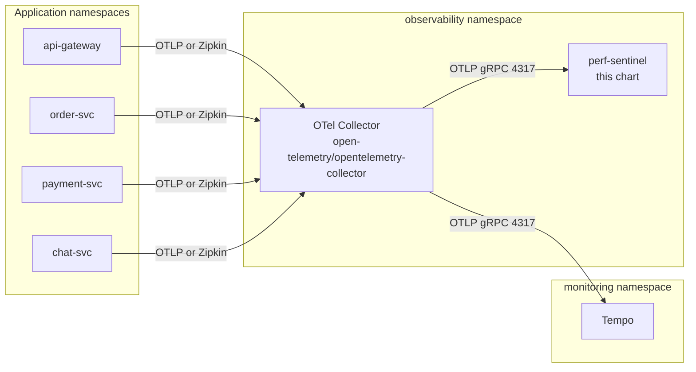

# Helm deployment guide

This guide walks through deploying perf-sentinel on Kubernetes via the
packaged Helm chart under [`charts/perf-sentinel/`](../charts/perf-sentinel/).
The chart ships the daemon (`perf-sentinel watch`) behind a `ClusterIP`
Service exposing OTLP gRPC (4317) and OTLP HTTP plus `/metrics` plus
`/api/*` (4318).

For a non-Helm alternative, see the raw manifests in
[`docs/INSTRUMENTATION.md`](./INSTRUMENTATION.md#kubernetes-deployment).

## Contents

- [TL;DR](#tldr): one-block install command.
- [Topology](#topology): why the chart is sentinel-only by design.
- [Install from OCI registry](#install-from-oci-registry): production install path with Cosign verification.
- [Artifact Hub](#artifact-hub): listing and metadata.
- [Software supply chain](#software-supply-chain): Cosign keyless signatures, SLSA provenance, SBOM, public-good attestation.
- [Install from a local checkout](#install-from-a-local-checkout): for contributors and bisecting.
- [Cutting a new chart release](#cutting-a-new-chart-release): maintainer task, points to RELEASE-PROCEDURE.
- [Workload modes](#workload-modes): the three `workload.kind` values to pick from.
- [Config surface](#config-surface): chart values mapping `.perf-sentinel.toml`, plus secrets, TLS and NetworkPolicy.
- [Observability](#observability): Prometheus ServiceMonitor, Grafana dashboard, alerts and exemplars.
- [Upgrading](#upgrading): `helm upgrade` flow.
- [Uninstalling](#uninstalling): `helm uninstall` flow.
- [End-to-end example](#end-to-end-example): worked example composing the chart with the upstream OpenTelemetry Collector chart.

## TL;DR

```bash
helm install perf-sentinel oci://ghcr.io/robintra/charts/perf-sentinel \
  --version 0.2.0 \
  --namespace observability --create-namespace
kubectl --namespace observability get pods -l app.kubernetes.io/name=perf-sentinel
```

Every published release is Cosign-keyless-signed, shipped with a
SLSA v1.0 build provenance attestation, and shipped with an SPDX
SBOM. See [Software supply chain](#software-supply-chain) below to
check them before installing.

After the pod is ready, point your OpenTelemetry Collector at
`perf-sentinel.observability.svc.cluster.local:4317` (gRPC) or `:4318`
(HTTP). A full end-to-end example composing perf-sentinel with the
upstream OTel Collector chart lives under
[`examples/helm/`](../examples/helm/).

## Topology

The chart is sentinel-only by design. Users compose perf-sentinel with
the upstream
[open-telemetry/opentelemetry-collector](https://github.com/open-telemetry/opentelemetry-helm-charts)
chart instead of bundling a collector that would get out of sync with
upstream releases.



## Install from OCI registry

The chart is published as an OCI artifact at
`oci://ghcr.io/robintra/charts/perf-sentinel`. Every version gets
Cosign keyless signing (GitHub OIDC, Rekor transparency log), a
SLSA v1.0 build provenance attestation stored on the repository's
attestation store, and an SPDX SBOM shipped both as a GitHub Release
asset and as a signed attestation.

### Pin a version

```bash
helm install perf-sentinel oci://ghcr.io/robintra/charts/perf-sentinel \
  --version 0.2.0 \
  --namespace observability --create-namespace \
  -f my-values.yaml
```

Chart version and app version are decoupled: `version` is the chart
release, `appVersion` is the daemon image tag that ships with it. Every
release bumps the two in lockstep, so a pinned `--version` already gives
you a known `appVersion`. Override `image.tag` only to run a specific
daemon build against a different chart.

### Use as a subchart or from Argo CD

`oci://ghcr.io/robintra/charts/perf-sentinel` is the full chart URL, the
form `helm install` takes. A `dependencies:` entry wants the parent
namespace instead, because Helm appends `name` to `repository`:

```yaml
dependencies:
  - name: perf-sentinel
    version: 0.9.16
    repository: oci://ghcr.io/robintra/charts   # namespace, not the chart URL
```

Same split for an Argo CD `Application`: `repoURL: ghcr.io/robintra/charts`
plus `chart: perf-sentinel`.

Repeating the chart name in `repository` resolves to
`charts/perf-sentinel/perf-sentinel`, which does not exist. ghcr.io
answers `403 denied` rather than `404` for a missing path when
unauthenticated, so the failure reads like a private-registry problem
when it is a path problem. To confirm the artifact is public, pull an
anonymous token and fetch the manifest:

```bash
token=$(curl -s "https://ghcr.io/token?scope=repository%3Arobintra%2Fcharts%2Fperf-sentinel%3Apull&service=ghcr.io" | jq -r .token)
curl -s -o /dev/null -w '%{http_code}\n' -H "Authorization: Bearer $token" \
  -H 'Accept: application/vnd.oci.image.manifest.v1+json' \
  https://ghcr.io/v2/robintra/charts/perf-sentinel/manifests/0.9.16
```

## Artifact Hub

The chart is indexed on [Artifact Hub](https://artifacthub.io), where
users can discover it, browse its values schema, and read the
changelog.

Registration flow (done by the maintainer once per chart):

1. Sign in to artifacthub.io with a GitHub account.
2. In the control panel, add a repository of kind "Helm charts (OCI)"
   pointing to `oci://ghcr.io/robintra/charts/perf-sentinel`.
3. Artifact Hub issues a `repositoryID` (UUID).
4. Edit `charts/perf-sentinel/artifacthub-repo.yml`, replace the
   `REPLACE_AFTER_ARTIFACTHUB_REGISTRATION` placeholder with the
   UUID, commit and push.
5. Tag a new chart release (patch bump) so the release workflow
   pushes the updated `artifacthub-repo.yml` to the OCI registry
   under the special `artifacthub.io` tag.
6. Artifact Hub polls the registry and picks up the new metadata
   within 30 minutes. The "Verified publisher" badge appears on the
   next processing cycle.

## Software supply chain

> **See also.** The [Sigstore primer](SUPPLY-CHAIN.md#background-sigstore-primer) in the supply-chain doc defines Cosign, Fulcio, Rekor, in-toto, OIDC, SLSA and SBOM used throughout this section.

Every published release is Cosign-keyless-signed, ships with a SLSA
v1.0 build provenance attestation, and ships with an SPDX SBOM
attested under the SPDX predicate. Users should check at least the
Cosign signature before installing, and the full set in
regulated environments.

### Verify the Cosign signature

Cosign keyless verification ties each release back to a specific
GitHub Actions workflow run. The certificate identity must match the
published release workflow, the OIDC issuer must be GitHub Actions:

```bash
cosign verify \
  --certificate-identity-regexp '^https://github.com/robintra/perf-sentinel/\.github/workflows/helm-release\.yml@refs/tags/chart-v' \
  --certificate-oidc-issuer https://token.actions.githubusercontent.com \
  ghcr.io/robintra/charts/perf-sentinel:0.2.0
```

A successful run prints the Rekor log entry and the certificate
details. A mismatched or absent signature exits non-zero.

### Verify the SLSA build provenance

Each published chart tarball carries a SLSA v1.0 build provenance
attestation produced by `actions/attest-build-provenance` and stored
on the repository's attestation store (not on the OCI registry). The
attestation is queryable via `gh`:

```bash
gh release download chart-v0.2.0 \
  --repo robintra/perf-sentinel \
  --pattern 'perf-sentinel-*.tgz'

gh attestation verify perf-sentinel-0.2.0.tgz \
  --repo robintra/perf-sentinel
```

If you already have the OCI artifact pulled and prefer not to fetch
the tarball, verify the build provenance directly against the OCI
reference:

```bash
docker login ghcr.io
gh attestation verify oci://ghcr.io/robintra/charts/perf-sentinel:0.2.0 \
  --repo robintra/perf-sentinel
```

Either recipe produces the same assurance. Pair whichever one you
pick with the Cosign signature check above to confirm both the
signer identity on the OCI artifact and the build provenance on the
tarball.

### Verify the SBOM

Each release ships an SPDX SBOM as a GitHub Release asset and as a
signed attestation on the repository's attestation store.

The SBOM attestation's subject is the chart tarball, not the SBOM file, so
verify it against the tarball, exactly like the provenance check above. The
`--predicate-type` filter picks the SPDX SBOM attestation over the
build-provenance one:

```bash
gh release download chart-v0.2.0 --repo robintra/perf-sentinel \
  --pattern 'perf-sentinel-*.tgz' \
  --pattern 'perf-sentinel-chart-*.spdx.json'

gh attestation verify perf-sentinel-0.2.0.tgz \
  --repo robintra/perf-sentinel \
  --predicate-type https://spdx.dev/Document/v2.3
```

The downloaded `perf-sentinel-chart-0.2.0.spdx.json` is the human-readable
copy of that attested SBOM. It captures the chart's declared dependencies at
release time.

## Install from a local checkout

For contributors and users who want to inspect, patch, or bisect the
chart before installing, a local clone still works:

```bash
git clone https://github.com/robintra/perf-sentinel.git
cd perf-sentinel

# Inspect or override defaults before install.
helm show values ./charts/perf-sentinel > my-values.yaml

helm install perf-sentinel ./charts/perf-sentinel \
  --namespace observability --create-namespace \
  -f my-values.yaml
```

Keep the OCI path for production installs. The local path bypasses
Cosign and SLSA checks by design, so it should not be used against
shared clusters unless you built the chart yourself.

## Cutting a new chart release

Releasing a new chart version is a maintainer task, not a deployment step. The full
procedure (bump the chart in lockstep, then `scripts/release-chart.sh chart-vA.B.C`,
which gates on the daemon image being published) lives in
[`RELEASE-PROCEDURE.md`](./RELEASE-PROCEDURE.md).

## Workload modes

The chart supports three `workload.kind` values. Pick one per install.

### `Deployment` (default)

Single daemon behind a `ClusterIP` Service. This is the recommended
topology. perf-sentinel is stateful per trace (the `TraceWindow` lives in
memory), so running one daemon and scaling vertically is the right first
move. The
[sharded topology](../examples/docker-compose-sharded.yml) is available
for multi-daemon deployments, it relies on consistent hashing by
`trace_id` in the OTel Collector's `loadbalancingexporter` so every span
of a given trace lands on the same daemon instance.

```yaml
workload:
  kind: Deployment
  replicas: 1
```

> **Scaling and state.** Replicas never share state. Per-trace detection
> stays correct across replicas only with the trace-id load balancing
> described above. Cross-service correlation is single-process and only
> sees what one daemon buffers, so run it on a single instance that
> receives all the services you want correlated. The daemon drains its
> in-flight window on SIGTERM, so a normal rolling update or scale-down
> loses nothing. Only an ungraceful kill (SIGKILL after the grace period,
> OOM) drops the window, and that costs at most `trace_ttl_ms` of
> recurring-pattern detection. Details in
> [LIMITATIONS.md](./LIMITATIONS.md#daemon-state-model-in-memory-single-process-no-shared-state).

### `DaemonSet`

Rare. Useful only when you have a hard requirement for a daemon on every
node (e.g. taking over an existing node-local trace forwarder role). Note
that a DaemonSet splits traces across nodes, which breaks N+1 detection
unless an upstream collector ensures all spans of a trace reach the same
daemon. Most users do not need this mode.

```yaml
workload:
  kind: DaemonSet
```

### `StatefulSet`

Use this mode when you want runtime acks (`POST /api/findings/{sig}/ack`,
since 0.5.20) to survive pod restarts. The daemon writes the JSONL ack
store at `~/.local/share/perf-sentinel/acks.jsonl` by default, which
resolves to a path inside the pod filesystem, lost on restart. Mount a
PersistentVolume and point `[daemon.ack] storage_path` at it so the
audit trail survives. CI TOML acks
(`.perf-sentinel-acknowledgments.toml`) are read-only at runtime and do
not need a PVC, only the daemon-side JSONL does.

```yaml
workload:
  kind: StatefulSet
  replicas: 1
  statefulset:
    persistence:
      enabled: true
      size: 5Gi
      storageClass: gp3
      mountPath: /var/lib/perf-sentinel

config:
  toml: |
    [daemon.ack]
    storage_path = "/var/lib/perf-sentinel/acks.jsonl"
```

In `Deployment` mode (the default), the JSONL is created on first ack
and lost on the next pod restart. That is acceptable for short-lived
acks (deferred to next sprint) but not for permanent ones, those should
go in the CI TOML baseline anyway.

## Config surface

The chart mounts a single ConfigMap at
`/etc/perf-sentinel/.perf-sentinel.toml`. Edit the content via
`values.yaml`:

```yaml
config:
  toml: |
    [thresholds]
    n_plus_one_sql_critical_max = 0
    io_waste_ratio_max = 0.25

    [green]
    enabled = true
    default_region = "eu-west-3"

    [daemon]
    listen_address = "0.0.0.0"
    environment = "production"
```

Full field reference: [`docs/CONFIGURATION.md`](./CONFIGURATION.md).

### Secrets

The TOML file must never contain secrets (the daemon rejects credential
fields at config load). Inject sensitive values via environment variables
fed by a Secret:

```bash
kubectl -n observability create secret generic perf-sentinel-secrets \
  --from-literal=PERF_SENTINEL_EMAPS_TOKEN=sk-your-token
```

```yaml
extraEnvFrom:
  - secretRef:
      name: perf-sentinel-secrets
```

Secret-backed config values follow one pattern: the Secret goes into the
pod env, and a dedicated environment variable overrides the matching config
field when set (`PERF_SENTINEL_EMAPS_TOKEN` for Electricity Maps,
`PERF_SENTINEL_ACK_API_KEY` for the ack key, and the scraper auth headers).
See the "Environment variables" section of `docs/CONFIGURATION.md`.

### Calibration files and TLS certs

Both go through `extraVolumes` plus `extraVolumeMounts`:

```yaml
extraVolumes:
  - name: tls
    secret:
      secretName: perf-sentinel-tls
      defaultMode: 0400
extraVolumeMounts:
  - name: tls
    mountPath: /etc/tls
    readOnly: true

config:
  toml: |
    [daemon]
    tls_cert_path = "/etc/tls/tls.crt"
    tls_key_path = "/etc/tls/tls.key"
```

### Daemon ack runtime store

The 0.5.20 daemon adds three runtime ack endpoints
(`POST` / `DELETE /api/findings/{signature}/ack` and `GET /api/acks`)
on the existing query API port. They share the loopback-by-default
posture of `/api/findings`, but they mutate state, so the deployment
shape needs three operator decisions when the chart is rolled out on a
non-loopback `listen_address`.

**Who may acknowledge findings.** The chart binds `0.0.0.0` so the Service
can route to the pod and keeps the ack store on so acks (and the committed
TOML acks the daemon loads with them) work. By default the daemon has no
app-layer auth (a non-loopback bind just logs a startup advisory): it expects
to run inside a non-exposed cluster network, where the Service and
NetworkPolicy are the boundary. Choose one of two ways to restrict who may
ack:

*Per-group (the faithful answer: only your architects / SRE, with a real
audit `by`).* perf-sentinel has no embedded IAM, so per-identity control
lives in a fronting SSO proxy. Deploy the oauth2-proxy + nginx setup in
[`docs/QUERY-API.md`](./QUERY-API.md#oauth2-proxy--nginx), which authorizes
ack writes by SSO group, and add a `networkPolicy` peer selector so only the
proxy reaches the daemon. Reads (`GET /api/findings`) stay open by design.

*Coarse shared key (anyone holding the key may ack).* Create a Kubernetes
Secret whose `PERF_SENTINEL_ACK_API_KEY` entry is your key and expose it via
`extraEnvFrom`:

```yaml
extraEnvFrom:
  - secretRef:
      name: perf-sentinel-ack   # your Secret, key PERF_SENTINEL_ACK_API_KEY
```

The `PERF_SENTINEL_ACK_API_KEY` env var overrides the config `[daemon.ack]
api_key`, so the key comes from the Secret, never the ConfigMap; a Secret
mounted empty is rejected at config load. The key also gates `GET /api/acks`
(the audit trail), not only the writes. The 16+ character floor still applies.

**Persist acks across pod restarts.** Default storage path is
`~/.local/share/perf-sentinel/acks.jsonl`, inside the pod filesystem,
lost on restart. Switch to `StatefulSet` mode (see above) and remap
`[daemon.ack] storage_path` to a PVC mount.

**Mind the `securityContext` floor.** The daemon opens the JSONL with
`O_NOFOLLOW` and rejects pre-existing files whose mode permits
group/other access (`mode & 0o077 != 0`). Setting `runAsUser` and
`fsGroup` such that the daemon UID does not own the PVC mount, or
adopting a default-restrictive `PodSecurityPolicy` that forces a wider
umask on volume mounts, will surface as `InsecurePermissions` at
startup and the ack store will be unavailable. The daemon stays up
without it (the three ack endpoints return 503), so this is a soft
failure, but check the WARN log line on first rollout.

**Load the CI TOML baseline from a ConfigMap.** Mount
`.perf-sentinel-acknowledgments.toml` via `extraVolumes` and point
`[daemon.ack] toml_path` at it so the daemon has a unified view of
permanent (TOML) and runtime (JSONL) acks. The runtime POST returns
`409 Conflict` on signatures already covered by an active TOML ack,
which prevents the daemon from silently shadowing the team-agreed
baseline.

```yaml
extraVolumes:
  - name: ack-toml
    configMap:
      name: perf-sentinel-acks
extraVolumeMounts:
  - name: ack-toml
    mountPath: /etc/perf-sentinel/acks
    readOnly: true

config:
  toml: |
    [daemon.ack]
    toml_path = "/etc/perf-sentinel/acks/.perf-sentinel-acknowledgments.toml"
```

See `docs/QUERY-API.md` and `docs/CONFIGURATION.md` for the full
endpoint reference and the `[daemon.ack]` field catalog.

### NetworkPolicy

The chart can render a `NetworkPolicy` that restricts who may reach the
daemon's ingest and metrics ports. It is off by default and fail-closed:
enabling it with no selectors blocks every ingress, so you must allow-list
the namespaces or pods that legitimately talk to perf-sentinel, typically
the OTel Collector (OTLP 4317 and 4318) and Prometheus (`/metrics` on 4318).

```yaml
networkPolicy:
  enabled: true
  ingress:
    fromNamespaceSelectors:
      - matchLabels:
          kubernetes.io/metadata.name: observability
    fromPodSelectors:
      - matchLabels:
          app.kubernetes.io/name: otel-collector
```

The two selector lists are OR-ed: an ingress source matching any entry in
either list is allowed. Leave a list empty to skip that match dimension.

## Observability

> **See also.** The [Prometheus and OpenMetrics primer](METRICS.md#background-prometheus-and-openmetrics-primer) defines scraping, exemplars and the Counter/Gauge/Histogram types referenced below.

### Prometheus ServiceMonitor

When the Prometheus Operator is installed, flip `serviceMonitor.enabled`
to scrape `/metrics` on port 4318:

```yaml
serviceMonitor:
  enabled: true
  interval: 15s
  scrapeTimeout: 10s
  labels:
    # Match whatever selector your Prometheus resource uses.
    release: prometheus
```

#### Dashboards that scrape `/api/findings`

Since 0.5.20, `GET /api/findings` filters out acked findings by
default. Existing dashboards or alert rules that hit the endpoint and
count results will silently miss critical findings if those findings
have been acked at runtime or by the CI TOML baseline. Two options
when wiring a Prometheus or Grafana panel against the endpoint:

- Pass `?include_acked=true` and rely on the `acknowledged_by`
  annotation in the response to filter or color the rows client-side.
  Keeps the count visibly high when an ack landed but lets the
  operator see what is currently silenced.
- Stick to the default-filter shape and document the alert as "active
  findings only", with a separate panel listing `GET /api/acks` so the
  acked set is reviewable.

`/metrics` counters (`perf_sentinel_findings_total`,
`perf_sentinel_io_waste_ratio`) are unaffected, they record raw
detection events without any ack filter.

### Grafana dashboard

A ready-made dashboard ships in the repo at
[`examples/grafana-dashboard.json`](../examples/grafana-dashboard.json)
(title `perf-sentinel overview`, uid `perf-sentinel-overview`, 20 panels:
I/O ops and waste ratio, finding types by severity, slow-query p95,
active traces, daemon health, plus the energy, carbon and runtime
headroom gauges off the `/metrics` counters scraped above). The chart
does not bundle it, for the same reason it does not bundle a collector:
a dashboard pinned in the chart drifts from the Grafana you already run.
Import it one of two ways.

Manual import: in Grafana open Dashboards then Import, upload the JSON,
and map the `DS_PROMETHEUS` input to your Prometheus datasource.

Sidecar import (kube-prometheus-stack and similar): load the JSON into a
ConfigMap labelled so the Grafana sidecar discovers it automatically.

```bash
kubectl -n observability create configmap perf-sentinel-grafana \
  --from-file=perf-sentinel-overview.json=examples/grafana-dashboard.json
kubectl -n observability label configmap perf-sentinel-grafana \
  grafana_dashboard=1
```

The label key (`grafana_dashboard` here) must match your Grafana
sidecar's configured `dashboards.sidecar.label`.

### Alerting rules (PrometheusRule)

The chart ships a `PrometheusRule` so loss and saturation alerts are
delivered, not a build-it-yourself wiring exercise. It is gated like the
ServiceMonitor and off by default:

```yaml
prometheusRule:
  enabled: true
  labels:
    # Match your Prometheus resource's ruleSelector.
    release: prometheus
  # Add the per-backend energy-scraper staleness alerts only when an
  # energy backend (Alumet, Scaphandre, Kepler, Redfish, cloud_energy) is configured.
  energyScrapers: false
  scraperStaleSeconds: 120
```

The default group `perf-sentinel.rules` covers the daemon being unreachable
(`absent(perf_sentinel_active_traces)`), OTLP rejection, analysis shedding and
queue saturation, correlator-pair eviction, and service-cardinality overflow.
Each alert's `description` names the `[daemon]` knob to raise. Append your own with `prometheusRule.additionalRules`
(rules are passed through verbatim into the same group), no fork needed.

### PodDisruptionBudget

The default is single-replica, where a PDB has little effect: `maxUnavailable: 1`
still allows the eviction and `minAvailable: 1` would block every node drain. When
uninterrupted collection matters (for example, gap-free carbon data feeding
`disclose`), run a sharded multi-replica topology with `minAvailable`, and use
StatefulSet mode so the archived windows survive restarts.

```yaml
podDisruptionBudget:
  enabled: true
  maxUnavailable: 1
```

### Exemplars

perf-sentinel emits Prometheus exemplars on
`perf_sentinel_findings_total`, `perf_sentinel_io_waste_ratio` and
`perf_sentinel_slow_duration_seconds`. Enable exemplar storage on your
Prometheus:

```yaml
prometheus:
  prometheusSpec:
    enableFeatures:
      - exemplar-storage
```

Then configure Grafana to click through from metric to trace:

```yaml
datasources:
  - name: Prometheus
    type: prometheus
    jsonData:
      exemplarTraceIdDestinations:
        - name: trace_id
          datasourceUid: tempo
```

### Without the Prometheus Operator

If you use a plain Prometheus without the operator, add a static scrape
entry instead:

```yaml
scrape_configs:
  - job_name: perf-sentinel
    kubernetes_sd_configs:
      - role: service
        namespaces:
          names: [observability]
    relabel_configs:
      - source_labels: [__meta_kubernetes_service_label_app_kubernetes_io_name]
        regex: perf-sentinel
        action: keep
      - source_labels: [__meta_kubernetes_endpoint_port_name]
        regex: otlp-http
        action: keep
```

## Upgrading

```bash
helm upgrade perf-sentinel ./charts/perf-sentinel \
  --namespace observability \
  -f my-values.yaml
```

The daemon does not hot-reload its config, so changes to `config.toml`
require a pod restart. The chart handles this automatically: a
`checksum/config` annotation on the pod template computes a hash of the
rendered ConfigMap, so any config edit bumps the annotation and triggers
a rolling restart. No manual `kubectl rollout restart` is needed.

When bumping the chart to a new `appVersion`, pin `image.tag` explicitly
and review `CHANGELOG.md` for breaking config changes. The chart does
not yet validate that the daemon version matches the chart version; this
is the operator's responsibility.

## Uninstalling

```bash
helm uninstall perf-sentinel --namespace observability
```

This removes the Deployment, Service, ConfigMap, ServiceAccount and
(when created) ServiceMonitor and NetworkPolicy. StatefulSet mode with
persistence retains the underlying PersistentVolumeClaims by default,
per Kubernetes semantics. Delete them explicitly if you are wiping
state:

```bash
kubectl --namespace observability delete pvc \
  -l app.kubernetes.io/instance=perf-sentinel
```

## End-to-end example

[`examples/helm/`](../examples/helm/) ships two values files composing
the perf-sentinel chart with the upstream OTel Collector chart for a
Zipkin + OTLP fanout topology to Tempo and perf-sentinel. Walk through
the README there for the full install + verification recipe.
