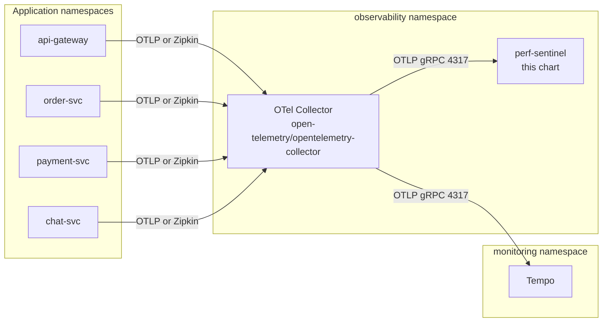

# Helm deployment guide

This guide walks through deploying perf-sentinel on Kubernetes via the
packaged Helm chart under [`charts/perf-sentinel/`](../charts/perf-sentinel/).
The chart ships the daemon (`perf-sentinel watch`) behind a `ClusterIP`
Service exposing OTLP gRPC (4317) and OTLP HTTP plus `/metrics` plus
`/api/*` (4318).

For a non-Helm alternative, see the raw manifests in
[`docs/INSTRUMENTATION.md`](./INSTRUMENTATION.md#kubernetes-deployment).

## Contents

- [TL;DR](#tldr): one-block install command.
- [Topology](#topology): why the chart is sentinel-only by design, and [where collector sampling belongs](#collector-sampling-and-what-reaches-the-daemon) relative to the daemon.
- [Install from OCI registry](#install-from-oci-registry): production install path with Cosign verification.
- [Artifact Hub](#artifact-hub): listing and metadata.
- [Software supply chain](#software-supply-chain): Cosign keyless signatures, SLSA provenance, SBOM, public-good attestation.
- [Install from a local checkout](#install-from-a-local-checkout): for contributors and bisecting.
- [Cutting a new chart release](#cutting-a-new-chart-release): maintainer task, points to RELEASE-PROCEDURE.
- [Workload modes](#workload-modes): the three `workload.kind` values to pick from.
- [Config surface](#config-surface): chart values mapping `.perf-sentinel.toml`, plus [fragments](#config-fragments), secrets, TLS, NetworkPolicy and the optional [Ingress](#ingress).
- [Observability](#observability): Prometheus ServiceMonitor, the Grafana dashboards (metrics and [the findings table](#grafana-on-the-query-api-findings-table)), alerts and exemplars.
- [Upgrading](#upgrading): `helm upgrade` flow.
- [Uninstalling](#uninstalling): `helm uninstall` flow.
- [End-to-end example](#end-to-end-example): worked example composing the chart with the upstream OpenTelemetry Collector chart.

## TL;DR

```bash
helm install perf-sentinel oci://ghcr.io/robintra/charts/perf-sentinel \
  --version 0.9.21 \
  --namespace observability --create-namespace
kubectl --namespace observability get pods -l app.kubernetes.io/name=perf-sentinel
```

Every published release is Cosign-keyless-signed, shipped with a
SLSA v1.0 build provenance attestation, and shipped with an SPDX
SBOM. See [Software supply chain](#software-supply-chain) below to
check them before installing.

After the pod is ready, point your OpenTelemetry Collector at
`perf-sentinel.observability.svc.cluster.local:4317` (gRPC) or `:4318`
(HTTP). A full end-to-end example composing perf-sentinel with the
upstream OTel Collector chart lives under
[`examples/helm/`](../examples/helm/).

## Topology

The chart is sentinel-only by design. Users compose perf-sentinel with
the upstream
[open-telemetry/opentelemetry-collector](https://github.com/open-telemetry/opentelemetry-helm-charts)
chart instead of bundling a collector that would get out of sync with
upstream releases.


```mermaid
flowchart LR
    subgraph apps [Application namespaces]
        A[api-gateway]
        B[order-svc]
        C[payment-svc]
        D[chat-svc]
    end
    subgraph obs [observability namespace]
        OC[OTel Collector<br/>open-telemetry/opentelemetry-collector]
        PS[perf-sentinel<br/>this chart]
    end
    subgraph mon [monitoring namespace]
        T[Tempo]
    end
    A -->|OTLP or Zipkin| OC
    B -->|OTLP or Zipkin| OC
    C -->|OTLP or Zipkin| OC
    D -->|OTLP or Zipkin| OC
    OC -->|OTLP gRPC 4317| T
    OC -->|OTLP gRPC 4317| PS
```

### Collector sampling and what reaches the daemon

Most production collectors sample. If the processor doing it sits
between the applications and perf-sentinel, the daemon analyzes a
fraction of the traffic and **has no way to know it**: a sampled trace
that was kept looks exactly like a complete one, and the report gives
no hint that its numbers cover a tenth of the requests.

What survives sampling and what does not:

| | Effect of upstream sampling |
|---|---|
| Per-trace detectors (`n_plus_one`, `chatty_service`, `excessive_fanout`, `serialized_calls`, `pool_saturation`) | **Unaffected on the traces that arrive.** Both head and tail policies keep or drop whole traces, so a kept trace still contains its full N+1 loop. |
| Coverage | Degraded. A pattern living in a small share of the traffic can be sampled out entirely and never surface. |
| Absolute counts (findings, occurrences, Prometheus totals) | Understated, silently. They describe the sample, and nothing scales them back up. |
| Ratios (I/O waste ratio, and the GreenOps figures derived from it) | Unbiased under a uniform sampler, which hits numerator and denominator alike. A tail sampler's `errors` and `slow` policies bias retention toward heavy traces, and the ratio drifts with them. |
| Cross-trace correlation | Effectively off. `[daemon.correlation] min_co_occurrences` needs a pair to recur inside the window, which rarely survives a 10% sample. |

**Give perf-sentinel its own unsampled pipeline.** Sampling exists to
bound storage cost, and perf-sentinel stores nothing: it holds a
per-trace window in memory for `trace_ttl_ms` and drops it. So fan out
from the same receiver and apply `tail_sampling` only on the branch
feeding the trace store:

```yaml
service:
  pipelines:
    # Storage: sampled, because Tempo pays per byte retained.
    traces/tempo:
      receivers: [otlp]
      processors: [k8sattributes, filter/drop_noise, tail_sampling, batch]
      exporters: [otlp/tempo]
    # Analysis: unsampled, because detection quality pays for it instead.
    traces/perf-sentinel:
      receivers: [otlp]
      processors: [k8sattributes, filter/drop_noise, batch]
      exporters: [otlp/perf-sentinel]
```

Keep the noise filter on both branches. Dropping health checks,
Liquibase migrations and the collector's own export spans removes
findings nobody will act on. Watch out for over-broad regexes there,
an unanchored DDL pattern such as `.*DROP\s+.*` also drops application
queries that merely contain the word.

If the extra volume is the problem, narrow the analysis branch by
**scope rather than by chance**: route only the namespaces or services
you are actively working on, which keeps their figures whole, instead
of a probabilistic sample that makes every service's figures partial.
`filter/drop_noise` already removes the spans perf-sentinel would
discard anyway (no `db.statement`, no `http.url`), so the branch
carries less than the storage one to begin with.

Two constraints if you cannot avoid sampling in front of the daemon:

- Prefer **tail-based**. It decides per whole trace after the fact, so
  traces arrive complete, and its usual policies (keep errors, keep
  slow traces) bias retention toward where structural waste lives.
  Head-based sampling at 1-10% is the worst case for detection.
- Read the counts as a sample, and do not publish them as whole-traffic
  figures. A tail sampler also biases the ratios, since keeping errors
  and slow traces over-represents heavy ones. This matters for
  `disclose`: a public disclosure report built on a sampled window
  misstates the waste it claims to measure. The daemon's own `[daemon] sampling_rate` knob
  raises a `tuning` warning in `Report.warning_details` for exactly this
  reason, but it cannot see what a collector dropped before the spans
  arrived.

When more than one daemon replica sits behind the pipeline, trace
integrity depends on trace-ID routing, see
[`DaemonSet`](#daemonset) and
[`workload.replicas`](#deployment-default).

## Install from OCI registry

The chart is published as an OCI artifact at
`oci://ghcr.io/robintra/charts/perf-sentinel`. Every version gets
Cosign keyless signing (GitHub OIDC, Rekor transparency log), a
SLSA v1.0 build provenance attestation stored on the repository's
attestation store, and an SPDX SBOM shipped both as a GitHub Release
asset and as a signed attestation.

### Pin a version

```bash
helm install perf-sentinel oci://ghcr.io/robintra/charts/perf-sentinel \
  --version 0.9.21 \
  --namespace observability --create-namespace \
  -f my-values.yaml
```

Chart version and app version are decoupled: `version` is the chart
release, `appVersion` is the daemon image tag that ships with it. An
application release bumps the two together, and a chart-only fix bumps
`version` alone (leaving `appVersion` behind, as in `0.9.16`, `0.9.18`,
`0.9.19`, `0.9.20` and `0.9.21`), so a pinned `--version` always gives you a known
`appVersion`. Override `image.tag` only to run a specific daemon build
against a different chart.

### Use as a subchart or from Argo CD

`oci://ghcr.io/robintra/charts/perf-sentinel` is the full chart URL, the
form `helm install` takes. A `dependencies:` entry wants the parent
namespace instead, because Helm appends `name` to `repository`:

```yaml
dependencies:
  - name: perf-sentinel
    version: 0.9.21
    repository: oci://ghcr.io/robintra/charts   # namespace, not the chart URL
```

Same split for an Argo CD `Application`: `repoURL: ghcr.io/robintra/charts`
plus `chart: perf-sentinel`.

Repeating the chart name in `repository` resolves to
`charts/perf-sentinel/perf-sentinel`, which does not exist. ghcr.io
answers `403 denied` rather than `404` for a missing path when
unauthenticated, so the failure reads like a private-registry problem
when it is a path problem. To confirm the artifact is public, pull an
anonymous token and fetch the manifest:

```bash
token=$(curl -s "https://ghcr.io/token?scope=repository%3Arobintra%2Fcharts%2Fperf-sentinel%3Apull&service=ghcr.io" | jq -r .token)
curl -s -o /dev/null -w '%{http_code}\n' -H "Authorization: Bearer $token" \
  -H 'Accept: application/vnd.oci.image.manifest.v1+json' \
  https://ghcr.io/v2/robintra/charts/perf-sentinel/manifests/0.9.21
```

## Artifact Hub

The chart is indexed on [Artifact Hub](https://artifacthub.io), where
users can discover it, browse its values schema, and read the
changelog.

Registration is done, `charts/perf-sentinel/artifacthub-repo.yml`
carries the issued `repositoryID` and every chart release pushes it to
the OCI registry under the reserved `artifacthub.io` tag. The flow, for
reference or to redo it on another registry:

1. Sign in to artifacthub.io with a GitHub account.
2. In the control panel, add a repository of kind "Helm charts (OCI)"
   pointing to `oci://ghcr.io/robintra/charts/perf-sentinel`.
3. Artifact Hub issues a `repositoryID` (UUID).
4. Put that UUID in `charts/perf-sentinel/artifacthub-repo.yml`, commit
   and push.
5. Tag a new chart release (patch bump) so the release workflow
   pushes the updated `artifacthub-repo.yml` to the OCI registry
   under the special `artifacthub.io` tag.
6. Artifact Hub polls the registry and picks up the new metadata
   within 30 minutes. The "Verified publisher" badge appears on the
   next processing cycle.

The `official` status is separate: it is requested through a GitHub
issue on the artifacthub/hub repository, once the repository already
holds the verified-publisher badge. No chart annotation grants it.

## Software supply chain

> **See also.** The [Sigstore primer](SUPPLY-CHAIN.md#background-sigstore-primer) in the supply-chain doc defines Cosign, Fulcio, Rekor, in-toto, OIDC, SLSA and SBOM used throughout this section.

Every published release is Cosign-keyless-signed, ships with a SLSA
v1.0 build provenance attestation, and ships with an SPDX SBOM
attested under the SPDX predicate. Users should check at least the
Cosign signature before installing, and the full set in
regulated environments.

### Verify the Cosign signature

Cosign keyless verification ties each release back to a specific
GitHub Actions workflow run. The certificate identity must match the
published release workflow, the OIDC issuer must be GitHub Actions:

```bash
cosign verify \
  --certificate-identity-regexp '^https://github.com/robintra/perf-sentinel/\.github/workflows/helm-release\.yml@refs/tags/chart-v' \
  --certificate-oidc-issuer https://token.actions.githubusercontent.com \
  ghcr.io/robintra/charts/perf-sentinel:0.9.21
```

**Requires cosign 3.0 or newer.** The signature is a Sigstore bundle
attached to the chart digest as an OCI 1.1 referrer, not a legacy
`sha256-<digest>.sig` tag. cosign 2.x does not read referrers and
answers `Error: no signatures found` on a chart that is correctly
signed, so check `cosign version` before concluding anything from that
message. Verified on chart `0.9.21` with cosign `v3.1.2`.

On Windows, run this from PowerShell or WSL rather than Git Bash: MSYS
rewrites the backslash escapes inside the regex (`\.` arrives as `/.`)
and verification then fails with a misleading `no matching
CertificateIdentity`. Writing the escapes as `[.]` instead is
equivalent and survives every shell.

A successful run prints the Rekor log entry and the certificate
details. A mismatched or absent signature exits non-zero.

**There is no `.prov` file, so `helm install --verify` is not available.**
That is a deliberate choice, not an omission. Helm's native provenance
mechanism requires a long-lived PGP key held as a CI secret, with the
rotation, revocation and fingerprint-publication burden that comes with
it. Cosign keyless signing plus the SLSA attestation cover the same
question, does this artefact come from the release workflow of this
repository, without a static signing key existing anywhere. Verify with
the `cosign verify` command above rather than with `helm --verify`.

### Verify the SLSA build provenance

Each published chart tarball carries a SLSA v1.0 build provenance
attestation produced by `actions/attest-build-provenance` and stored
on the repository's attestation store (not on the OCI registry). The
attestation is queryable via `gh`:

```bash
gh release download chart-v0.9.21 \
  --repo robintra/perf-sentinel \
  --pattern 'perf-sentinel-*.tgz'

gh attestation verify perf-sentinel-0.9.21.tgz \
  --repo robintra/perf-sentinel
```

If you already have the OCI artifact pulled and prefer not to fetch
the tarball, verify the build provenance directly against the OCI
reference:

```bash
docker login ghcr.io
gh attestation verify oci://ghcr.io/robintra/charts/perf-sentinel:0.9.21 \
  --repo robintra/perf-sentinel
```

Either recipe produces the same assurance. Pair whichever one you
pick with the Cosign signature check above to confirm both the
signer identity on the OCI artifact and the build provenance on the
tarball.

### Verify the SBOM

Each release ships an SPDX SBOM as a GitHub Release asset and as a
signed attestation on the repository's attestation store.

The SBOM attestation's subject is the chart tarball, not the SBOM file, so
verify it against the tarball, exactly like the provenance check above. The
`--predicate-type` filter picks the SPDX SBOM attestation over the
build-provenance one:

```bash
gh release download chart-v0.9.21 --repo robintra/perf-sentinel \
  --pattern 'perf-sentinel-*.tgz' \
  --pattern 'perf-sentinel-chart-*.spdx.json'

gh attestation verify perf-sentinel-0.9.21.tgz \
  --repo robintra/perf-sentinel \
  --predicate-type https://spdx.dev/Document/v2.3
```

The downloaded `perf-sentinel-chart-0.9.21.spdx.json` is the human-readable
copy of that attested SBOM. It captures the chart's declared dependencies at
release time.

## Install from a local checkout

For contributors and users who want to inspect, patch, or bisect the
chart before installing, a local clone still works:

```bash
git clone https://github.com/robintra/perf-sentinel.git
cd perf-sentinel

# Inspect or override defaults before install.
helm show values ./charts/perf-sentinel > my-values.yaml

helm install perf-sentinel ./charts/perf-sentinel \
  --namespace observability --create-namespace \
  -f my-values.yaml
```

Keep the OCI path for production installs. The local path bypasses
Cosign and SLSA checks by design, so it should not be used against
shared clusters unless you built the chart yourself.

## Cutting a new chart release

Releasing a new chart version is a maintainer task, not a deployment step. The full
procedure (bump the chart in lockstep, then `scripts/release-chart.sh chart-vA.B.C`,
which gates on the daemon image being published) lives in
[`RELEASE-PROCEDURE.md`](./RELEASE-PROCEDURE.md).

## Workload modes

The chart supports three `workload.kind` values. Pick one per install.

### `Deployment` (default)

Single daemon behind a `ClusterIP` Service. This is the recommended
topology. perf-sentinel is stateful per trace (the `TraceWindow` lives in
memory), so running one daemon and scaling vertically is the right first
move. The
[sharded topology](../examples/docker-compose-sharded.yml) is available
for multi-daemon deployments, it relies on consistent hashing by
`trace_id` in the OTel Collector's `loadbalancingexporter` so every span
of a given trace lands on the same daemon instance.

```yaml
workload:
  kind: Deployment
  replicas: 1
```

> **Scaling and state.** Replicas never share state. Per-trace detection
> stays correct across replicas only with the trace-id load balancing
> described above. Cross-service correlation is single-process and only
> sees what one daemon buffers, so run it on a single instance that
> receives all the services you want correlated. The daemon drains its
> in-flight window on SIGTERM, so a normal rolling update or scale-down
> loses nothing. Only an ungraceful kill (SIGKILL after the grace period,
> OOM) drops the window, and that costs at most `trace_ttl_ms` of
> recurring-pattern detection. Details in
> [LIMITATIONS.md](./LIMITATIONS.md#daemon-state-model-in-memory-single-process-no-shared-state).

### `DaemonSet`

Rare. Useful only when you have a hard requirement for a daemon on every
node (e.g. taking over an existing node-local trace forwarder role). Note
that a DaemonSet splits traces across nodes, which breaks N+1 detection
unless an upstream collector ensures all spans of a trace reach the same
daemon. Most users do not need this mode.

Because that breakage is silent (groups fall under their threshold and
the findings simply never appear, with no error and no metric), the mode
requires an explicit assertion that the routing is in place. Rendering
fails without it:

```yaml
workload:
  kind: DaemonSet
  daemonset:
    # Only true when an upstream collector routes by trace ID to these
    # pods, e.g. the OTel `loadbalancing` exporter with
    # `routing_key: traceID`. A plain Service round-robins and splits
    # traces, which is exactly the case this guard catches.
    spanRoutingByTraceId: true
```

### `StatefulSet`

The only mode where runtime acks (`POST /api/findings/{sig}/ack`, since
0.5.20) work at all. Enabling persistence mounts a PVC at
`/var/lib/perf-sentinel` and the chart itself points `[daemon.ack]
storage_path` and `[daemon.archive] path` at it, so the ack audit trail
and the disclosure archive survive pod restarts and rescheduling. CI
TOML acks (`.perf-sentinel-acknowledgments.toml`) are read-only at
runtime and do not need a PVC, only the daemon-side JSONL does.

> **Mounting the CI ack TOML: a plain ConfigMap mount works.** A
> ConfigMap projects every key as a symlink (`key -> ..data/key`). The
> loader follows a symlink that resolves under its own directory, which
> is exactly that projection, and refuses one resolving anywhere else,
> the hardening against a hostile link pointing at a sensitive file
> (`caused by: Acknowledgments file is a symlink resolving outside its
> own directory, refusing to follow`). Mount the ConfigMap as a
> directory and point `[daemon.ack] toml_path` at the projected key:
>
> ```yaml
> volumeMounts:
>   - name: ci-acks
>     mountPath: /etc/perf-sentinel/acks
> ```
>
> With `toml_path = "/etc/perf-sentinel/acks/acknowledgments.toml"` the
> daemon re-reads the file every minute, so a ConfigMap edit applies
> without a pod restart. `subPath` still works and materialises a real
> file, but it freezes the content at mount time, so a ConfigMap change
> then needs a rollout.

```yaml
workload:
  kind: StatefulSet
  replicas: 1
  statefulset:
    persistence:
      enabled: true
      size: 5Gi
      storageClass: gp3
```

To own those tables yourself, for `[daemon.ack] toml_path` or
`[daemon.archive] max_size_mb`, set
`persistence.manageDaemonPaths: false` and write both durable paths
under `/var/lib/perf-sentinel` in `config.toml`. TOML cannot open the
same table twice, and a table is opened by a header, a dotted key
(`ack.storage_path = ...` under `[daemon]`) or an inline table alike, so
while `manageDaemonPaths` is true the chart refuses to render as soon as
`config.toml` mentions either table in any of those spellings. The
message names the flag to flip. It errs on the side of refusing, because
the alternative is a config the daemon cannot parse and a pod that
crash-loops.

`[daemon.archive]` is skipped entirely when `config.toml` sets `[green]
enabled = false`: the daemon rejects that pairing at startup, an archive
of windows with no energy or carbon would make `disclose` output
meaningless. Declaring the archive yourself alongside green scoring off
fails the render in every workload mode, not only under persistence,
since the daemon refuses it either way.

The mount path is fixed at `/var/lib/perf-sentinel`, `persistence` takes
no `mountPath` key, and enabling it on a `Deployment` or `DaemonSet`
fails the render instead of silently mounting nothing.

In `Deployment` and `DaemonSet` mode, runtime acks are unavailable, not
merely ephemeral. The default store path resolves through
`dirs::data_local_dir()`, and the container image is `FROM scratch` with
no `HOME` and no `/etc/passwd`, so the path cannot be resolved at all.
The daemon logs a WARN at startup, stays up, and the two ack write
routes return `503 Service Unavailable`. `GET /api/acks` is auth-only by
design and still answers `200` with an empty list, so it is not a probe
for this condition.

Make that trade-off deliberately. If operators are expected to
acknowledge findings at runtime, from the dashboard, the `ack` CLI or an
alert at 3am, the default topology cannot do it and `StatefulSet` with
`persistence.enabled` is the install you want. The CI TOML baseline is
not a substitute: it carries the team's permanent decisions, reviewed in
a pull request and shared by every environment, not an oncall defer
during an incident. It does cover the case where every acknowledgment is
a durable team-level decision, and it needs no PVC, being read-only at
runtime. See [`docs/ACK-WORKFLOW.md`](./ACK-WORKFLOW.md#choosing-between-toml-and-daemon)
for which acknowledgment belongs where.

## Config surface

The chart mounts a single ConfigMap at
`/etc/perf-sentinel/.perf-sentinel.toml`. Edit the content via
`values.yaml`:

```yaml
config:
  toml: |
    [thresholds]
    n_plus_one_sql_critical_max = 0
    io_waste_ratio_max = 0.25

    [green]
    enabled = true
    default_region = "eu-west-3"

    [daemon]
    listen_address = "0.0.0.0"
    environment = "production"
```

Full field reference: [`docs/CONFIGURATION.md`](./CONFIGURATION.md).

### Config fragments

`config.toml` is one document. `config.fragments` is a map of additional TOML
documents, rendered into a second ConfigMap and mounted as a directory at
`/etc/perf-sentinel/.perf-sentinel.d/`. The daemon merges them in ascending
filename priority, then applies `config.toml` last as the final override
([Configuration fragments](./CONFIGURATION.md#configuration-fragments)).

```yaml
config:
  toml: |
    [green]
    enabled = true
    default_region = "eu-west-3"
  fragments:
    33-green-kepler.toml: |
      [green.kepler]
      endpoint = "http://kepler.kube-system.svc.cluster.local:9102/metrics"
      metric_kind = "container"

      [green.kepler.service_mappings]
      "order-svc" = "order-svc"
```

This is how the ready-to-copy files in `examples/` reach a cluster: keep the
filename, its `NN` prefix already carries the merge order. `examples/helm/`
ships one values overlay per energy backend, stackable on the base values with
a second `-f`.

Two rules are enforced at render time, because the daemon enforces them at
startup and the image is `FROM scratch`, so a boot failure leaves no shell to
read the error in:

- **Names.** `NN-lowercase-name.toml`, `NN` two digits, the rest `[a-z0-9-]`
  with no leading, trailing or doubled dash. No two fragments may share an
  `NN`, since their merge order would be undefined.
- **Reserved keys.** `listen_port_*` and turning `[green]` off belong in
  `config.toml`, always. `[daemon.ack]` and `[daemon.archive]` are refused only
  when persistence has the chart writing them itself, which is the one case
  where a fragment would open a table TOML already has; without persistence, or
  with `manageDaemonPaths=false`, you own both paths and a fragment is a fine
  place for them. The chart cross-checks these against `service.ports.*`, the
  probes and the PVC reading `config.toml` alone, so a fragment redefining one
  would pass a green check and produce a pod that listens where nothing routes.
  The check folds the spellings TOML allows into one first, so a spaced header
  (`[ green ]`), a quoted key name or an inline table is caught like the plain
  form, and a reserved key merely named in a comment is not.

Editing any fragment moves the `checksum/config` annotation, so `helm upgrade`
rolls the pods. The directory is mounted whole rather than per key, so adding
or removing a fragment reaches a running pod too.

Secrets never go in a fragment: it renders into a ConfigMap, readable by anyone
holding `get` on the namespace. Use the Secret pattern below.

### Secrets

The TOML file must never contain secrets (the daemon rejects credential
fields at config load). Inject sensitive values via environment variables
fed by a Secret:

```bash
kubectl -n observability create secret generic perf-sentinel-secrets \
  --from-literal=PERF_SENTINEL_EMAPS_TOKEN=sk-your-token
```

```yaml
extraEnvFrom:
  - secretRef:
      name: perf-sentinel-secrets
```

Secret-backed config values follow one pattern: the Secret goes into the
pod env, and a dedicated environment variable overrides the matching config
field when set (`PERF_SENTINEL_EMAPS_TOKEN` for Electricity Maps,
`PERF_SENTINEL_ACK_API_KEY` for the ack key, and the scraper auth headers).
See the "Environment variables" section of `docs/CONFIGURATION.md`.

### Calibration files and TLS certs

Both go through `extraVolumes` plus `extraVolumeMounts`:

```yaml
extraVolumes:
  - name: tls
    secret:
      secretName: perf-sentinel-tls
      defaultMode: 0400
extraVolumeMounts:
  - name: tls
    mountPath: /etc/tls
    readOnly: true

config:
  toml: |
    [daemon]
    tls_cert_path = "/etc/tls/tls.crt"
    tls_key_path = "/etc/tls/tls.key"
```

### Daemon ack runtime store

The 0.5.20 daemon adds three runtime ack endpoints
(`POST` / `DELETE /api/findings/{signature}/ack` and `GET /api/acks`)
on the existing query API port. They share the loopback-by-default
posture of `/api/findings`, but they mutate state, so the deployment
shape needs three operator decisions when the chart is rolled out on a
non-loopback `listen_address`.

**Who may acknowledge findings.** The chart binds `0.0.0.0` so the Service
can route to the pod and keeps the ack store on so acks (and the committed
TOML acks the daemon loads with them) work. By default the daemon has no
app-layer auth (a non-loopback bind just logs a startup advisory): it expects
to run inside a non-exposed cluster network, where the Service and
NetworkPolicy are the boundary. Choose one of two ways to restrict who may
ack:

*Per-group (the faithful answer: only your architects / SRE, with a real
audit `by`).* perf-sentinel has no embedded IAM, so per-identity control
lives in a fronting SSO proxy. Deploy the oauth2-proxy + nginx setup in
[`docs/QUERY-API.md`](./QUERY-API.md#oauth2-proxy--nginx), which authorizes
ack writes by SSO group, and add a `networkPolicy` peer selector so only the
proxy reaches the daemon. Reads (`GET /api/findings`) stay open by design.

*Coarse shared key (anyone holding the key may ack).* Create a Kubernetes
Secret whose `PERF_SENTINEL_ACK_API_KEY` entry is your key and expose it via
`extraEnvFrom`:

```yaml
extraEnvFrom:
  - secretRef:
      name: perf-sentinel-ack   # your Secret, key PERF_SENTINEL_ACK_API_KEY
```

The `PERF_SENTINEL_ACK_API_KEY` env var overrides the config `[daemon.ack]
api_key`, so the key comes from the Secret, never the ConfigMap; a Secret
mounted empty is rejected at config load. The key also gates `GET /api/acks`
(the audit trail), not only the writes. The 16+ character floor still applies.

**Runtime acks need a PVC to exist at all.** Without one the default
storage path cannot be resolved inside the scratch image and the ack
write routes return 503. Switch to `StatefulSet` mode with
`persistence.enabled: true` (see above), which wires `[daemon.ack]
storage_path` to the PVC for you.

**Mind the `securityContext` floor.** The daemon opens the JSONL with
`O_NOFOLLOW` and rejects pre-existing files whose mode permits
group/other access (`mode & 0o077 != 0`). Setting `runAsUser` and
`fsGroup` such that the daemon UID does not own the PVC mount, or
running under a mutating admission policy (Kyverno, OPA Gatekeeper) that
rewrites `fsGroup` or `runAsUser` on the pod, will surface as
`InsecurePermissions` at
startup and the ack store will be unavailable. The daemon stays up
without it (the ack write routes return 503, `GET /api/acks` an empty
list), so this is a soft failure, but check the WARN log line on first
rollout.

**Load the CI TOML baseline from a ConfigMap.** Mount
`.perf-sentinel-acknowledgments.toml` via `extraVolumes` and point
`[daemon.ack] toml_path` at it so the daemon has a unified view of
permanent (TOML) and runtime (JSONL) acks. The runtime POST returns
`409 Conflict` on signatures already covered by an active TOML ack,
which prevents the daemon from silently shadowing the team-agreed
baseline.

```yaml
extraVolumes:
  - name: ack-toml
    configMap:
      name: perf-sentinel-acks
extraVolumeMounts:
  - name: ack-toml
    mountPath: /etc/perf-sentinel/acks
    readOnly: true

# Under StatefulSet persistence, declaring the table yourself means
# taking both paths over. Without persistence this flag is irrelevant.
workload:
  statefulset:
    persistence:
      manageDaemonPaths: false

config:
  toml: |
    [daemon.ack]
    toml_path = "/etc/perf-sentinel/acks/.perf-sentinel-acknowledgments.toml"
    storage_path = "/var/lib/perf-sentinel/acks.jsonl"

    [daemon.archive]
    path = "/var/lib/perf-sentinel/archive.ndjson"
```

See `docs/QUERY-API.md` and `docs/CONFIGURATION.md` for the full
endpoint reference and the `[daemon.ack]` field catalog.

### NetworkPolicy

The chart can render a `NetworkPolicy` that restricts who may reach the
daemon's ingest and metrics ports. It is off by default and fail-closed:
enabling it with no selectors blocks every ingress, so you must allow-list
the namespaces or pods that legitimately talk to perf-sentinel, typically
the OTel Collector (OTLP 4317 and 4318) and Prometheus (`/metrics` on 4318).

```yaml
networkPolicy:
  enabled: true
  ingress:
    fromNamespaceSelectors:
      - matchLabels:
          kubernetes.io/metadata.name: observability
    fromPodSelectors:
      - matchLabels:
          app.kubernetes.io/name: otel-collector
```

The two selector lists are OR-ed: an ingress source matching any entry in
either list is allowed. Leave a list empty to skip that match dimension.

### Ingress

The chart can render an `Ingress` in front of the Service. It is off by
default, and that default is a security decision rather than a packaging
one: perf-sentinel has no embedded IAM, so publishing it puts an
unauthenticated API on the network. Anyone who reaches the host can POST
OTLP traces, read `/api/findings` (your SQL templates and endpoint names)
and call the ack write endpoints. The chart's threat model is a
non-exposed cluster network bounded by the Service and the optional
NetworkPolicy.

Two postures are supported. **Internal-only** is the simpler one: the
Ingress rides a controller that is itself unreachable from outside your
network, and the NetworkPolicy allows that controller's pods. The
boundary becomes the controller's own exposure, so verify that assumption
rather than inherit it, since a shared controller often carries a public
listener alongside the internal one. **Authenticated** is required as
soon as the host resolves beyond that: put an SSO proxy in front, either
as the Ingress backend or as a controller auth annotation, per
[the SSO proxy and shared-key options](#daemon-ack-runtime-store). Only
the SSO path yields a per-person audit `by` on acknowledgments; the shared
key gates ack writes alone and leaves every read open.

Before reaching for either, check whether you need the Ingress at all.
The common ask behind it, "stop making me `kubectl port-forward` to look
at the findings", is answered in-cluster by
[Grafana on the query API](#grafana-on-the-query-api-findings-table),
which exposes nothing. The Ingress earns its place for the full HTML
report and the operator TUI from a workstation.

```yaml
ingress:
  enabled: true
  className: nginx
  annotations:
    # Authenticate at the controller. Without something like this, the
    # API is open to whoever resolves the host.
    nginx.ingress.kubernetes.io/auth-url: "https://oauth2-proxy.example.com/oauth2/auth"
    nginx.ingress.kubernetes.io/auth-signin: "https://oauth2-proxy.example.com/oauth2/start?rd=$escaped_request_uri"
  hosts:
    - host: perf-sentinel.example.com
      paths:
        - path: /
          pathType: Prefix
  tls:
    - secretName: perf-sentinel-tls
      hosts:
        - perf-sentinel.example.com
```

`servicePortName` selects which published port the rules route to,
`otlp-http` (4318: OTLP HTTP, the query API and `/metrics`) by default or
`otlp-grpc` (4317: OTLP gRPC). Anything else fails the render, since the
Service publishes no other port and the mistake would otherwise surface as
a 503 at request time. Routing gRPC also needs a controller told to speak
HTTP/2 to the backend, for ingress-nginx
`nginx.ingress.kubernetes.io/backend-protocol: GRPC`.

Terminate TLS at the controller. The daemon speaks plaintext HTTP unless
`[daemon.tls]` is configured, and this chart does not wire certificates
into the Ingress backend.

A host entry with no `host` key matches every host reaching the
controller. That is legal and sometimes wanted on an internal controller,
but on a shared one it publishes the API far more broadly than intended.

Enabling an Ingress does not relax the NetworkPolicy. If both are on, the
controller's pods must be allowed as a peer, otherwise the Ingress
resolves and every request times out against a policy that denies it.
Allow the controller's namespace by its automatic label, which Kubernetes
sets on every namespace since 1.21, rather than by a label the controller
chart may or may not apply:

```yaml
networkPolicy:
  enabled: true
  ingress:
    fromNamespaceSelectors:
      # ingress-nginx installed in its own namespace. Use `traefik`,
      # `kube-system`, or whatever `kubectl get pods -A | grep ingress`
      # reports for your cluster.
      - matchLabels:
          kubernetes.io/metadata.name: ingress-nginx
```

A quick way to confirm the peer is the one blocking: with the Ingress
enabled and requests timing out, set `networkPolicy.enabled=false` for
one upgrade. If requests start flowing, the selector is what is missing.
Turn it back on before you leave it that way.

## Observability

> **See also.** The [Prometheus and OpenMetrics primer](METRICS.md#background-prometheus-and-openmetrics-primer) defines scraping, exemplars and the Counter/Gauge/Histogram types referenced below.

### Prometheus ServiceMonitor

When the Prometheus Operator is installed, flip `serviceMonitor.enabled`
to scrape `/metrics` on port 4318:

```yaml
serviceMonitor:
  enabled: true
  interval: 15s
  scrapeTimeout: 10s
  labels:
    # Match whatever selector your Prometheus resource uses.
    release: prometheus
```

`honorLabels` defaults to `true` since chart 0.17.1, and that default
matters. The operator attaches a target label named `service`, taken
from the Service name, and with honor labels off Prometheus renames the
colliding label a target exposes, so the daemon's own `service` was
stored as `exported_service`. The dashboard's `Service` variable then
offered the release name as its only value and its per-service panel
collapsed every analysed service into one line. The daemon exposes no
`job`, `instance` or `namespace` label, so nothing else changes hands
and `Namespace` still reads what the scrape attaches. Honor labels
settles a collision rather than replacing anything, and
the daemon's own `service` label (`perf_sentinel_service_io_ops_total`,
and since 0.18.0 `perf_sentinel_findings_total`,
`perf_sentinel_slow_duration_seconds` and the per-service analysis
counters) is kept where it is exposed, so every other series still takes
the operator's `service` from the target and anything routing on that label is
untouched. The `grouping` label those series gain in 0.19.0 collides with
nothing the operator attaches. It is not called `namespace` for exactly that
reason: the operator does attach a `namespace` target label, honor labels
would let the daemon's win, and the dashboard's `Daemon namespace` variable
and every `namespace=~"$namespace"` filter would start selecting workload
namespaces instead of the install. A panel or an alert written against the shape the bug
produced, filtering `service="<release fullname>"` on the per-service
metric, comes back empty with the real service names in its place. On
an install
that already stored the renamed series, `helm upgrade` fixes the next
scrape and leaves the history as it is.

#### Dashboards that scrape `/api/findings`

Since 0.5.20, `GET /api/findings` filters out acked findings by
default. Existing dashboards or alert rules that hit the endpoint and
count results will silently miss critical findings if those findings
have been acked at runtime or by the CI TOML baseline. Two options
when wiring a Prometheus or Grafana panel against the endpoint:

- Pass `?include_acked=true` and rely on the `acknowledged_by`
  annotation in the response to filter or color the rows client-side.
  Keeps the count visibly high when an ack landed but lets the
  operator see what is currently silenced.
- Stick to the default-filter shape and document the alert as "active
  findings only", with a separate panel listing `GET /api/acks` so the
  acked set is reviewable.

`/metrics` counters (`perf_sentinel_findings_total`,
`perf_sentinel_io_waste_ratio`) are unaffected, they record raw
detection events without any ack filter.

### Grafana dashboard

A ready-made dashboard ships in the repo at
[`examples/grafana-dashboard.json`](../examples/grafana-dashboard.json)
(title `perf-sentinel overview`, uid `perf-sentinel-overview`, 21 panels:
I/O ops and waste ratio, finding types by severity, slow-query p95,
active traces, daemon health, plus the energy, carbon and runtime
headroom gauges off the `/metrics` counters scraped above). The chart
does not bundle it, for the same reason it does not bundle a collector:
a dashboard pinned in the chart drifts from the Grafana you already run.
Import it one of two ways.

Manual import: in Grafana open Dashboards then Import, upload the JSON,
and map the `DS_PROMETHEUS` input to your Prometheus datasource.

**Four template variables** sit above the panels. `Job` selects which
Prometheus job to read, which matters when several daemons are scraped
by the same Prometheus, staging and production for instance.
`Namespace` narrows all twenty-one panels to one or more Kubernetes
namespaces, and defaults to `All`, the fleet-wide view the dashboard
had before. The namespace is the one each daemon runs in, not the one
its analysed workloads run in, so the variable picks an install rather
than a slice of the traffic. It is the one label the daemon does not
export: the scrape attaches it, so Prometheus Operator fills it in when
it reads the chart's ServiceMonitor, and a scrape that attaches none is
still matched by `All`, which leaves the dashboard unchanged outside
Kubernetes. `Service` filters the analysis panels: findings, slow-span
latency and I/O, eleven panels in total since 0.18.0, when
`perf_sentinel_findings_total` and `perf_sentinel_slow_duration_seconds`
gained a bounded `service` label, and `Grouping`, ahead of it, narrows the
same eleven panels and the service list to the analysed traffic's grouping
(`k8s.namespace.name`, then `service.namespace`, by default), which is what
`Namespace` does not do. The remaining panels measure the
daemon itself (health, queues, OTLP intake, energy freshness) and stay
daemon-wide by construction: no service emits those numbers, so no
service filter could slice them. Cardinality stays under control
through per-run caps (128 services on findings, 64 on the histogram,
overflow folded into `service="_other"`), and
`[daemon] per_service_labels = false` restores the unlabeled shape, and `per_grouping_labels = false` the 0.18.0
one. The grouping caps count admitted (service, grouping) pairs after the
service caps and fold only the grouping half into `grouping="_other"`.

**Every panel follows the time picker**, with one rule and one stated
exception. Rate panels use `$__rate_interval` and windowed panels use
`$__range`, so picking `Last 6 hours` means the ranking, the
distribution and the detail table all answer for those six hours and
never contradict each other. Until 0.10.0 three panels carried a window
baked into the query (`1h`, `1h`, `24h`) while everything around them
adapted, which read as a dashboard that half-ignored the picker.

The exception is the handful of `stat` panels that show a current value
(`Active traces`, `Daemon health`) or a lifetime total (`Total findings
(cumulative)`, `Traces analyzed (cumulative)`, `Ingested I/O ops
(cumulative)`). A counter total since daemon start is what those report, so
they say so in the title or the description, and they reset when the pod
restarts.

`I/O waste ratio` is computed in the panel, as
`sum(increase(perf_sentinel_service_avoidable_io_ops_total[$__range]))`
over `sum(increase(perf_sentinel_service_analyzed_io_ops_total[$__range]))`,
the two analysis-side counters of the same scoring pass under the same
caps, rather than read off the `perf_sentinel_io_waste_ratio` gauge the daemon
exports. That gauge is a ratio of lifetime counters: it ignores the time
picker, dilutes a current problem in everything since the pod started,
and renders one dial per replica. The panel form answers for the
selected range across the whole fleet, and carries two decimals because
a fleet at 1% avoidable I/O over a million operations is worth seeing
where integer percent rounds it to zero. The exported gauge stays
available for alerting.

Every series a query returns once per replica is labelled with
`{{instance}}`, and the panels that aggregate across the fleet name what
they aggregated instead. Running more than one replica otherwise
produced legends with the same entry repeated once per pod (`events/s`,
`events/s`, `events/s`), and stat panels showing four unlabelled numbers
side by side with no way to tell which pod was which.

Sidecar import (kube-prometheus-stack and similar): load the JSON into a
ConfigMap labelled so the Grafana sidecar discovers it automatically.

```bash
kubectl -n observability create configmap perf-sentinel-grafana \
  --from-file=perf-sentinel-overview.json=examples/grafana-dashboard.json
kubectl -n observability label configmap perf-sentinel-grafana \
  grafana_dashboard=1
```

The label key (`grafana_dashboard` here) must match your Grafana
sidecar's configured `dashboards.sidecar.label`.

### Grafana on the query API (findings table)

The dashboard above reads Prometheus, which answers "how many findings
of what kind, from which service": since 0.18.0
`perf_sentinel_findings_total` carries `type`, `severity` and a
`service` label bounded by a 128-service cap (overflow folds into
`service="_other"`) and, since 0.19.0, a `grouping` label bounded by its
own caps. A per-endpoint label stays off `/metrics`,
deliberately, because endpoint cardinality is unbounded. Which
operation on which endpoint lives behind the query API.

A second dashboard reads it directly through the
[Infinity plugin](https://grafana.com/grafana/plugins/yesoreyeram-infinity-datasource/)
(`yesoreyeram-infinity-datasource`, install it first, it does not ship
with Grafana):

- [`examples/grafana-infinity-datasource.yaml`](../examples/grafana-infinity-datasource.yaml),
  the provisioned datasource. Set the namespace in the URL.
- [`examples/grafana-findings-dashboard.json`](../examples/grafana-findings-dashboard.json),
  title `perf-sentinel findings`, uid `perf-sentinel-findings`: a
  filterable table of findings plus the runtime acknowledgments.

**No port-forward and no Ingress.** Grafana's backend performs the
request, so an in-cluster Grafana reaches the Service over the cluster
network. This is the answer to "I need a `kubectl port-forward` every
time I want to look at the findings", and it exposes nothing outside the
cluster.

Two things to settle before you ship it. First, the daemon has no
embedded IAM: whoever opens this dashboard's folder reads your SQL
templates and endpoint names, so scope the folder to the people allowed
to see them. Second, if `networkPolicy.enabled=true`, add Grafana as a
peer under `networkPolicy.ingress.fromNamespaceSelectors` or
`.fromPodSelectors`, otherwise the datasource times out with no useful
error, because a NetworkPolicy denies silently.

The table shows one row per distinct problem rather than one per
detection, since `/api/findings` folds by the signature acknowledgments
use, and its `Traces` column is that fold's count. It counts detections
still held in the daemon's ring buffer, so it falls as older ones age out
and resets when the daemon restarts. Filtering is done with the column
headers rather than a dashboard variable, so no request can ask the API
for a severity it does not know.

### Alerting rules (PrometheusRule)

The chart ships a `PrometheusRule` so the alerts that matter are delivered, not
a build-it-yourself wiring exercise. It is gated like the ServiceMonitor and off
by default:

```yaml
prometheusRule:
  enabled: true
  labels:
    # Match your Prometheus resource's ruleSelector.
    release: prometheus
  # Add the per-backend energy-scraper staleness alerts only when an
  # energy backend (Alumet, Scaphandre, Kepler, Redfish, cloud_energy) is configured.
  energyScrapers: false
  scraperStaleSeconds: 120
```

The default group `perf-sentinel.rules` carries five rules, and every one of
them fires on data the daemon lost and cannot recover: the daemon not being
scraped (`up{job="<release fullname>"} == 0`), ingest dropped at a saturated
channel, ingest refused under memory pressure, traces shed before analysis, and
a dropped disclosure archive window. Each `description` names the `[daemon]` knob
to raise. Append your own with `prometheusRule.additionalRules`, passed through
verbatim into the same group, no fork needed.

Queue saturation, correlator-pair eviction and service-cardinality overflow are
deliberately **not** alerts. Each fires on a state the daemon reaches while
working normally, and each is already a panel on the shipped Grafana dashboard.
Saturation in particular predicted the shedding alert, so one incident produced
two notifications and the first carried no remedy the second did not.

`PerfSentinelDown` reads the job name Prometheus Operator derives from the
Service, which is the release fullname. Scraping with your own `scrape_config`
under a different `job_name` leaves that one rule silent, so override it through
`additionalRules` if you do.

### PodDisruptionBudget

The default is single-replica, where a PDB has little effect: `maxUnavailable: 1`
still allows the eviction and `minAvailable: 1` would block every node drain. When
uninterrupted collection matters (for example, gap-free carbon data feeding
`disclose`), run a sharded multi-replica topology with `minAvailable`, and use
StatefulSet mode so the archived windows survive restarts.

```yaml
podDisruptionBudget:
  enabled: true
  maxUnavailable: 1
```

### Exemplars

perf-sentinel emits Prometheus exemplars on
`perf_sentinel_findings_total`, `perf_sentinel_io_waste_ratio` and
`perf_sentinel_slow_duration_seconds`. Enable exemplar storage on your
Prometheus:

```yaml
prometheus:
  prometheusSpec:
    enableFeatures:
      - exemplar-storage
```

Then configure Grafana to click through from metric to trace:

```yaml
datasources:
  - name: Prometheus
    type: prometheus
    jsonData:
      exemplarTraceIdDestinations:
        - name: trace_id
          datasourceUid: tempo
```

### Without the Prometheus Operator

If you use a plain Prometheus without the operator, add a static scrape
entry instead:

```yaml
scrape_configs:
  - job_name: perf-sentinel
    kubernetes_sd_configs:
      - role: endpoints
        namespaces:
          names: [observability]
    relabel_configs:
      - source_labels: [__meta_kubernetes_service_label_app_kubernetes_io_name]
        regex: perf-sentinel
        action: keep
      - source_labels: [__meta_kubernetes_endpoint_port_name]
        regex: otlp-http
        action: keep
      - source_labels: [__meta_kubernetes_namespace]
        target_label: namespace
```

The role is `endpoints` because `__meta_kubernetes_endpoint_port_name`
exists only there, and a `keep` on a label the role never sets drops
every target. The last rule is what the dashboard's `Namespace` variable
reads: Prometheus Operator attaches that label on its own, a
hand-written scrape config has to ask for it.

## Upgrading

```bash
helm upgrade perf-sentinel ./charts/perf-sentinel \
  --namespace observability \
  -f my-values.yaml
```

The daemon does not hot-reload its config, so changes to `config.toml`
require a pod restart. The chart handles this automatically: a
`checksum/config` annotation on the pod template computes a hash of the
rendered ConfigMap, so any config edit bumps the annotation and triggers
a rolling restart. No manual `kubectl rollout restart` is needed.

When bumping the chart to a new `appVersion`, pin `image.tag` explicitly
and review `CHANGELOG.md` for breaking config changes. The chart does
not yet validate that the daemon version matches the chart version; this
is the operator's responsibility.

## Uninstalling

```bash
helm uninstall perf-sentinel --namespace observability
```

This removes the Deployment, Service, ConfigMap, ServiceAccount and
(when created) ServiceMonitor and NetworkPolicy. StatefulSet mode with
persistence retains the underlying PersistentVolumeClaims by default,
per Kubernetes semantics. Delete them explicitly if you are wiping
state:

```bash
kubectl --namespace observability delete pvc \
  -l app.kubernetes.io/instance=perf-sentinel
```

## End-to-end example

[`examples/helm/`](../examples/helm/) ships two values files composing
the perf-sentinel chart with the upstream OTel Collector chart for a
Zipkin + OTLP fanout topology to Tempo and perf-sentinel. Walk through
the README there for the full install + verification recipe.
