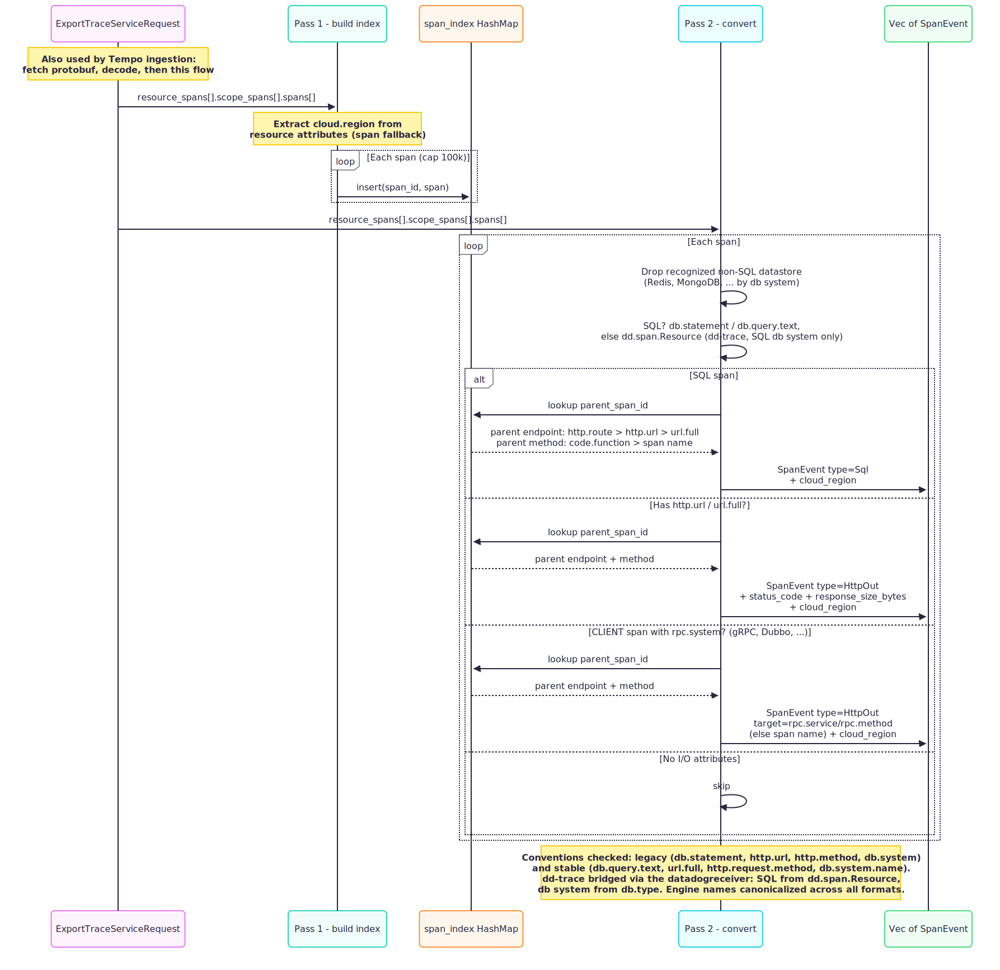

# Ingestion and daemon mode

## OTLP Conversion



### Two-pass design

`convert_otlp_request()` processes each `resource_spans` block in two passes:

**Pass 1: Build span index:**
```rust
let span_index: HashMap<&[u8], &Span> = scope_spans.iter()
    .flat_map(|ss| &ss.spans)
    .map(|span| (span.span_id.as_slice(), span))
    .collect();
```

**Pass 2: Convert I/O spans:**
```rust
for span in &scope.spans {
    if let Some(event) = convert_span(span, service_name, &span_index) {
        events.push(event);
    }
}
```

**Why two passes?** In OTLP, a parent span may appear after its child in the protobuf message. The first pass builds a lookup table so that the second pass can resolve `source.endpoint` from the parent span's `http.route` attribute. A single-pass approach would miss parent spans defined later in the message.

The index uses `&[u8]` keys (raw span_id bytes), avoiding hex encoding just for lookup. The span index is capped at 100,000 spans per resource to prevent memory exhaustion from pathological OTLP payloads.

### `bytes_to_hex` Lookup Table

```rust
fn bytes_to_hex(bytes: &[u8]) -> String {
    const HEX: &[u8; 16] = b"0123456789abcdef";
    let mut buf = Vec::with_capacity(bytes.len() * 2);
    for &b in bytes {
        buf.push(HEX[(b >> 4) as usize]);
        buf.push(HEX[(b & 0x0f) as usize]);
    }
    // SAFETY: all bytes are ASCII hex digits (0-9, a-f)
    unsafe { String::from_utf8_unchecked(buf) }
}
```

This is a well-known optimization for hex encoding. Instead of using `write!(hex, "{b:02x}")` (which invokes the formatting machinery per byte at ~30ns), the lookup table converts each byte to two hex characters via bit shifting at ~5ns per byte. Building a `Vec<u8>` and using `from_utf8_unchecked` avoids the char-to-UTF8 conversion overhead of `String::push(char)`. The `unsafe` is justified because all output bytes are ASCII hex digits.

For a 16-byte trace_id + 8-byte span_id, this saves ~600ns per span conversion. At 100,000 events/sec, that is 60ms/sec of avoided overhead.

### `nanos_to_iso8601`: Howard Hinnant's Algorithm

> **Note:** This function now lives in `time.rs` (shared module) and is reused by Jaeger and Zipkin ingestion via `micros_to_iso8601`.

Converting Unix nanoseconds to `YYYY-MM-DDTHH:MM:SS.mmmZ` uses the civil date algorithm from [Howard Hinnant](https://howardhinnant.github.io/date_algorithms.html). The key steps:

1. Convert nanoseconds to days since epoch + remaining milliseconds
2. Shift the epoch to March 1, year 0 (by adding 719,468 days)
3. Compute the era (400-year cycle) and day-of-era
4. Derive year-of-era, day-of-year, month, and day using a lookup-free formula

This avoids the [chrono](https://docs.rs/chrono/) crate (~150KB binary overhead) and its ~200ns parse overhead. The hand-rolled algorithm handles leap years correctly (verified by a test with `2024-02-29`).

### Event type priority

When a span has both a SQL attribute (`db.statement` or `db.query.text`) and an HTTP attribute (`http.url` or `url.full`), SQL takes priority. This is intentional: database instrumentation is more specific than HTTP client instrumentation. The SQL attribute carries the actual query text needed for normalization, while the HTTP attribute might represent the same operation at the transport level.

Both legacy (pre-1.21) and stable (1.21+) [OTel semantic conventions](https://opentelemetry.io/docs/specs/semconv/) are supported: `db.statement` and `db.query.text` for SQL, `http.url` and `url.full` for HTTP, `http.method` and `http.request.method` for the HTTP verb, `http.status_code` and `http.response.status_code` for the status. This ensures compatibility with both older OTel SDKs and modern Java agents (v2.x).

### Clock skew protection

```rust
if end_nanos < start_nanos {
    tracing::trace!("Span has end_time < start_time (clock skew?), duration forced to 0");
}
let duration_us = end_nanos.saturating_sub(start_nanos) / 1000;
```

`saturating_sub` returns 0 for negative durations instead of wrapping around. A trace-level log helps operators diagnose OTLP integration issues without flooding logs.

## JSON Ingestion

```rust
pub fn ingest(&self, raw: &[u8]) -> Result<Vec<SpanEvent>, Self::Error> {
    if raw.len() > self.max_size {
        return Err(JsonIngestError::PayloadTooLarge { ... });
    }
    serde_json::from_slice(raw)
}
```

The payload size is checked **before** deserialization. This prevents `serde_json` from allocating memory for a multi-gigabyte JSON payload before rejecting it.

### Auto-format detection

`JsonIngest` now auto-detects the input format using lightweight byte-level heuristics. It peeks at the first 1-4 KB of the payload:

- Starts with `{` and contains `"data"` + `"spans"` in the first 4 KB: **Jaeger**
- Starts with `[` and contains `"traceId"` + `"localEndpoint"` in the first 1 KB: **Zipkin**
- Otherwise: **Native** perf-sentinel format

This avoids parsing the full payload into a `serde_json::Value` for detection, eliminating a 2x parse cost. The heuristic operates on raw bytes (`std::str::from_utf8` on a bounded prefix), making it O(1) regardless of payload size.

### Jaeger JSON ingestion

`ingest/jaeger.rs` parses the Jaeger JSON export format (`{ "data": [{ "traceID": "...", "spans": [...], "processes": {...} }] }`). Key mappings:

- `startTime` (microseconds) is converted via `micros_to_iso8601` from the shared `time.rs` module
- `parent_span_id` is extracted from `references` where `refType = "CHILD_OF"`
- Both legacy and stable OTel semantic conventions are supported in tags

### Zipkin JSON v2 ingestion

`ingest/zipkin.rs` parses the Zipkin JSON v2 format (flat array of span objects). Key differences from Jaeger:

- `parentId` is a direct field (not in a references array)
- Tags are a `HashMap<String, String>` (not an array of key-value objects)
- `localEndpoint.serviceName` provides the service name

## Daemon event loop


### Architecture

```
OTLP gRPC (port 4317)   ─┐
OTLP HTTP (port 4318)   ─┤─→ mpsc::channel(1024) ─→ TraceWindow ─→ eviction ─→ detect ─→ score ─→ NDJSON
JSON unix socket        ─┘
```

The event loop uses `tokio::select!` to multiplex:
- **Receive events** from the channel -> normalize -> push into window
- **Ticker** every TTL/2 ms -> evict expired traces -> detect/score -> emit
- **Ctrl+C** -> drain all traces -> detect/score -> emit -> shutdown

### Normalization outside the lock

```rust
// Normalize OUTSIDE the lock:
let normalized: Vec<_> = events.into_iter().map(normalize::normalize).collect();
// Then acquire the lock and push:
let mut w = window.lock().await;
for event in normalized { w.push(event, now_ms); }
```

Normalization is CPU-bound work (regex, string manipulation). Moving it outside the `Mutex` lock minimizes lock hold time to just the HashMap operations. Under contention (ticker and receive running concurrently), this prevents the eviction ticker from blocking on normalization.

### Trace-level sampling

```rust
fn should_sample(trace_id: &str, rate: f64) -> bool {
    let mut hash: u64 = 0xcbf2_9ce4_8422_2325; // FNV-1a offset basis
    for b in trace_id.as_bytes() {
        hash ^= u64::from(*b);
        hash = hash.wrapping_mul(0x0100_0000_01b3); // FNV-1a prime
    }
    (hash as f64 / u64::MAX as f64) < rate
}
```

The [FNV-1a hash](https://en.wikipedia.org/wiki/Fowler%E2%80%93Noll%E2%80%93Vo_hash_function) is a fast, non-cryptographic hash that produces well-distributed output. The offset basis and prime are the standard 64-bit FNV-1a constants.

**Why FNV-1a?** Simpler and faster (~2ns for a typical trace_id) than `std::hash::DefaultHasher` (SipHash, ~10ns). Cryptographic quality is not needed for sampling: only uniform distribution matters.

**Deterministic:** the same `trace_id` always produces the same sampling decision, ensuring all events from a trace are either kept or dropped together.

**Per-batch caching:** the `apply_sampling()` function filters a batch of events using a `HashMap<String, bool>` cache. Within a single batch, multiple events may share a `trace_id`. The cache uses `get()` before `insert()` so that `trace_id` is only cloned for the first event of each trace, not on every cache hit. Extracting this logic into a standalone function keeps the `tokio::select!` event loop readable.

### Bounded channel

```rust
let (tx, mut rx) = mpsc::channel::<Vec<SpanEvent>>(1024);
```

The [bounded channel](https://docs.rs/tokio/latest/tokio/sync/mpsc/fn.channel.html) provides backpressure: if the event loop falls behind and the buffer fills to 1024 batches, ingestion senders will await until space is available. This prevents unbounded memory growth from fast producers.

### Security hardening

**Unix socket permissions:**
```rust
use std::os::unix::fs::PermissionsExt;
std::fs::set_permissions(path, std::fs::Permissions::from_mode(0o600));
```

The `0o600` mode restricts read/write to the socket owner only, preventing other local users from injecting events. If `set_permissions` fails, the socket file is removed and the listener does not start (fatal error, not a warning).

**Connection semaphore:**
```rust
let semaphore = Arc::new(tokio::sync::Semaphore::new(128));
```

Limits concurrent JSON socket connections to 128. Without this, a local attacker could open thousands of connections, each consuming a tokio task and buffer memory.

**Per-connection byte limit:**
```rust
const CONNECTION_LIMIT_FACTOR: u64 = 16;
let limited = stream.take(max_payload_size as u64 * CONNECTION_LIMIT_FACTOR);
```

Each connection is limited to 16 × max_payload_size bytes total (default 16 MB). This prevents a single connection from consuming unbounded memory with a stream of data that never contains a newline.

**Request timeouts:**
- gRPC: `tonic::transport::Server::builder().timeout(Duration::from_secs(60))`
- HTTP: `tower::timeout::TimeoutLayer::new(Duration::from_secs(60))` via axum's `HandleErrorLayer`

These prevent slow/stalled connections from holding resources indefinitely. The HTTP timeout handler emits a `tracing::debug!` log before returning `408 REQUEST_TIMEOUT`, helping operators diagnose slow or stalled clients.

### NDJSON Output

Findings are emitted as newline-delimited JSON to stdout using `serde_json::to_writer` with a locked stdout handle to avoid intermediate String allocations and reduce lock contention:

```rust
let stdout = std::io::stdout();
let mut lock = stdout.lock();
for finding in &findings {
    if serde_json::to_writer(&mut lock, finding).is_ok() {
        let _ = writeln!(lock);
    }
}
```

This format is compatible with log aggregation tools (Loki, ELK) that consume line-delimited JSON. Each line is a complete JSON object that can be parsed independently.

### Cumulative waste ratio

The Prometheus `io_waste_ratio` gauge is computed from cumulative counters:

```rust
let cumulative_total = metrics.total_io_ops.get();
if cumulative_total > 0.0 {
    metrics.io_waste_ratio.set(metrics.avoidable_io_ops.get() / cumulative_total);
}
```

This is an all-time average, not a windowed metric. Users who need a recent rate can use Prometheus `rate()` on the raw counters (`total_io_ops`, `avoidable_io_ops`).

### Grafana Exemplars

The `prometheus` crate 0.14.0 does not support OpenMetrics exemplars natively. Instead of adding a dependency, exemplar annotations are injected by post-processing the rendered Prometheus text output.

**Tracking worst-case trace IDs:**

`MetricsState` stores exemplar data in `RwLock`-protected fields:
- `worst_finding_trace: HashMap<(String, String), ExemplarData>` -- keyed by (finding_type, severity), updated on each `record_batch()` call
- `worst_waste_trace: Option<ExemplarData>` -- the trace_id of the finding with the most avoidable I/O

`RwLock` is used instead of `Mutex` because `render()` (read path) is called frequently by Prometheus scrapes, while `record_batch()` (write path) is called less often. Multiple concurrent scrapes should not block each other. Lock poisoning is handled gracefully via `unwrap_or_else(PoisonError::into_inner)`, so a panic in one thread does not cascade into crashes on subsequent lock acquisitions.

**Exemplar injection:**

`inject_exemplars()` iterates over the rendered text line by line. For `perf_sentinel_findings_total{...}` lines, it parses the `type` and `severity` labels to look up the matching exemplar. For `perf_sentinel_io_waste_ratio` lines, it appends the waste trace exemplar.

The exemplar format follows the OpenMetrics specification: `metric{labels} value # {trace_id="abc123"}`. When exemplars are present, the `Content-Type` header switches from `text/plain; version=0.0.4` (Prometheus) to `application/openmetrics-text; version=1.0.0` (OpenMetrics) so that Grafana's Prometheus data source can recognize and display exemplar links.

**Grafana integration:** with exemplars enabled, users can click from a metric spike in Grafana directly to the worst-case trace in Tempo or Jaeger, provided the Prometheus data source has "Exemplars" enabled and a Tempo/Jaeger data source is configured as the trace backend.

## pg_stat_statements Ingestion

`ingest/pg_stat.rs` provides a standalone analysis path for PostgreSQL `pg_stat_statements` exports. Unlike trace-based ingestion, this data has no `trace_id` or `span_id` -- it cannot feed the N+1/redundant detection pipeline. Instead, it provides hotspot ranking and cross-referencing with trace findings.

### Design decisions

**Separate from `IngestSource`:** the `IngestSource` trait returns `Vec<SpanEvent>`, but `pg_stat_statements` data does not map to `SpanEvent` (no trace_id, span_id, or timestamp). It produces its own `PgStatReport` type with rankings.

**Auto-format detection:** follows the same byte-level heuristic pattern as `json.rs`. If the first non-whitespace byte is `[` or `{`, parse as JSON; otherwise, parse as CSV. No external csv crate -- the CSV parser handles RFC 4180 quoting manually (double-quoted fields, escaped `""`).

**SQL normalization reuse:** each query goes through `normalize::sql::normalize_sql()` to produce a template comparable with trace-based findings. PostgreSQL normalizes queries at the server level (e.g., `$1` placeholders), but perf-sentinel re-normalizes for consistency with its own template format.

### Cross-referencing

`cross_reference()` accepts `&mut [PgStatEntry]` and `&[Finding]`. It builds a `HashSet` of finding templates and marks entries whose `normalized_template` matches. This is O(n + m) where n = entries, m = findings. The `seen_in_traces` flag enables the CLI to highlight queries that appear in both data sources -- useful for validating OTLP trace capture fidelity against database-native ground truth.
